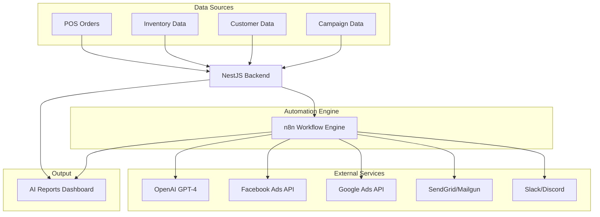

# DiveSeeks Ltd Backend Architecture - AI Marketing & Automation Layer (Layer 3)

## 1. AI Marketing System Overview

This document defines the **AI Marketing & Automation Layer** for DiveSeeks Ltd's multi-tenant backend system. This third layer builds upon the foundational software architecture and marketing integration to provide intelligent automation, AI-powered insights, and comprehensive reporting through n8n workflow orchestration.

### 1.1 AI Marketing Layer Foundation
This automation layer extends the system with:
- **n8n Workflow Orchestration**: Centralized automation engine for marketing workflows
- **OpenAI Integration**: AI-powered content generation and business insights
- **Automated Marketing Campaigns**: Email retargeting, abandoned cart recovery, and smart triggers
- **Intelligent Reporting**: AI-generated weekly/monthly performance reports
- **Smart Analytics**: Predictive insights for inventory, sales, and campaign optimization
- **Multi-Platform Automation**: Seamless integration with Google Ads, Facebook, Instagram, and email services

### 1.2 Core AI Marketing Objectives
- **Workflow Automation**: Reduce manual marketing tasks through intelligent automation
- **AI-Powered Insights**: Generate actionable business intelligence using OpenAI
- **Personalized Marketing**: Create targeted campaigns based on customer behavior and sales patterns
- **Performance Optimization**: Automatically identify and respond to business opportunities
- **Scalable Reporting**: Deliver consistent, AI-enhanced reports to store owners
- **Predictive Analytics**: Anticipate inventory needs, customer behavior, and campaign performance

### 1.3 Integration Architecture


## 2. Database Schema - AI Marketing & Automation

### 2.1 AI Reports Table
```sql
-- AI-generated reports and insights
CREATE TABLE ai_reports (
    id UUID PRIMARY KEY DEFAULT gen_random_uuid(),
    store_id UUID REFERENCES branches(id) NOT NULL,
    report_type VARCHAR(50) NOT NULL CHECK (report_type IN (
        'weekly_summary', 'monthly_summary', 'low_stock', 'abandoned_cart',
        'top_products_insights', 'ad_copy_suggestions', 'campaign_recommendations',
        'performance_analysis', 'inventory_forecast', 'customer_insights'
    )),
    
    -- Report content and metadata
    title VARCHAR(255) NOT NULL,
    content JSONB NOT NULL, -- Structured OpenAI response or generated report
    summary TEXT, -- Executive summary
    recommendations JSONB, -- AI-generated recommendations
    
    -- Generation details
    generated_by VARCHAR(20) DEFAULT 'ai' CHECK (generated_by IN ('ai', 'manual', 'scheduled')),
    ai_model VARCHAR(50), -- e.g., 'gpt-4', 'gpt-3.5-turbo'
    prompt_template VARCHAR(100),
    
    -- Status and delivery
    status VARCHAR(20) DEFAULT 'pending' CHECK (status IN ('pending', 'generating', 'success', 'error', 'delivered')),
    error_message TEXT,
    delivered_at TIMESTAMP,
    delivery_method VARCHAR(20), -- 'email', 'dashboard', 'slack'
    
    -- Scheduling
    scheduled_for TIMESTAMP,
    recurring_schedule VARCHAR(50), -- 'weekly', 'monthly', 'daily'
    
    -- Metadata
    data_period_start DATE,
    data_period_end DATE,
    created_at TIMESTAMP DEFAULT NOW(),
    updated_at TIMESTAMP DEFAULT NOW()
);

-- Indexes for performance
CREATE INDEX idx_ai_reports_store_type ON ai_reports(store_id, report_type);
CREATE INDEX idx_ai_reports_status ON ai_reports(status);
CREATE INDEX idx_ai_reports_scheduled ON ai_reports(scheduled_for);
CREATE INDEX idx_ai_reports_created ON ai_reports(created_at DESC);
```

### 2.2 n8n Workflows Table
```sql
-- n8n workflow tracking and management
CREATE TABLE n8n_workflows (
    id UUID PRIMARY KEY DEFAULT gen_random_uuid(),
    store_id UUID REFERENCES branches(id) NOT NULL,
    workflow_name VARCHAR(100) NOT NULL,
    workflow_type VARCHAR(50) NOT NULL CHECK (workflow_type IN (
        'abandoned_cart_alert', 'sales_summary_report', 'low_stock_alert',
        'top_products_insights', 'ad_copy_suggestion', 'sync_ads_insights',
        'auto_campaign_trigger', 'customer_retargeting', 'inventory_forecast'
    )),
    
    -- n8n integration details
    n8n_workflow_id VARCHAR(255) NOT NULL,
    webhook_url TEXT,
    execution_token VARCHAR(255),
    
    -- Configuration
    is_active BOOLEAN DEFAULT true,
    trigger_conditions JSONB, -- Conditions that trigger the workflow
    schedule_config JSONB, -- Cron schedule or interval configuration
    
    -- Execution tracking
    last_execution_at TIMESTAMP,
    last_execution_status VARCHAR(20),
    execution_count INTEGER DEFAULT 0,
    success_count INTEGER DEFAULT 0,
    error_count INTEGER DEFAULT 0,
    
    -- Metadata
    created_at TIMESTAMP DEFAULT NOW(),
    updated_at TIMESTAMP DEFAULT NOW(),
    
    UNIQUE(store_id, workflow_type)
);

CREATE INDEX idx_workflows_store_active ON n8n_workflows(store_id, is_active);
CREATE INDEX idx_workflows_execution ON n8n_workflows(last_execution_at);
```

### 2.3 Automation Triggers Table
```sql
-- Smart triggers for automated workflows
CREATE TABLE automation_triggers (
    id UUID PRIMARY KEY DEFAULT gen_random_uuid(),
    store_id UUID REFERENCES branches(id) NOT NULL,
    trigger_name VARCHAR(100) NOT NULL,
    trigger_type VARCHAR(50) NOT NULL CHECK (trigger_type IN (
        'low_stock', 'high_cart_abandonment', 'low_performing_product',
        'high_performing_product', 'new_order', 'inventory_update',
        'campaign_threshold', 'customer_milestone', 'sales_target'
    )),
    
    -- Trigger conditions
    conditions JSONB NOT NULL, -- Threshold values and conditions
    is_active BOOLEAN DEFAULT true,
    
    -- Associated workflows
    workflow_ids UUID[] DEFAULT '{}',
    
    -- Execution tracking
    last_triggered_at TIMESTAMP,
    trigger_count INTEGER DEFAULT 0,
    
    created_at TIMESTAMP DEFAULT NOW(),
    updated_at TIMESTAMP DEFAULT NOW()
);

CREATE INDEX idx_triggers_store_active ON automation_triggers(store_id, is_active);
CREATE INDEX idx_triggers_type ON automation_triggers(trigger_type);
```

## 3. NestJS API Endpoints - n8n Integration

### 3.1 Workflow Management Endpoints

#### 3.1.1 Register Webhook
```typescript
// POST /api/v1/n8n/register-webhook
// Called by n8n to register/report new workflows

interface RegisterWebhookRequest {
  storeId: string;
  workflowType: string;
  n8nWorkflowId: string;
  webhookUrl: string;
  executionToken: string;
  triggerConditions?: Record<string, any>;
  scheduleConfig?: {
    type: 'cron' | 'interval';
    expression: string;
  };
}

interface RegisterWebhookResponse {
  success: boolean;
  workflowId: string;
  message: string;
}
```

#### 3.1.2 Trigger Workflow
```typescript
// POST /api/v1/n8n/trigger/:workflow
// Manual or automated trigger to run a workflow

interface TriggerWorkflowRequest {
  storeId: string;
  triggerData?: Record<string, any>;
  priority?: 'low' | 'normal' | 'high';
  scheduledFor?: string; // ISO timestamp
}

interface TriggerWorkflowResponse {
  success: boolean;
  executionId: string;
  status: 'queued' | 'running' | 'completed' | 'failed';
  estimatedCompletion?: string;
}
```

#### 3.1.3 Workflow Status
```typescript
// GET /api/v1/n8n/report-status/:store
// Get last report status per store

interface WorkflowStatusResponse {
  success: boolean;
  data: {
    storeId: string;
    workflows: {
      workflowType: string;
      isActive: boolean;
      lastExecution: {
        timestamp: string;
        status: string;
        duration: number;
      };
      executionStats: {
        total: number;
        successful: number;
        failed: number;
        successRate: number;
      };
      nextScheduled?: string;
    }[];
    overallHealth: 'healthy' | 'warning' | 'critical';
  };
}
```

#### 3.1.4 Sync AI Report
```typescript
// POST /api/v1/n8n/sync-ai-report
// Sync AI-generated report into store dashboard

interface SyncAIReportRequest {
  storeId: string;
  reportType: string;
  title: string;
  content: Record<string, any>;
  summary?: string;
  recommendations?: Record<string, any>[];
  aiModel: string;
  promptTemplate: string;
  dataPeriod: {
    startDate: string;
    endDate: string;
  };
}

interface SyncAIReportResponse {
  success: boolean;
  reportId: string;
  message: string;
  dashboardUrl?: string;
}
```

### 3.2 AI Content Generation Endpoints

#### 3.2.1 Generate Ad Copy
```typescript
// POST /api/v1/ai/generate-ad-copy
// Generate AI-powered ad copy based on products and performance

interface GenerateAdCopyRequest {
  storeId: string;
  products: {
    id: string;
    name: string;
    description: string;
    price: number;
    salesData?: {
      unitsSold: number;
      revenue: number;
      period: string;
    };
  }[];
  platform: 'facebook' | 'instagram' | 'google';
  adType: 'headline' | 'description' | 'full_ad';
  tone?: 'professional' | 'casual' | 'urgent' | 'friendly';
  targetAudience?: string;
}

interface GenerateAdCopyResponse {
  success: boolean;
  data: {
    adCopy: {
      headline: string;
      description: string;
      callToAction: string;
    }[];
    aiInsights: {
      recommendedProducts: string[];
      suggestedBudget: number;
      targetingRecommendations: string[];
    };
    promptUsed: string;
    model: string;
  };
}
```

#### 3.2.2 Generate Business Insights
```typescript
// POST /api/v1/ai/generate-insights
// Generate AI-powered business insights and recommendations

interface GenerateInsightsRequest {
  storeId: string;
  analysisType: 'sales_performance' | 'inventory_optimization' | 'customer_behavior' | 'marketing_effectiveness';
  dataPeriod: {
    startDate: string;
    endDate: string;
  };
  includeRecommendations: boolean;
}

interface GenerateInsightsResponse {
  success: boolean;
  data: {
    insights: {
      category: string;
      finding: string;
      impact: 'high' | 'medium' | 'low';
      confidence: number; // 0-100
    }[];
    recommendations: {
      action: string;
      priority: 'high' | 'medium' | 'low';
      estimatedImpact: string;
      implementation: string;
    }[];
    summary: string;
    keyMetrics: Record<string, number>;
  };
}
```

## 4. n8n Workflow Specifications

### 4.1 Abandoned Cart Alert Workflow
```json
{
  "workflowType": "abandoned_cart_alert",
  "description": "Sends automated email/SMS to customers with abandoned cart items",
  "trigger": {
    "type": "webhook",
    "conditions": {
      "cartAbandonedMinutes": 30,
      "cartValue": ">= 10",
      "customerContactable": true
    }
  },
  "steps": [
    {
      "node": "webhook_trigger",
      "type": "webhook",
      "description": "Receives cart abandonment event from NestJS"
    },
    {
      "node": "customer_lookup",
      "type": "http_request",
      "description": "Fetch customer details and preferences",
      "endpoint": "/api/v1/customers/{{customerId}}"
    },
    {
      "node": "ai_email_generation",
      "type": "openai",
      "description": "Generate personalized email content",
      "prompt": "Create a friendly abandoned cart email for {{customerName}} with items: {{cartItems}}. Include a 10% discount code."
    },
    {
      "node": "send_email",
      "type": "sendgrid",
      "description": "Send personalized abandonment email"
    },
    {
      "node": "schedule_followup",
      "type": "schedule",
      "description": "Schedule follow-up email in 24 hours if no conversion",
      "delay": "24h"
    },
    {
      "node": "track_conversion",
      "type": "webhook",
      "description": "Track if customer completes purchase"
    }
  ],
  "outputs": [
    "email_sent",
    "conversion_tracked",
    "followup_scheduled"
  ]
}
```

### 4.2 Sales Summary Report Workflow
```json
{
  "workflowType": "sales_summary_report",
  "description": "AI-generated PDF/Email with weekly performance analysis",
  "trigger": {
    "type": "schedule",
    "schedule": "0 9 * * 1",
    "description": "Every Monday at 9 AM"
  },
  "steps": [
    {
      "node": "fetch_sales_data",
      "type": "http_request",
      "description": "Retrieve sales data for the past week",
      "endpoint": "/api/v1/reports/sales-data"
    },
    {
      "node": "fetch_inventory_data",
      "type": "http_request",
      "description": "Get current inventory levels",
      "endpoint": "/api/v1/inventory/summary"
    },
    {
      "node": "fetch_marketing_data",
      "type": "http_request",
      "description": "Retrieve marketing campaign performance",
      "endpoint": "/api/v1/marketing/campaigns/performance"
    },
    {
      "node": "ai_analysis",
      "type": "openai",
      "description": "Generate comprehensive business analysis",
      "prompt": "Analyze this week's performance data and provide insights: Sales: {{salesData}}, Inventory: {{inventoryData}}, Marketing: {{marketingData}}. Include recommendations for next week."
    },
    {
      "node": "generate_pdf",
      "type": "pdf_generator",
      "description": "Create formatted PDF report"
    },
    {
      "node": "send_to_owner",
      "type": "sendgrid",
      "description": "Email report to store owner"
    },
    {
      "node": "save_to_dashboard",
      "type": "http_request",
      "description": "Save report to store dashboard",
      "endpoint": "/api/v1/n8n/sync-ai-report"
    }
  ]
}
```

### 4.3 Low Stock Alert Workflow
```json
{
  "workflowType": "low_stock_alert",
  "description": "Notifies branch manager when inventory is low",
  "trigger": {
    "type": "webhook",
    "conditions": {
      "stockLevel": "<= minimumStock",
      "productActive": true
    }
  },
  "steps": [
    {
      "node": "inventory_check",
      "type": "http_request",
      "description": "Verify current stock levels",
      "endpoint": "/api/v1/inventory/product/{{productId}}"
    },
    {
      "node": "sales_velocity_analysis",
      "type": "http_request",
      "description": "Calculate product sales velocity",
      "endpoint": "/api/v1/analytics/sales-velocity/{{productId}}"
    },
    {
      "node": "ai_reorder_suggestion",
      "type": "openai",
      "description": "Generate intelligent reorder recommendations",
      "prompt": "Based on sales velocity {{salesVelocity}} and current stock {{currentStock}}, suggest optimal reorder quantity and timing for {{productName}}."
    },
    {
      "node": "notify_manager",
      "type": "sendgrid",
      "description": "Send alert to branch manager"
    },
    {
      "node": "create_purchase_order",
      "type": "conditional",
      "description": "Optionally create automated purchase order",
      "condition": "autoReorderEnabled === true"
    }
  ]
}
```

### 4.4 Ad Copy Suggestion Workflow
```json
{
  "workflowType": "ad_copy_suggestion",
  "description": "Uses OpenAI to draft ad copy based on best sellers",
  "trigger": {
    "type": "schedule",
    "schedule": "0 10 * * 3",
    "description": "Every Wednesday at 10 AM"
  },
  "steps": [
    {
      "node": "fetch_top_products",
      "type": "http_request",
      "description": "Get top-performing products from last 30 days",
      "endpoint": "/api/v1/analytics/top-products"
    },
    {
      "node": "analyze_customer_segments",
      "type": "http_request",
      "description": "Identify target customer segments",
      "endpoint": "/api/v1/analytics/customer-segments"
    },
    {
      "node": "generate_facebook_ads",
      "type": "openai",
      "description": "Create Facebook ad variations",
      "prompt": "Create 3 Facebook ad variations for these top products: {{topProducts}}. Target audience: {{customerSegments}}. Include compelling headlines and descriptions."
    },
    {
      "node": "generate_google_ads",
      "type": "openai",
      "description": "Create Google Ads copy",
      "prompt": "Create Google Ads headlines and descriptions for: {{topProducts}}. Focus on search intent and include relevant keywords."
    },
    {
      "node": "save_suggestions",
      "type": "http_request",
      "description": "Save ad copy suggestions to dashboard",
      "endpoint": "/api/v1/n8n/sync-ai-report"
    },
    {
      "node": "notify_marketing_team",
      "type": "slack",
      "description": "Send suggestions to marketing team"
    }
  ]
}
```

## 5. OpenAI Integration & Prompt Templates

### 5.1 AI Prompt Templates

#### 5.1.1 Sales Performance Analysis
```typescript
const SALES_ANALYSIS_PROMPT = `
Analyze the following sales data for {{storeName}} from {{startDate}} to {{endDate}}:

Sales Data:
- Total Revenue: ${{totalRevenue}}
- Total Orders: {{totalOrders}}
- Average Order Value: ${{averageOrderValue}}
- Top Products: {{topProducts}}
- Customer Count: {{customerCount}}
- Return Rate: {{returnRate}}%

Comparison to Previous Period:
- Revenue Change: {{revenueChange}}%
- Order Change: {{orderChange}}%
- Customer Change: {{customerChange}}%

Provide a comprehensive analysis including:
1. Key performance highlights
2. Areas of concern
3. Specific recommendations for improvement
4. Predicted trends for next period
5. Action items with priority levels

Format the response as structured JSON with sections for insights, recommendations, and metrics.
`;
```

#### 5.1.2 Ad Copy Generation
```typescript
const AD_COPY_PROMPT = `
Create compelling {{platform}} ad copy for {{storeName}} featuring these products:

{{#each products}}
- {{name}}: {{description}} (Price: ${{price}}, Sales: {{salesData.unitsSold}} units)
{{/each}}

Target Audience: {{targetAudience}}
Tone: {{tone}}
Special Offers: {{specialOffers}}

Generate:
1. 3 headline variations (max 25 words each)
2. 3 description variations (max 90 words each)
3. 3 call-to-action options
4. Suggested hashtags (for social platforms)
5. Targeting recommendations

Focus on:
- Product benefits and unique selling points
- Emotional triggers appropriate for the audience
- Clear value propositions
- Urgency and scarcity when applicable

Return as structured JSON with separate arrays for headlines, descriptions, and CTAs.
`;
```

#### 5.1.3 Inventory Optimization
```typescript
const INVENTORY_OPTIMIZATION_PROMPT = `
Analyze inventory data for {{storeName}} and provide optimization recommendations:

Current Inventory:
{{#each inventory}}
- {{productName}}: {{currentStock}} units (Min: {{minimumStock}}, Max: {{maximumStock}})
  - Sales Velocity: {{salesVelocity}} units/day
  - Days of Stock: {{daysOfStock}}
  - Last Restock: {{lastRestockDate}}
{{/each}}

Sales Trends (Last 30 days):
{{salesTrends}}

Seasonal Factors:
{{seasonalFactors}}

Provide recommendations for:
1. Products to reorder immediately
2. Optimal reorder quantities
3. Products to discontinue or reduce
4. Seasonal adjustments needed
5. Cost optimization opportunities

Include confidence levels and reasoning for each recommendation.
`;
```

### 5.2 OpenAI Service Implementation
```typescript
@Injectable()
export class OpenAIService {
  private readonly openai: OpenAI;
  
  constructor(private configService: ConfigService) {
    this.openai = new OpenAI({
      apiKey: configService.get('OPENAI_API_KEY'),
    });
  }
  
  async generateSalesAnalysis(storeId: string, salesData: SalesData): Promise<AIAnalysisResult> {
    const prompt = this.buildPrompt('SALES_ANALYSIS', {
      storeName: salesData.storeName,
      startDate: salesData.period.startDate,
      endDate: salesData.period.endDate,
      ...salesData.metrics
    });
    
    const response = await this.openai.chat.completions.create({
      model: 'gpt-4',
      messages: [
        {
          role: 'system',
          content: 'You are a business analyst expert specializing in retail analytics and recommendations.'
        },
        {
          role: 'user',
          content: prompt
        }
      ],
      temperature: 0.3,
      max_tokens: 2000,
      response_format: { type: 'json_object' }
    });
    
    return JSON.parse(response.choices[0].message.content);
  }
  
  async generateAdCopy(request: GenerateAdCopyRequest): Promise<AdCopyResult> {
    const prompt = this.buildPrompt('AD_COPY_GENERATION', request);
    
    const response = await this.openai.chat.completions.create({
      model: 'gpt-4',
      messages: [
        {
          role: 'system',
          content: 'You are a creative marketing expert specializing in high-converting ad copy for retail businesses.'
        },
        {
          role: 'user',
          content: prompt
        }
      ],
      temperature: 0.7,
      max_tokens: 1500,
      response_format: { type: 'json_object' }
    });
    
    return JSON.parse(response.choices[0].message.content);
  }
  
  async generateInventoryRecommendations(storeId: string, inventoryData: InventoryData): Promise<InventoryRecommendations> {
    const prompt = this.buildPrompt('INVENTORY_OPTIMIZATION', inventoryData);
    
    const response = await this.openai.chat.completions.create({
      model: 'gpt-4',
      messages: [
        {
          role: 'system',
          content: 'You are an inventory management expert with deep knowledge of retail operations and demand forecasting.'
        },
        {
          role: 'user',
          content: prompt
        }
      ],
      temperature: 0.2,
      max_tokens: 1800,
      response_format: { type: 'json_object' }
    });
    
    return JSON.parse(response.choices[0].message.content);
  }
  
  private buildPrompt(templateName: string, data: Record<string, any>): string {
    // Implementation for template rendering with Handlebars or similar
    const template = this.getPromptTemplate(templateName);
    return this.renderTemplate(template, data);
  }
}
```

## 6. Smart Triggers & Automation Rules

### 6.1 Trigger Configuration Service
```typescript
@Injectable()
export class AutomationTriggerService {
  constructor(
    private triggerRepository: Repository<AutomationTrigger>,
    private workflowService: N8nWorkflowService,
    private analyticsService: AnalyticsService
  ) {}
  
  // Low stock trigger
  async checkLowStockTriggers(): Promise<void> {
    const triggers = await this.triggerRepository.find({
      where: { triggerType: 'low_stock', isActive: true }
    });
    
    for (const trigger of triggers) {
      const inventory = await this.analyticsService.getInventoryLevels(trigger.storeId);
      const lowStockProducts = inventory.filter(item => 
        item.currentStock <= (trigger.conditions.threshold || item.minimumStock)
      );
      
      if (lowStockProducts.length > 0) {
        await this.workflowService.triggerWorkflow(trigger.storeId, 'low_stock_alert', {
          products: lowStockProducts,
          triggerId: trigger.id
        });
        
        await this.updateTriggerExecution(trigger.id);
      }
    }
  }
  
  // Cart abandonment trigger
  async checkCartAbandonmentTriggers(): Promise<void> {
    const triggers = await this.triggerRepository.find({
      where: { triggerType: 'high_cart_abandonment', isActive: true }
    });
    
    for (const trigger of triggers) {
      const abandonmentRate = await this.analyticsService.getCartAbandonmentRate(
        trigger.storeId,
        trigger.conditions.timeWindow || '24h'
      );
      
      if (abandonmentRate > (trigger.conditions.threshold || 0.7)) {
        await this.workflowService.triggerWorkflow(trigger.storeId, 'abandoned_cart_alert', {
          abandonmentRate,
          timeWindow: trigger.conditions.timeWindow,
          triggerId: trigger.id
        });
        
        await this.updateTriggerExecution(trigger.id);
      }
    }
  }
  
  // Performance-based triggers
  async checkPerformanceTriggers(): Promise<void> {
    const triggers = await this.triggerRepository.find({
      where: { 
        triggerType: In(['low_performing_product', 'high_performing_product']),
        isActive: true 
      }
    });
    
    for (const trigger of triggers) {
      const productPerformance = await this.analyticsService.getProductPerformance(
        trigger.storeId,
        trigger.conditions.period || '7d'
      );
      
      const thresholdMet = this.evaluatePerformanceThreshold(
        productPerformance,
        trigger.triggerType,
        trigger.conditions
      );
      
      if (thresholdMet.length > 0) {
        const workflowType = trigger.triggerType === 'low_performing_product' 
          ? 'product_optimization_alert'
          : 'upsell_opportunity_alert';
          
        await this.workflowService.triggerWorkflow(trigger.storeId, workflowType, {
          products: thresholdMet,
          triggerId: trigger.id
        });
        
        await this.updateTriggerExecution(trigger.id);
      }
    }
  }
}
```

### 6.2 Trigger Conditions Examples
```typescript
// Low stock trigger conditions
const LOW_STOCK_CONDITIONS = {
  threshold: 10, // Trigger when stock <= 10 units
  thresholdType: 'absolute', // 'absolute' or 'percentage'
  excludeCategories: ['seasonal', 'discontinued'],
  minimumValue: 50, // Only trigger for products worth >= $50
  salesVelocityFactor: 1.5 // Consider sales velocity in threshold calculation
};

// Cart abandonment conditions
const CART_ABANDONMENT_CONDITIONS = {
  threshold: 0.7, // 70% abandonment rate
  timeWindow: '24h', // Check last 24 hours
  minimumCarts: 10, // At least 10 carts to calculate meaningful rate
  minimumValue: 25, // Only track carts worth >= $25
  excludeReturningCustomers: false
};

// Campaign performance conditions
const CAMPAIGN_PERFORMANCE_CONDITIONS = {
  roas: {
    minimum: 2.0, // ROAS below 2.0 triggers alert
    period: '7d'
  },
  spend: {
    maximum: 1000, // Daily spend above $1000 triggers review
    period: '1d'
  },
  ctr: {
    minimum: 0.02, // CTR below 2% triggers optimization alert
    period: '3d'
  }
};
```

## 7. n8n Deployment Strategy

### 7.1 Infrastructure Setup
```yaml
# docker-compose.yml for n8n deployment
version: '3.8'

services:
  n8n:
    image: n8nio/n8n:latest
    container_name: divesesks-n8n
    restart: unless-stopped
    ports:
      - "5678:5678"
    environment:
      - N8N_BASIC_AUTH_ACTIVE=true
      - N8N_BASIC_AUTH_USER=${N8N_AUTH_USER}
      - N8N_BASIC_AUTH_PASSWORD=${N8N_AUTH_PASSWORD}
      - N8N_HOST=${N8N_HOST}
      - N8N_PORT=5678
      - N8N_PROTOCOL=https
      - WEBHOOK_URL=${N8N_WEBHOOK_URL}
      - GENERIC_TIMEZONE=${TIMEZONE}
      - N8N_ENCRYPTION_KEY=${N8N_ENCRYPTION_KEY}
      - DB_TYPE=postgresdb
      - DB_POSTGRESDB_HOST=${POSTGRES_HOST}
      - DB_POSTGRESDB_PORT=5432
      - DB_POSTGRESDB_DATABASE=${N8N_DB_NAME}
      - DB_POSTGRESDB_USER=${N8N_DB_USER}
      - DB_POSTGRESDB_PASSWORD=${N8N_DB_PASSWORD}
    volumes:
      - n8n_data:/home/node/.n8n
      - ./n8n/workflows:/home/node/.n8n/workflows
    depends_on:
      - postgres
    networks:
      - divesesks-network

  postgres:
    image: postgres:15
    container_name: divesesks-n8n-db
    restart: unless-stopped
    environment:
      - POSTGRES_DB=${N8N_DB_NAME}
      - POSTGRES_USER=${N8N_DB_USER}
      - POSTGRES_PASSWORD=${N8N_DB_PASSWORD}
    volumes:
      - postgres_data:/var/lib/postgresql/data
    networks:
      - divesesks-network

volumes:
  n8n_data:
  postgres_data:

networks:
  divesesks-network:
    external: true
```

### 7.2 Security Configuration
```typescript
// n8n security service
@Injectable()
export class N8nSecurityService {
  constructor(private configService: ConfigService) {}
  
  generateWorkflowToken(storeId: string, workflowType: string): string {
    const payload = {
      storeId,
      workflowType,
      iat: Math.floor(Date.now() / 1000),
      exp: Math.floor(Date.now() / 1000) + (365 * 24 * 60 * 60) // 1 year
    };
    
    return jwt.sign(payload, this.configService.get('N8N_JWT_SECRET'));
  }
  
  validateWorkflowToken(token: string): { storeId: string; workflowType: string } | null {
    try {
      const decoded = jwt.verify(token, this.configService.get('N8N_JWT_SECRET')) as any;
      return {
        storeId: decoded.storeId,
        workflowType: decoded.workflowType
      };
    } catch (error) {
      return null;
    }
  }
  
  encryptWorkflowData(data: any): string {
    const cipher = crypto.createCipher('aes-256-gcm', this.configService.get('N8N_ENCRYPTION_KEY'));
    let encrypted = cipher.update(JSON.stringify(data), 'utf8', 'hex');
    encrypted += cipher.final('hex');
    return encrypted;
  }
  
  decryptWorkflowData(encryptedData: string): any {
    const decipher = crypto.createDecipher('aes-256-gcm', this.configService.get('N8N_ENCRYPTION_KEY'));
    let decrypted = decipher.update(encryptedData, 'hex', 'utf8');
    decrypted += decipher.final('utf8');
    return JSON.parse(decrypted);
  }
}
```

### 7.3 Workflow Version Control
```typescript
// Workflow versioning service
@Injectable()
export class WorkflowVersionService {
  constructor(
    private workflowRepository: Repository<N8nWorkflow>,
    private gitService: GitService
  ) {}
  
  async saveWorkflowVersion(workflowId: string, workflowData: any): Promise<void> {
    const workflow = await this.workflowRepository.findOne({ where: { id: workflowId } });
    
    if (!workflow) {
      throw new NotFoundException('Workflow not found');
    }
    
    // Save to Git repository
    const fileName = `${workflow.storeId}/${workflow.workflowType}.json`;
    await this.gitService.commitFile(
      fileName,
      JSON.stringify(workflowData, null, 2),
      `Update ${workflow.workflowType} for store ${workflow.storeId}`
    );
    
    // Update database record
    await this.workflowRepository.update(workflowId, {
      updatedAt: new Date()
    });
  }
  
  async restoreWorkflowVersion(workflowId: string, commitHash: string): Promise<any> {
    const workflow = await this.workflowRepository.findOne({ where: { id: workflowId } });
    
    if (!workflow) {
      throw new NotFoundException('Workflow not found');
    }
    
    const fileName = `${workflow.storeId}/${workflow.workflowType}.json`;
    const workflowData = await this.gitService.getFileAtCommit(fileName, commitHash);
    
    return JSON.parse(workflowData);
  }
  
  async getWorkflowHistory(workflowId: string): Promise<WorkflowVersion[]> {
    const workflow = await this.workflowRepository.findOne({ where: { id: workflowId } });
    
    if (!workflow) {
      throw new NotFoundException('Workflow not found');
    }
    
    const fileName = `${workflow.storeId}/${workflow.workflowType}.json`;
    return await this.gitService.getFileHistory(fileName);
  }
}
```

## 8. Store Owner Dashboard Integration

### 8.1 AI Reports Dashboard Component
```typescript
// components/ai-reports/AIReportsDashboard.tsx
import { Card, CardContent, CardHeader, CardTitle } from '@/components/ui/card';
import { Button } from '@/components/ui/button';
import { Badge } from '@/components/ui/badge';
import { Progress } from '@/components/ui/progress';

interface AIReportsDashboardProps {
  storeId: string;
}

export function AIReportsDashboard({ storeId }: AIReportsDashboardProps) {
  const [reports, setReports] = useState<AIReport[]>([]);
  const [workflows, setWorkflows] = useState<WorkflowStatus[]>([]);
  const [isGenerating, setIsGenerating] = useState(false);
  
  const handleGenerateReport = async (reportType: string) => {
    setIsGenerating(true);
    try {
      await fetch(`/api/v1/n8n/trigger/sales_summary_report`, {
        method: 'POST',
        headers: { 'Content-Type': 'application/json' },
        body: JSON.stringify({ storeId, reportType })
      });
      
      // Refresh reports list
      await fetchReports();
    } catch (error) {
      console.error('Failed to generate report:', error);
    } finally {
      setIsGenerating(false);
    }
  };
  
  return (
    <div className="space-y-6">
      {/* AI Reports Overview */}
      <Card>
        <CardHeader>
          <CardTitle className="flex items-center justify-between">
            <span>AI-Generated Reports</span>
            <Button 
              onClick={() => handleGenerateReport('weekly_summary')}
              disabled={isGenerating}
            >
              {isGenerating ? 'Generating...' : 'Generate New Report'}
            </Button>
          </CardTitle>
        </CardHeader>
        <CardContent>
          <div className="grid grid-cols-1 md:grid-cols-2 lg:grid-cols-3 gap-4">
            {reports.map((report) => (
              <ReportCard key={report.id} report={report} />
            ))}
          </div>
        </CardContent>
      </Card>
      
      {/* Workflow Status */}
      <Card>
        <CardHeader>
          <CardTitle>Automation Status</CardTitle>
        </CardHeader>
        <CardContent>
          <div className="space-y-4">
            {workflows.map((workflow) => (
              <WorkflowStatusCard key={workflow.workflowType} workflow={workflow} />
            ))}
          </div>
        </CardContent>
      </Card>
      
      {/* AI Insights */}
      <AIInsightsPanel storeId={storeId} />
    </div>
  );
}

// Report card component
function ReportCard({ report }: { report: AIReport }) {
  const getStatusColor = (status: string) => {
    switch (status) {
      case 'success': return 'bg-green-100 text-green-800';
      case 'error': return 'bg-red-100 text-red-800';
      case 'generating': return 'bg-yellow-100 text-yellow-800';
      default: return 'bg-gray-100 text-gray-800';
    }
  };
  
  return (
    <Card className="hover:shadow-md transition-shadow">
      <CardHeader className="pb-3">
        <div className="flex items-center justify-between">
          <CardTitle className="text-sm font-medium">{report.title}</CardTitle>
          <Badge className={getStatusColor(report.status)}>
            {report.status}
          </Badge>
        </div>
      </CardHeader>
      <CardContent>
        <div className="space-y-2">
          <p className="text-sm text-gray-600">{report.summary}</p>
          <div className="flex items-center justify-between text-xs text-gray-500">
            <span>Generated: {formatDate(report.createdAt)}</span>
            <span>AI Model: {report.aiModel}</span>
          </div>
          <div className="flex space-x-2 mt-3">
            <Button size="sm" variant="outline" className="flex-1">
              View Report
            </Button>
            <Button size="sm" variant="outline">
              Download
            </Button>
          </div>
        </div>
      </CardContent>
    </Card>
  );
}

// Workflow status component
function WorkflowStatusCard({ workflow }: { workflow: WorkflowStatus }) {
  const getHealthColor = (health: string) => {
    switch (health) {
      case 'healthy': return 'text-green-600';
      case 'warning': return 'text-yellow-600';
      case 'critical': return 'text-red-600';
      default: return 'text-gray-600';
    }
  };
  
  return (
    <div className="flex items-center justify-between p-4 border rounded-lg">
      <div className="flex items-center space-x-3">
        <div className={`w-3 h-3 rounded-full ${workflow.isActive ? 'bg-green-500' : 'bg-gray-300'}`} />
        <div>
          <h4 className="font-medium">{workflow.workflowType.replace('_', ' ').toUpperCase()}</h4>
          <p className="text-sm text-gray-600">
            Last run: {formatDate(workflow.lastExecution.timestamp)}
          </p>
        </div>
      </div>
      <div className="text-right">
        <div className={`text-sm font-medium ${getHealthColor(workflow.health)}`}>
          {workflow.executionStats.successRate.toFixed(1)}% Success
        </div>
        <div className="text-xs text-gray-500">
          {workflow.executionStats.total} executions
        </div>
      </div>
    </div>
  );
}
```

### 8.2 AI Insights Panel
```typescript
// components/ai-reports/AIInsightsPanel.tsx
export function AIInsightsPanel({ storeId }: { storeId: string }) {
  const [insights, setInsights] = useState<AIInsight[]>([]);
  const [isLoading, setIsLoading] = useState(true);
  
  useEffect(() => {
    fetchAIInsights();
  }, [storeId]);
  
  const fetchAIInsights = async () => {
    try {
      const response = await fetch(`/api/v1/ai/generate-insights`, {
        method: 'POST',
        headers: { 'Content-Type': 'application/json' },
        body: JSON.stringify({
          storeId,
          analysisType: 'sales_performance',
          dataPeriod: {
            startDate: new Date(Date.now() - 7 * 24 * 60 * 60 * 1000).toISOString(),
            endDate: new Date().toISOString()
          },
          includeRecommendations: true
        })
      });
      
      const data = await response.json();
      setInsights(data.data.insights);
    } catch (error) {
      console.error('Failed to fetch AI insights:', error);
    } finally {
      setIsLoading(false);
    }
  };
  
  if (isLoading) {
    return (
      <Card>
        <CardHeader>
          <CardTitle>AI Insights</CardTitle>
        </CardHeader>
        <CardContent>
          <div className="space-y-3">
            {[1, 2, 3].map((i) => (
              <div key={i} className="animate-pulse">
                <div className="h-4 bg-gray-200 rounded w-3/4 mb-2"></div>
                <div className="h-3 bg-gray-200 rounded w-1/2"></div>
              </div>
            ))}
          </div>
        </CardContent>
      </Card>
    );
  }
  
  return (
    <Card>
      <CardHeader>
        <CardTitle className="flex items-center justify-between">
          <span>AI Insights</span>
          <Button size="sm" variant="outline" onClick={fetchAIInsights}>
            Refresh
          </Button>
        </CardTitle>
      </CardHeader>
      <CardContent>
        <div className="space-y-4">
          {insights.map((insight, index) => (
            <div key={index} className="border-l-4 border-blue-500 pl-4">
              <div className="flex items-center justify-between mb-2">
                <Badge variant="outline">{insight.category}</Badge>
                <div className="flex items-center space-x-2">
                  <Badge 
                    className={`${
                      insight.impact === 'high' ? 'bg-red-100 text-red-800' :
                      insight.impact === 'medium' ? 'bg-yellow-100 text-yellow-800' :
                      'bg-green-100 text-green-800'
                    }`}
                  >
                    {insight.impact} impact
                  </Badge>
                  <div className="text-xs text-gray-500">
                    {insight.confidence}% confidence
                  </div>
                </div>
              </div>
              <p className="text-sm text-gray-700">{insight.finding}</p>
            </div>
          ))}
        </div>
      </CardContent>
    </Card>
  );
}
```

## 9. Performance Monitoring & Analytics

### 9.1 Workflow Performance Tracking
```typescript
@Injectable()
export class WorkflowAnalyticsService {
  constructor(
    private workflowRepository: Repository<N8nWorkflow>,
    private reportRepository: Repository<AIReport>
  ) {}
  
  async getWorkflowPerformanceMetrics(storeId: string): Promise<WorkflowMetrics> {
    const workflows = await this.workflowRepository.find({
      where: { storeId }
    });
    
    const metrics = {
      totalWorkflows: workflows.length,
      activeWorkflows: workflows.filter(w => w.isActive).length,
      totalExecutions: workflows.reduce((sum, w) => sum + w.executionCount, 0),
      successRate: this.calculateOverallSuccessRate(workflows),
      averageExecutionTime: await this.calculateAverageExecutionTime(workflows),
      workflowHealth: this.assessWorkflowHealth(workflows)
    };
    
    return metrics;
  }
  
  async getAIReportMetrics(storeId: string, period: string): Promise<AIReportMetrics> {
    const startDate = this.getPeriodStartDate(period);
    
    const reports = await this.reportRepository.find({
      where: {
        storeId,
        createdAt: MoreThan(startDate)
      }
    });
    
    return {
      totalReports: reports.length,
      successfulReports: reports.filter(r => r.status === 'success').length,
      averageGenerationTime: this.calculateAverageGenerationTime(reports),
      reportTypes: this.groupReportsByType(reports),
      aiModelUsage: this.groupReportsByModel(reports)
    };
  }
  
  @Cron('0 */6 * * *') // Every 6 hours
  async generatePerformanceReport(): Promise<void> {
    const stores = await this.getActiveStores();
    
    for (const store of stores) {
      const workflowMetrics = await this.getWorkflowPerformanceMetrics(store.id);
      const reportMetrics = await this.getAIReportMetrics(store.id, '7d');
      
      // Generate performance insights
      const insights = await this.generatePerformanceInsights(workflowMetrics, reportMetrics);
      
      // Save performance report
      await this.reportRepository.save({
        storeId: store.id,
        reportType: 'performance_analysis',
        title: 'Automation Performance Report',
        content: {
          workflowMetrics,
          reportMetrics,
          insights
        },
        generatedBy: 'ai',
        status: 'success'
      });
    }
  }
}
```

## 10. Deployment & Configuration

### 10.1 Environment Configuration
```bash
# n8n Configuration
N8N_HOST=n8n.diveseeks.com
N8N_WEBHOOK_URL=https://n8n.diveseeks.com/webhook
N8N_AUTH_USER=admin
N8N_AUTH_PASSWORD=secure_password
N8N_ENCRYPTION_KEY=your_32_byte_encryption_key
N8N_JWT_SECRET=your_jwt_secret

# Database Configuration
N8N_DB_NAME=diveseeks_n8n
N8N_DB_USER=n8n_user
N8N_DB_PASSWORD=n8n_password

# OpenAI Configuration
OPENAI_API_KEY=your_openai_api_key
OPENAI_MODEL=gpt-4
OPENAI_MAX_TOKENS=2000

# Email Configuration
SENDGRID_API_KEY=your_sendgrid_api_key
MAILGUN_API_KEY=your_mailgun_api_key

# Slack/Discord (Optional)
SLACK_WEBHOOK_URL=your_slack_webhook
DISCORD_WEBHOOK_URL=your_discord_webhook

# Automation Settings
WORKFLOW_EXECUTION_TIMEOUT=300000
MAX_CONCURRENT_WORKFLOWS=10
RETRY_FAILED_WORKFLOWS=true
WORKFLOW_RETENTION_DAYS=90
```

### 10.2 Kubernetes Deployment
```yaml
# k8s/n8n-deployment.yaml
apiVersion: apps/v1
kind: Deployment
metadata:
  name: diveseeks-n8n
  namespace: diveseeks
spec:
  replicas: 2
  selector:
    matchLabels:
      app: diveseeks-n8n
  template:
    metadata:
      labels:
        app: diveseeks-n8n
    spec:
      containers:
      - name: n8n
        image: n8nio/n8n:latest
        ports:
        - containerPort: 5678
        env:
        - name: N8N_HOST
          valueFrom:
            configMapKeyRef:
              name: n8n-config
              key: host
        - name: N8N_ENCRYPTION_KEY
          valueFrom:
            secretKeyRef:
              name: n8n-secrets
              key: encryption-key
        - name: DB_POSTGRESDB_HOST
          valueFrom:
            configMapKeyRef:
              name: n8n-config
              key: db-host
        volumeMounts:
        - name: n8n-data
          mountPath: /home/node/.n8n
        resources:
          requests:
            memory: "512Mi"
            cpu: "250m"
          limits:
            memory: "1Gi"
            cpu: "500m"
      volumes:
      - name: n8n-data
        persistentVolumeClaim:
          claimName: n8n-pvc
---
apiVersion: v1
kind: Service
metadata:
  name: diveseeks-n8n-service
  namespace: diveseeks
spec:
  selector:
    app: diveseeks-n8n
  ports:
  - protocol: TCP
    port: 80
    targetPort: 5678
  type: ClusterIP
```

This comprehensive AI Marketing & Automation Layer provides DiveSeeks Ltd with intelligent automation capabilities, AI-powered insights, and seamless workflow orchestration through n8n integration. The layer is designed to scale with business growth while maintaining high performance, security, and reliability standards.
