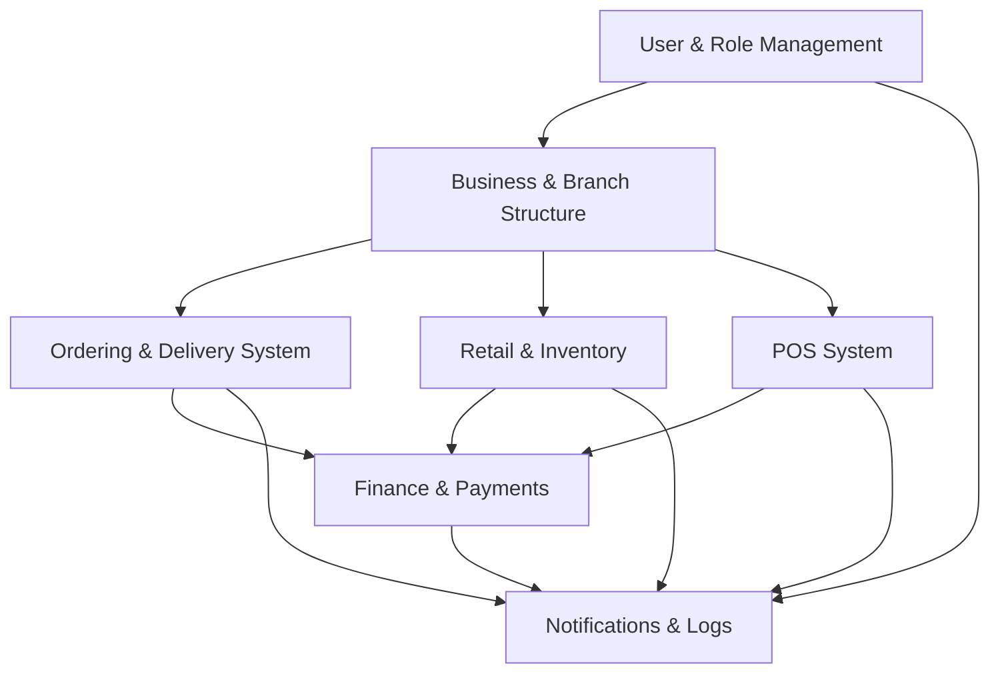

# DiveSeeks Ltd Backend Architecture - Software Architecture Layer

## 1. System Overview

This document defines the **Software Architecture Layer** for DiveSeeks Ltd's multi-tenant backend system. This foundational software layer establishes the architectural patterns, development standards, and technical specifications that guide all development activities. The system is built with NestJS and PostgreSQL, designed to serve multiple business types (restaurants, retail, services) with comprehensive role-based access control and modular architecture.

### 1.1 Software Architecture Foundation
This software layer serves as the core foundation that:
- Defines architectural patterns and design principles
- Establishes code quality standards and development practices
- Specifies performance requirements and scalability metrics
- Outlines security software requirements and monitoring standards
- Provides the technical blueprint for all subsequent development layers

### 1.2 Core Business Objectives
- Multi-tenant architecture supporting brokers, business owners, and branch operations
- Role-based access control (RBAC) for secure operations
- Scalable modular design for different business types
- Real-time order processing and inventory management
- Comprehensive POS system integration
- Financial tracking and payment processing

### 1.3 Software Architecture Patterns

#### 1.3.1 Primary Architecture Pattern
- **Modular Monolith**: Microservices-ready architecture with clear module boundaries
- **Hexagonal Architecture**: Clean separation between business logic and external concerns
- **Domain-Driven Design**: Business logic organized around domain concepts
- **Multi-tenant Architecture**: Isolated data and operations per tenant

#### 1.3.2 Supporting Patterns
- **CQRS (Command Query Responsibility Segregation)**: Separate read and write operations
- **Repository Pattern**: Data access abstraction layer
- **Dependency Injection**: Loose coupling between components
- **Event-Driven Architecture**: Asynchronous communication between modules
- **Factory Pattern**: Object creation abstraction

### 1.4 Software Design Principles

#### 1.4.1 SOLID Principles
- **Single Responsibility**: Each class has one reason to change
- **Open/Closed**: Open for extension, closed for modification
- **Liskov Substitution**: Subtypes must be substitutable for base types
- **Interface Segregation**: Clients shouldn't depend on unused interfaces
- **Dependency Inversion**: Depend on abstractions, not concretions

#### 1.4.2 Additional Principles
- **DRY (Don't Repeat Yourself)**: Eliminate code duplication
- **KISS (Keep It Simple, Stupid)**: Favor simplicity over complexity
- **Separation of Concerns**: Distinct sections handle distinct concerns
- **Composition over Inheritance**: Favor object composition
- **Fail Fast**: Early error detection and handling

### 1.5 Technology Stack & Dependencies

#### 1.5.1 Core Technologies
- **Framework**: NestJS ^10.0.0 + TypeScript ^5.0.0 (Strict mode)
- **Database**: PostgreSQL ^15.0 with TypeORM ^0.3.0
- **Authentication**: JWT + Refresh Tokens
- **File Handling**: Multer for uploads (product images, logos)
- **API**: REST (GraphQL optional for future)
- **Validation**: class-validator, class-transformer

#### 1.5.2 Development Dependencies
- **Testing**: Jest ^29.0.0, Supertest for E2E
- **Code Quality**: ESLint ^8.0.0, Prettier ^3.0.0
- **Documentation**: Swagger/OpenAPI
- **Environment**: Docker for containerization
- **Package Manager**: npm with package-lock.json

#### 1.5.3 Version Management
- **Node.js**: >=18.0.0 LTS
- **Dependency Locking**: Strict package-lock enforcement
- **Security Auditing**: Regular npm audit and updates
- **Compatibility**: Semantic versioning compliance

## 2. Code Quality Standards

### 2.1 TypeScript Configuration
- **Strict Mode**: Enabled for maximum type safety
- **No Implicit Any**: Explicit type declarations required
- **Strict Null Checks**: Null safety enforcement
- **No Unused Locals**: Clean code maintenance
- **Exact Optional Property Types**: Precise optional handling

### 2.2 ESLint Rules
- **Base Configuration**: @typescript-eslint/recommended
- **Import Order**: Consistent import organization
- **Naming Conventions**: camelCase for variables, PascalCase for classes
- **Complexity Limits**: Maximum cyclomatic complexity of 10
- **Line Length**: Maximum 120 characters per line

### 2.3 Testing Requirements
- **Unit Tests**: Minimum 80% code coverage
- **Integration Tests**: API endpoint testing with Supertest
- **E2E Tests**: Critical user journey testing
- **Test Documentation**: Clear test descriptions and scenarios
- **Mocking Strategy**: Proper isolation of external dependencies

## 3. Software Development Lifecycle

### 3.1 Git Workflow
- **Branching Strategy**: GitFlow (main, develop, feature, release, hotfix)
- **Commit Messages**: Conventional Commits specification
- **Pull Requests**: Mandatory for all changes to main/develop
- **Branch Protection**: Main branch protection with required reviews
- **Merge Strategy**: Squash and merge for feature branches

### 3.2 Code Review Process
- **Peer Review**: Minimum 1 reviewer, 2 for critical changes
- **Automated Checks**: CI/CD pipeline validation before review
- **Review Criteria**: Code quality, security, performance, documentation
- **Review Checklist**: Standardized review criteria
- **Documentation Updates**: README and API docs updated with changes

### 3.3 CI/CD Pipeline Stages
- **Build Stage**: TypeScript compilation and dependency installation
- **Test Stage**: Unit, integration, and E2E test execution
- **Quality Stage**: ESLint, Prettier, and security scanning
- **Deploy Stage**: Automated deployment to staging/production
- **Rollback Strategy**: Automated rollback on deployment failures

## 4. Performance Requirements

### 4.1 Response Time Targets
- **API Endpoints**: <200ms for 95th percentile
- **Database Queries**: <100ms for simple queries, <500ms for complex
- **File Uploads**: <5s for files up to 10MB
- **Authentication**: <50ms for token validation
- **Real-time Updates**: <100ms for WebSocket messages

### 4.2 Throughput Requirements
- **Concurrent Users**: Support 1000+ concurrent users per instance
- **API Requests**: Handle 10,000+ requests per minute
- **Database Connections**: Efficient connection pooling (max 20 per instance)
- **Memory Usage**: <512MB per instance under normal load
- **CPU Usage**: <70% under normal load

### 4.3 Scalability Metrics
- **Horizontal Scaling**: Stateless application design
- **Database Scaling**: Read replicas and connection pooling
- **Caching Strategy**: Redis for session and frequently accessed data
- **Load Balancing**: Application-level load distribution
- **Auto-scaling**: Container orchestration with Kubernetes

## 5. Error Handling & Logging Standards

### 5.1 Error Handling
- **Global Exception Filter**: Centralized error handling with NestJS
- **Custom Exceptions**: Domain-specific error types
- **Error Codes**: Consistent HTTP status codes and custom error codes
- **User-Friendly Messages**: Clear, actionable error messages
- **Error Propagation**: Proper error bubbling through layers

### 5.2 Logging Standards
- **Log Levels**: DEBUG, INFO, WARN, ERROR, FATAL
- **Structured Logging**: JSON format with consistent fields
- **Request Tracing**: Unique correlation ID for request tracking
- **Performance Logging**: Response times and resource usage
- **Security Logging**: Authentication attempts and access violations

### 5.3 Monitoring Requirements
- **Health Checks**: /health endpoint for application status
- **Metrics Collection**: Prometheus-compatible metrics
- **Alerting**: Automated alerts for critical issues
- **Log Aggregation**: Centralized logging with ELK stack
- **Dashboards**: Real-time monitoring with Grafana

## 6. Security Software Requirements

### 6.1 Authentication & Authorization
- **JWT Implementation**: Secure token-based authentication
- **Role-Based Access Control**: Granular permission system
- **Session Management**: Secure session handling with refresh tokens
- **Multi-Factor Authentication**: Optional 2FA support
- **Password Policy**: Strong password requirements

### 6.2 Data Encryption
- **Data at Rest**: Database encryption with PostgreSQL TDE
- **Data in Transit**: HTTPS/TLS 1.3 encryption
- **Password Hashing**: bcrypt with salt rounds ≥12
- **Sensitive Data**: Field-level encryption for PII
- **API Keys**: Secure storage and rotation

### 6.3 Security Standards
- **Input Validation**: Comprehensive sanitization with class-validator
- **SQL Injection Prevention**: Parameterized queries with TypeORM
- **XSS Protection**: Output encoding and CSP headers
- **Rate Limiting**: API endpoint protection with throttling
- **CORS Configuration**: Strict cross-origin resource sharing

## 7. Software Monitoring & Observability

### 7.1 Application Monitoring
- **Performance Metrics**: Response times, throughput, error rates
- **Business Metrics**: Order volumes, user activity, revenue
- **Resource Monitoring**: CPU, memory, disk, network usage
- **Dependency Monitoring**: Database, Redis, external service health

### 7.2 Observability Tools
- **Logging**: Winston with structured JSON logging
- **Metrics**: Prometheus metrics with custom business metrics
- **Tracing**: Distributed tracing with OpenTelemetry
- **Dashboards**: Grafana dashboards for real-time monitoring

### 7.3 Alerting Strategy
- **Critical Alerts**: System failures, security breaches
- **Warning Alerts**: Performance degradation, high error rates
- **Business Alerts**: Unusual transaction patterns
- **Escalation**: Automated escalation with PagerDuty integration

## 8. Core Module Architecture

### 8.1 Module Overview


## 3. Module Specifications

### 3.1 User & Role Management Module

#### 3.1.1 User Roles Hierarchy
```typescript
enum UserRole {
  SUPER_ADMIN = 'super_admin',
  BROKER = 'broker',
  BUSINESS_OWNER = 'business_owner',
  BRANCH_MANAGER = 'branch_manager',
  CASHIER = 'cashier',
  KITCHEN_STAFF = 'kitchen_staff',
  DELIVERY_DRIVER = 'delivery_driver',
  INVENTORY_MANAGER = 'inventory_manager'
}
```

#### 3.1.2 Core Features
- **Role-Based Access Control (RBAC)**: Granular permissions per role
- **Multi-tenant User Management**: Users tied to specific businesses/branches
- **Authentication**: JWT with refresh token rotation
- **User Hierarchy**: Super Admin → Broker → Business Owner → Branch Staff

#### 3.1.3 Database Schema
```sql
-- Users table
CREATE TABLE users (
    id UUID PRIMARY KEY DEFAULT gen_random_uuid(),
    email VARCHAR(255) UNIQUE NOT NULL,
    password_hash VARCHAR(255) NOT NULL,
    first_name VARCHAR(100) NOT NULL,
    last_name VARCHAR(100) NOT NULL,
    role UserRole NOT NULL,
    is_active BOOLEAN DEFAULT true,
    created_at TIMESTAMP DEFAULT NOW(),
    updated_at TIMESTAMP DEFAULT NOW()
);

-- User permissions
CREATE TABLE user_permissions (
    id UUID PRIMARY KEY DEFAULT gen_random_uuid(),
    user_id UUID REFERENCES users(id),
    business_id UUID REFERENCES businesses(id),
    branch_id UUID REFERENCES branches(id),
    permissions JSONB NOT NULL,
    created_at TIMESTAMP DEFAULT NOW()
);
```

### 3.2 Business & Branch Structure Module

#### 3.2.1 Business Types
```typescript
enum BusinessType {
  RESTAURANT = 'restaurant',
  RETAIL = 'retail',
  SERVICE = 'service'
}

enum BusinessStatus {
  PENDING = 'pending',
  ACTIVE = 'active',
  SUSPENDED = 'suspended',
  CLOSED = 'closed'
}
```

#### 3.2.2 Core Features
- **Broker Registration**: Brokers register and manage businesses
- **Multi-branch Support**: Business owners create and manage multiple branches
- **Branch Configuration**: Staff, inventory, kitchen, delivery zones per branch
- **Operational Status**: Real-time open/closed status management

#### 3.2.3 Database Schema
```sql
-- Businesses table
CREATE TABLE businesses (
    id UUID PRIMARY KEY DEFAULT gen_random_uuid(),
    name VARCHAR(255) NOT NULL,
    business_type BusinessType NOT NULL,
    status BusinessStatus DEFAULT 'pending',
    broker_id UUID REFERENCES users(id),
    owner_id UUID REFERENCES users(id),
    registration_number VARCHAR(100),
    tax_id VARCHAR(100),
    logo_url VARCHAR(500),
    created_at TIMESTAMP DEFAULT NOW(),
    updated_at TIMESTAMP DEFAULT NOW()
);

-- Branches table
CREATE TABLE branches (
    id UUID PRIMARY KEY DEFAULT gen_random_uuid(),
    business_id UUID REFERENCES businesses(id),
    name VARCHAR(255) NOT NULL,
    address JSONB NOT NULL,
    phone VARCHAR(20),
    email VARCHAR(255),
    is_operational BOOLEAN DEFAULT false,
    operating_hours JSONB,
    delivery_zones JSONB,
    created_at TIMESTAMP DEFAULT NOW(),
    updated_at TIMESTAMP DEFAULT NOW()
);
```

### 3.3 Ordering & Delivery System Module

#### 3.3.1 Order Lifecycle
```typescript
enum OrderStatus {
  PENDING = 'pending',
  ACCEPTED = 'accepted',
  PREPARING = 'preparing',
  READY = 'ready',
  OUT_FOR_DELIVERY = 'out_for_delivery',
  COMPLETED = 'completed',
  CANCELLED = 'cancelled'
}

enum OrderType {
  DINE_IN = 'dine_in',
  TAKEAWAY = 'takeaway',
  DELIVERY = 'delivery',
  ONLINE = 'online'
}
```

#### 3.3.2 Core Features
- **Customer Ordering**: Website and mobile app integration
- **Real-time Status Updates**: Live order tracking
- **Staff Notifications**: Automated alerts for status changes
- **Delivery Management**: Driver assignment and tracking
- **Order Processing**: Kitchen workflow management

#### 3.3.3 Database Schema
```sql
-- Orders table
CREATE TABLE orders (
    id UUID PRIMARY KEY DEFAULT gen_random_uuid(),
    order_number VARCHAR(50) UNIQUE NOT NULL,
    branch_id UUID REFERENCES branches(id),
    customer_id UUID REFERENCES customers(id),
    order_type OrderType NOT NULL,
    status OrderStatus DEFAULT 'pending',
    subtotal DECIMAL(10,2) NOT NULL,
    tax_amount DECIMAL(10,2) DEFAULT 0,
    discount_amount DECIMAL(10,2) DEFAULT 0,
    total_amount DECIMAL(10,2) NOT NULL,
    delivery_address JSONB,
    delivery_driver_id UUID REFERENCES users(id),
    estimated_delivery_time TIMESTAMP,
    created_at TIMESTAMP DEFAULT NOW(),
    updated_at TIMESTAMP DEFAULT NOW()
);

-- Order items
CREATE TABLE order_items (
    id UUID PRIMARY KEY DEFAULT gen_random_uuid(),
    order_id UUID REFERENCES orders(id),
    product_id UUID REFERENCES products(id),
    quantity INTEGER NOT NULL,
    unit_price DECIMAL(10,2) NOT NULL,
    total_price DECIMAL(10,2) NOT NULL,
    modifiers JSONB,
    special_instructions TEXT
);
```

### 3.4 Retail & Inventory Module

#### 3.4.1 Inventory Management
```typescript
enum StockStatus {
  IN_STOCK = 'in_stock',
  LOW_STOCK = 'low_stock',
  OUT_OF_STOCK = 'out_of_stock',
  DISCONTINUED = 'discontinued'
}
```

#### 3.4.2 Core Features
- **Per-branch Inventory**: Separate stock tracking per location
- **Real-time Stock Updates**: Automatic stock adjustments
- **Low Stock Alerts**: Automated notifications
- **Product Availability**: Auto-disable out-of-stock items
- **Stock Movements**: Track all inventory changes

#### 3.4.3 Database Schema
```sql
-- Products table
CREATE TABLE products (
    id UUID PRIMARY KEY DEFAULT gen_random_uuid(),
    business_id UUID REFERENCES businesses(id),
    name VARCHAR(255) NOT NULL,
    description TEXT,
    category_id UUID REFERENCES categories(id),
    sku VARCHAR(100),
    barcode VARCHAR(100),
    price DECIMAL(10,2) NOT NULL,
    cost_price DECIMAL(10,2),
    image_urls JSONB,
    is_active BOOLEAN DEFAULT true,
    created_at TIMESTAMP DEFAULT NOW(),
    updated_at TIMESTAMP DEFAULT NOW()
);

-- Branch inventory
CREATE TABLE branch_inventory (
    id UUID PRIMARY KEY DEFAULT gen_random_uuid(),
    branch_id UUID REFERENCES branches(id),
    product_id UUID REFERENCES products(id),
    current_stock INTEGER NOT NULL DEFAULT 0,
    minimum_stock INTEGER DEFAULT 0,
    maximum_stock INTEGER,
    stock_status StockStatus DEFAULT 'in_stock',
    last_restocked TIMESTAMP,
    updated_at TIMESTAMP DEFAULT NOW(),
    UNIQUE(branch_id, product_id)
);
```

### 3.5 POS System Module

#### 3.5.1 POS Features
```typescript
enum PaymentMethod {
  CASH = 'cash',
  CARD = 'card',
  DIGITAL_WALLET = 'digital_wallet',
  STORE_CREDIT = 'store_credit'
}

enum CartStatus {
  ACTIVE = 'active',
  HELD = 'held',
  COMPLETED = 'completed',
  CANCELLED = 'cancelled'
}
```

#### 3.5.2 Core Features
- **Product Lookup**: Search by name, SKU, or barcode
- **Cart Management**: Add, update, remove items with quantities
- **Pricing Controls**: Discounts, taxes, modifiers
- **Payment Processing**: Multiple payment types and split payments
- **Receipt Generation**: Digital and print receipts
- **Cart Operations**: Save, hold, and resume carts

#### 3.5.3 Database Schema
```sql
-- POS carts
CREATE TABLE pos_carts (
    id UUID PRIMARY KEY DEFAULT gen_random_uuid(),
    branch_id UUID REFERENCES branches(id),
    cashier_id UUID REFERENCES users(id),
    cart_number VARCHAR(50) NOT NULL,
    status CartStatus DEFAULT 'active',
    subtotal DECIMAL(10,2) DEFAULT 0,
    tax_amount DECIMAL(10,2) DEFAULT 0,
    discount_amount DECIMAL(10,2) DEFAULT 0,
    total_amount DECIMAL(10,2) DEFAULT 0,
    customer_id UUID REFERENCES customers(id),
    created_at TIMESTAMP DEFAULT NOW(),
    updated_at TIMESTAMP DEFAULT NOW()
);

-- Cart items
CREATE TABLE pos_cart_items (
    id UUID PRIMARY KEY DEFAULT gen_random_uuid(),
    cart_id UUID REFERENCES pos_carts(id),
    product_id UUID REFERENCES products(id),
    quantity INTEGER NOT NULL,
    unit_price DECIMAL(10,2) NOT NULL,
    total_price DECIMAL(10,2) NOT NULL,
    discount_amount DECIMAL(10,2) DEFAULT 0,
    modifiers JSONB
);
```

### 3.6 Finance & Payments Module

#### 3.6.1 Payment Integration
```typescript
enum TransactionStatus {
  PENDING = 'pending',
  PROCESSING = 'processing',
  COMPLETED = 'completed',
  FAILED = 'failed',
  REFUNDED = 'refunded'
}

enum TransactionType {
  SALE = 'sale',
  REFUND = 'refund',
  COMMISSION = 'commission',
  PAYOUT = 'payout'
}
```

#### 3.6.2 Core Features
- **Stripe Integration**: Online and NFC payments
- **Cash Management**: POS cash handling
- **Commission Tracking**: Broker and platform fees
- **Financial Reports**: Branch-wise revenue reports
- **Z Reports**: End-of-day cash reconciliation
- **Payment Splits**: Multiple payment methods per transaction

#### 3.6.3 Database Schema
```sql
-- Transactions table
CREATE TABLE transactions (
    id UUID PRIMARY KEY DEFAULT gen_random_uuid(),
    branch_id UUID REFERENCES branches(id),
    order_id UUID REFERENCES orders(id),
    transaction_type TransactionType NOT NULL,
    payment_method PaymentMethod NOT NULL,
    amount DECIMAL(10,2) NOT NULL,
    commission_amount DECIMAL(10,2) DEFAULT 0,
    status TransactionStatus DEFAULT 'pending',
    stripe_payment_intent_id VARCHAR(255),
    reference_number VARCHAR(100),
    processed_at TIMESTAMP,
    created_at TIMESTAMP DEFAULT NOW()
);

-- Daily reports
CREATE TABLE daily_reports (
    id UUID PRIMARY KEY DEFAULT gen_random_uuid(),
    branch_id UUID REFERENCES branches(id),
    report_date DATE NOT NULL,
    total_sales DECIMAL(10,2) DEFAULT 0,
    total_cash DECIMAL(10,2) DEFAULT 0,
    total_card DECIMAL(10,2) DEFAULT 0,
    total_commission DECIMAL(10,2) DEFAULT 0,
    order_count INTEGER DEFAULT 0,
    created_at TIMESTAMP DEFAULT NOW(),
    UNIQUE(branch_id, report_date)
);
```

### 3.7 Notifications & Logs Module

#### 3.7.1 Notification Types
```typescript
enum NotificationType {
  ORDER_RECEIVED = 'order_received',
  ORDER_STATUS_CHANGE = 'order_status_change',
  LOW_STOCK = 'low_stock',
  PAYMENT_RECEIVED = 'payment_received',
  SYSTEM_ALERT = 'system_alert'
}

enum NotificationChannel {
  IN_APP = 'in_app',
  EMAIL = 'email',
  SMS = 'sms',
  PUSH = 'push'
}
```

#### 3.7.2 Core Features
- **Real-time Notifications**: WebSocket-based updates
- **Multi-channel Delivery**: In-app, email, SMS, push
- **Audit Logging**: Complete activity trail
- **User Activity Tracking**: Per-branch and per-user logs
- **System Monitoring**: Performance and error tracking

#### 3.7.3 Database Schema
```sql
-- Notifications table
CREATE TABLE notifications (
    id UUID PRIMARY KEY DEFAULT gen_random_uuid(),
    user_id UUID REFERENCES users(id),
    branch_id UUID REFERENCES branches(id),
    type NotificationType NOT NULL,
    title VARCHAR(255) NOT NULL,
    message TEXT NOT NULL,
    data JSONB,
    channels NotificationChannel[] DEFAULT '{in_app}',
    is_read BOOLEAN DEFAULT false,
    sent_at TIMESTAMP,
    created_at TIMESTAMP DEFAULT NOW()
);

-- Audit logs
CREATE TABLE audit_logs (
    id UUID PRIMARY KEY DEFAULT gen_random_uuid(),
    user_id UUID REFERENCES users(id),
    branch_id UUID REFERENCES branches(id),
    action VARCHAR(100) NOT NULL,
    entity_type VARCHAR(50) NOT NULL,
    entity_id UUID,
    old_values JSONB,
    new_values JSONB,
    ip_address INET,
    user_agent TEXT,
    created_at TIMESTAMP DEFAULT NOW()
);
```

## 4. Multi-Tenant Architecture

### 4.1 Tenant Isolation Strategy
- **Row-Level Security**: PostgreSQL RLS for data isolation
- **Business-Based Tenancy**: Each business acts as a tenant
- **Branch-Level Permissions**: Granular access control per branch
- **Shared Schema**: Single database with tenant-aware queries

### 4.2 Security Implementation
```typescript
// Tenant context decorator
@Injectable()
export class TenantGuard implements CanActivate {
  canActivate(context: ExecutionContext): boolean {
    const request = context.switchToHttp().getRequest();
    const user = request.user;
    const businessId = request.params.businessId || request.body.businessId;
    
    return this.validateTenantAccess(user, businessId);
  }
}
```

## 5. API Structure

### 5.1 Module-Based Routing
```
/api/v1/
├── auth/                 # Authentication endpoints
├── users/                # User management
├── businesses/           # Business operations
├── branches/             # Branch management
├── orders/               # Order processing
├── inventory/            # Inventory management
├── pos/                  # POS operations
├── payments/             # Payment processing
├── notifications/        # Notification system
└── reports/              # Reporting and analytics
```

### 5.2 Standard Response Format
```typescript
interface ApiResponse<T> {
  success: boolean;
  data?: T;
  message?: string;
  errors?: string[];
  meta?: {
    page?: number;
    limit?: number;
    total?: number;
  };
}
```

## 6. Development Guidelines

### 6.1 Code Organization
```
src/
├── modules/
│   ├── auth/
│   ├── users/
│   ├── businesses/
│   ├── branches/
│   ├── orders/
│   ├── inventory/
│   ├── pos/
│   ├── payments/
│   └── notifications/
├── common/
│   ├── decorators/
│   ├── guards/
│   ├── interceptors/
│   ├── pipes/
│   └── filters/
├── database/
│   ├── entities/
│   ├── migrations/
│   └── seeds/
└── config/
```

### 6.2 Best Practices
- **Modular Design**: Each module is self-contained
- **Dependency Injection**: Proper IoC container usage
- **Error Handling**: Consistent error responses
- **Validation**: DTO validation with class-validator
- **Documentation**: Swagger/OpenAPI integration
- **Testing**: Unit and integration tests

## 7. Scalability Considerations

### 7.1 Performance Optimization
- **Database Indexing**: Optimized queries with proper indexes
- **Caching Strategy**: Redis for session and frequently accessed data
- **Connection Pooling**: Efficient database connection management
- **Query Optimization**: TypeORM query builder for complex queries

### 7.2 Future Enhancements
- **Microservices Migration**: Module-based service separation
- **Event-Driven Architecture**: Message queues for async processing
- **GraphQL Integration**: Flexible query capabilities
- **Real-time Features**: WebSocket integration for live updates

## 8. Deployment Architecture

### 8.1 Environment Configuration
- **Development**: Local PostgreSQL with hot reload
- **Staging**: Docker containers with environment parity
- **Production**: Scalable cloud deployment with load balancing

### 8.2 Infrastructure Requirements
- **Database**: PostgreSQL 14+ with connection pooling
- **Cache**: Redis for session storage and caching
- **File Storage**: AWS S3 or similar for image uploads
- **Monitoring**: Application performance monitoring
- **Logging**: Centralized logging with ELK stack

This documentation establishes the foundation for the DiveSeeks Ltd backend system. The modular architecture ensures scalability while maintaining clear separation of concerns across all business operations.