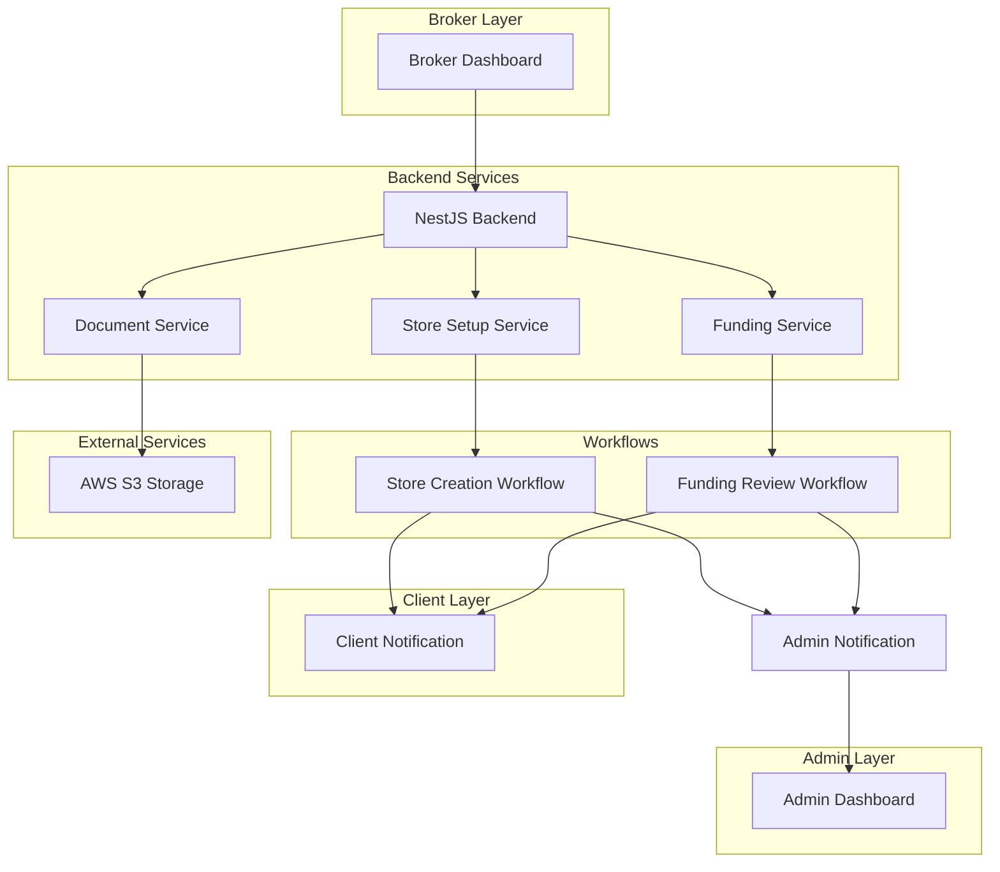
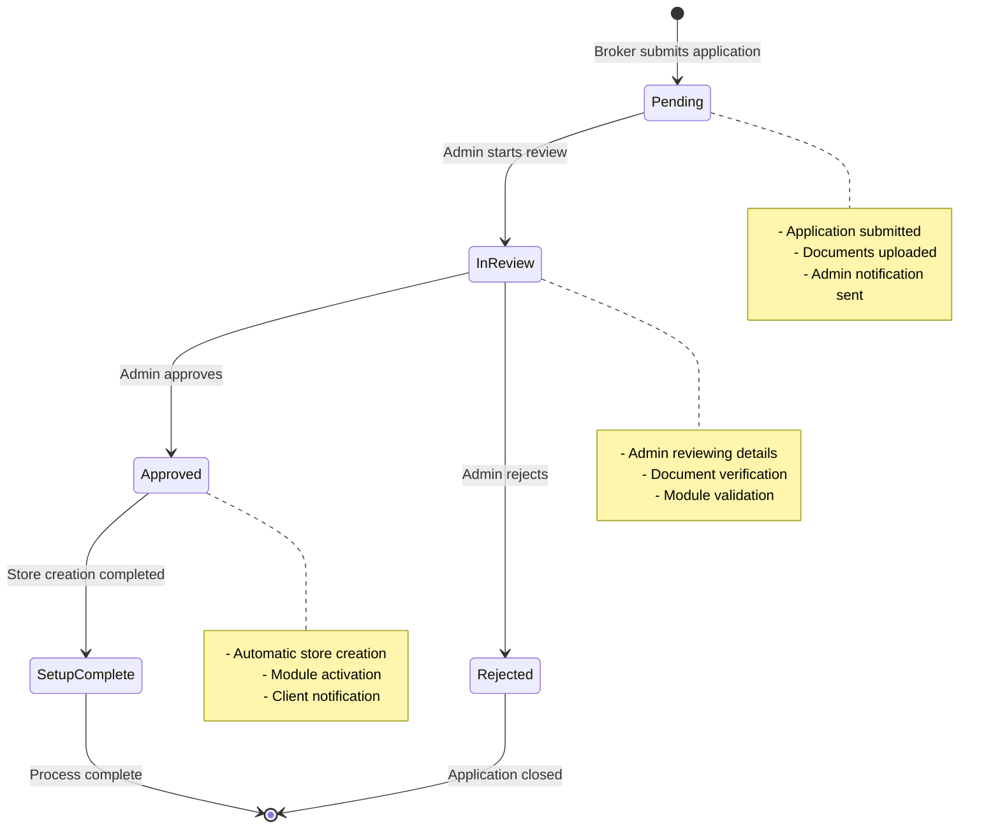
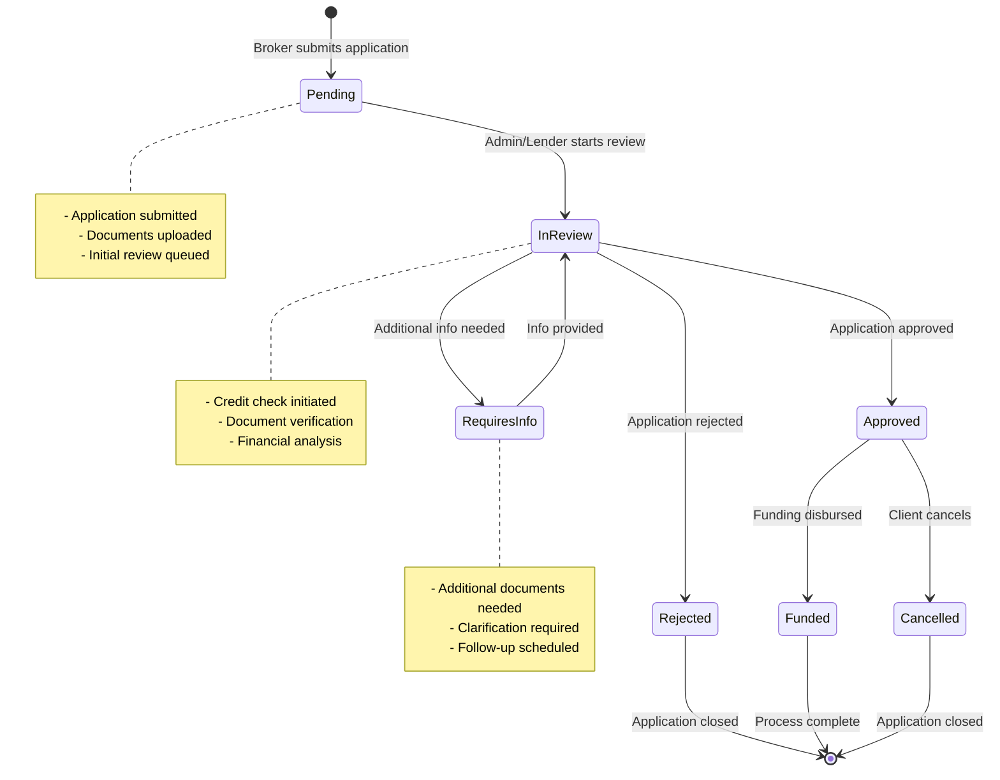

# DiveSeeks Ltd Backend Architecture - Broker Platform Enhancement Layer (Layer 4)

## 1. Broker Platform Overview

This document defines the **Broker Platform Enhancement Layer** for DiveSeeks Ltd's multi-tenant backend system. This fourth layer builds upon the foundational software architecture, marketing integration, and AI automation to provide comprehensive broker capabilities for client store setup and funding applications.

### 1.1 Broker Platform Foundation
This enhancement layer extends the system with:
- **Client Store Setup Applications**: Brokers can apply for new client store setup with comprehensive business information
- **Business Funding Applications**: Brokers can submit funding requests on behalf of clients
- **Document Management**: Secure AWS S3 integration for document uploads and storage
- **Module Selection System**: Configurable activation of POS, Online Ordering, Mobile App, Security Services, and Marketing Tools
- **Automated Workflows**: Streamlined approval processes with admin notifications
- **Role-Based Security**: Granular access control for BrokerAdmin and AgencyStaff roles

### 1.2 Core Broker Platform Objectives
- **Streamlined Client Onboarding**: Simplify the process of setting up new client stores
- **Funding Facilitation**: Enable brokers to assist clients with business funding applications
- **Document Security**: Ensure secure handling and storage of sensitive business documents
- **Workflow Automation**: Reduce manual processes through automated approval workflows
- **Agency Management**: Maintain clear relationships between brokers, agencies, and clients
- **Compliance & Tracking**: Comprehensive audit trails for all applications and approvals

### 1.3 Integration Architecture


## 2. Database Schema - Broker Platform Enhancement

### 2.1 Store Setup Applications Table
```sql
-- Store setup applications submitted by brokers
CREATE TABLE store_setup_applications (
    id UUID PRIMARY KEY DEFAULT gen_random_uuid(),
    broker_id UUID REFERENCES users(id) NOT NULL,
    client_id UUID REFERENCES users(id), -- Can be null if client doesn't exist yet
    agency_id UUID REFERENCES agencies(id) NOT NULL,
    
    -- Application status
    status VARCHAR(20) DEFAULT 'pending' CHECK (status IN (
        'pending', 'in_review', 'approved', 'rejected', 'setup_complete'
    )),
    
    -- Store information (JSON structure)
    store_data JSONB NOT NULL,
    -- {
    --   "businessName": "string",
    --   "businessType": "restaurant|retail|services",
    --   "category": "string",
    --   "location": {
    --     "address": "string",
    --     "city": "string",
    --     "state": "string",
    --     "zipCode": "string",
    --     "country": "string",
    --     "coordinates": {"lat": number, "lng": number}
    --   },
    --   "operatingHours": {
    --     "monday": {"open": "09:00", "close": "17:00", "closed": false},
    --     "tuesday": {"open": "09:00", "close": "17:00", "closed": false},
    --     // ... other days
    --   },
    --   "contactInfo": {
    --     "phone": "string",
    --     "email": "string",
    --     "website": "string"
    --   },
    --   "description": "string",
    --   "specialties": ["string"]
    -- }
    
    -- Module selections
    selected_modules JSONB NOT NULL DEFAULT '{}',
    -- {
    --   "pos": {"enabled": true, "plan": "basic|premium"},
    --   "onlineOrdering": {"enabled": true, "plan": "basic|premium"},
    --   "mobileApp": {"enabled": false},
    --   "securityServices": {"enabled": true, "plan": "basic|premium"},
    --   "marketingTools": {"enabled": true, "plan": "basic|premium"}
    -- }
    
    -- Document references
    documents JSONB DEFAULT '[]',
    -- [
    --   {
    --     "type": "logo|menu|business_license|tax_id|other",
    --     "fileName": "string",
    --     "s3Key": "string",
    --     "uploadedAt": "timestamp",
    --     "fileSize": number,
    --     "mimeType": "string"
    --   }
    -- ]
    
    -- Client information (if new client)
    client_info JSONB,
    -- {
    --   "firstName": "string",
    --   "lastName": "string",
    --   "email": "string",
    --   "phone": "string",
    --   "role": "business_owner|manager"
    -- }
    
    -- Approval tracking
    approved_by UUID REFERENCES users(id),
    approved_at TIMESTAMP,
    rejection_reason TEXT,
    
    -- Setup tracking
    store_id UUID REFERENCES branches(id), -- Set after store creation
    setup_completed_at TIMESTAMP,
    
    -- Admin notes
    admin_notes TEXT,
    
    -- Metadata
    created_at TIMESTAMP DEFAULT NOW(),
    updated_at TIMESTAMP DEFAULT NOW()
);

-- Indexes for performance
CREATE INDEX idx_store_setup_broker ON store_setup_applications(broker_id);
CREATE INDEX idx_store_setup_status ON store_setup_applications(status);
CREATE INDEX idx_store_setup_agency ON store_setup_applications(agency_id);
CREATE INDEX idx_store_setup_created ON store_setup_applications(created_at DESC);
CREATE INDEX idx_store_setup_client ON store_setup_applications(client_id);
```

### 2.2 Funding Applications Table
```sql
-- Business funding applications submitted by brokers
CREATE TABLE funding_applications (
    id UUID PRIMARY KEY DEFAULT gen_random_uuid(),
    broker_id UUID REFERENCES users(id) NOT NULL,
    client_id UUID REFERENCES users(id), -- Can be null if client doesn't exist yet
    agency_id UUID REFERENCES agencies(id) NOT NULL,
    
    -- Application status
    status VARCHAR(20) DEFAULT 'pending' CHECK (status IN (
        'pending', 'in_review', 'approved', 'rejected', 'funded', 'cancelled'
    )),
    
    -- Funding details
    business_type VARCHAR(50) NOT NULL,
    monthly_revenue DECIMAL(12,2),
    amount_requested DECIMAL(12,2) NOT NULL,
    funding_purpose VARCHAR(100) NOT NULL CHECK (funding_purpose IN (
        'expansion', 'marketing', 'equipment', 'inventory', 'working_capital', 
        'renovation', 'technology', 'staffing', 'other'
    )),
    purpose_description TEXT,
    
    -- Business information
    business_info JSONB NOT NULL,
    -- {
    --   "businessName": "string",
    --   "businessType": "string",
    --   "yearsInBusiness": number,
    --   "numberOfEmployees": number,
    --   "industry": "string",
    --   "location": {
    --     "address": "string",
    --     "city": "string",
    --     "state": "string",
    --     "zipCode": "string"
    --   },
    --   "ownerInfo": {
    --     "firstName": "string",
    --     "lastName": "string",
    --     "email": "string",
    --     "phone": "string",
    --     "ssn": "string" // encrypted
    --   }
    -- }
    
    -- Financial information
    financial_info JSONB,
    -- {
    --   "annualRevenue": number,
    --   "monthlyExpenses": number,
    --   "existingDebt": number,
    --   "creditScore": number,
    --   "bankInfo": {
    --     "bankName": "string",
    --     "accountType": "checking|savings|business",
    --     "routingNumber": "string", // encrypted
    --     "accountNumber": "string" // encrypted
    --   }
    -- }
    
    -- Document references
    documents JSONB DEFAULT '[]',
    -- [
    --   {
    --     "type": "proof_of_income|bank_statements|tax_returns|business_license|id_document|other",
    --     "fileName": "string",
    --     "s3Key": "string",
    --     "uploadedAt": "timestamp",
    --     "fileSize": number,
    --     "mimeType": "string",
    --     "required": boolean
    --   }
    -- ]
    
    -- Review tracking
    reviewed_by UUID REFERENCES users(id),
    reviewed_at TIMESTAMP,
    approval_amount DECIMAL(12,2), -- May differ from requested amount
    rejection_reason TEXT,
    
    -- Lender information
    assigned_lender VARCHAR(100),
    lender_contact_info JSONB,
    
    -- Internal notes and communication
    admin_notes TEXT,
    broker_notes TEXT,
    
    -- Follow-up tracking
    follow_up_required BOOLEAN DEFAULT false,
    follow_up_date DATE,
    follow_up_notes TEXT,
    
    -- Metadata
    created_at TIMESTAMP DEFAULT NOW(),
    updated_at TIMESTAMP DEFAULT NOW()
);

-- Indexes for performance
CREATE INDEX idx_funding_broker ON funding_applications(broker_id);
CREATE INDEX idx_funding_status ON funding_applications(status);
CREATE INDEX idx_funding_agency ON funding_applications(agency_id);
CREATE INDEX idx_funding_created ON funding_applications(created_at DESC);
CREATE INDEX idx_funding_client ON funding_applications(client_id);
CREATE INDEX idx_funding_amount ON funding_applications(amount_requested);
CREATE INDEX idx_funding_follow_up ON funding_applications(follow_up_required, follow_up_date);
```

### 2.3 Application Documents Table
```sql
-- Detailed document tracking for applications
CREATE TABLE application_documents (
    id UUID PRIMARY KEY DEFAULT gen_random_uuid(),
    application_id UUID NOT NULL, -- References either store_setup_applications or funding_applications
    application_type VARCHAR(20) NOT NULL CHECK (application_type IN ('store_setup', 'funding')),
    
    -- Document details
    document_type VARCHAR(50) NOT NULL,
    file_name VARCHAR(255) NOT NULL,
    original_file_name VARCHAR(255) NOT NULL,
    s3_bucket VARCHAR(100) NOT NULL,
    s3_key VARCHAR(500) NOT NULL,
    
    -- File metadata
    file_size BIGINT NOT NULL,
    mime_type VARCHAR(100) NOT NULL,
    file_hash VARCHAR(64), -- SHA-256 hash for integrity
    
    -- Upload tracking
    uploaded_by UUID REFERENCES users(id) NOT NULL,
    uploaded_at TIMESTAMP DEFAULT NOW(),
    
    -- Security and access
    is_encrypted BOOLEAN DEFAULT true,
    access_level VARCHAR(20) DEFAULT 'restricted' CHECK (access_level IN ('public', 'restricted', 'confidential')),
    
    -- Verification status
    verification_status VARCHAR(20) DEFAULT 'pending' CHECK (verification_status IN (
        'pending', 'verified', 'rejected', 'requires_update'
    )),
    verified_by UUID REFERENCES users(id),
    verified_at TIMESTAMP,
    verification_notes TEXT,
    
    -- Metadata
    created_at TIMESTAMP DEFAULT NOW(),
    updated_at TIMESTAMP DEFAULT NOW()
);

-- Indexes for performance
CREATE INDEX idx_app_docs_application ON application_documents(application_id, application_type);
CREATE INDEX idx_app_docs_type ON application_documents(document_type);
CREATE INDEX idx_app_docs_uploaded ON application_documents(uploaded_at DESC);
CREATE INDEX idx_app_docs_verification ON application_documents(verification_status);
```

## 3. NestJS API Endpoints - Broker Platform

### 3.1 Store Setup Application Endpoints

#### 3.1.1 Submit Store Setup Application
```typescript
// POST /api/v1/brokers/{brokerId}/apply-store-setup
// Submit a new store setup application for a client

interface StoreSetupApplicationRequest {
  clientId?: string; // Optional if creating new client
  storeData: {
    businessName: string;
    businessType: 'restaurant' | 'retail' | 'services';
    category: string;
    location: {
      address: string;
      city: string;
      state: string;
      zipCode: string;
      country: string;
      coordinates?: { lat: number; lng: number };
    };
    operatingHours: {
      [day: string]: {
        open: string;
        close: string;
        closed: boolean;
      };
    };
    contactInfo: {
      phone: string;
      email: string;
      website?: string;
    };
    description: string;
    specialties?: string[];
  };
  selectedModules: {
    pos: { enabled: boolean; plan?: 'basic' | 'premium' };
    onlineOrdering: { enabled: boolean; plan?: 'basic' | 'premium' };
    mobileApp: { enabled: boolean };
    securityServices: { enabled: boolean; plan?: 'basic' | 'premium' };
    marketingTools: { enabled: boolean; plan?: 'basic' | 'premium' };
  };
  clientInfo?: {
    firstName: string;
    lastName: string;
    email: string;
    phone: string;
    role: 'business_owner' | 'manager';
  };
  documents?: {
    type: 'logo' | 'menu' | 'business_license' | 'tax_id' | 'other';
    fileName: string;
    s3Key: string;
  }[];
}

interface StoreSetupApplicationResponse {
  success: boolean;
  data: {
    applicationId: string;
    status: string;
    submittedAt: string;
    estimatedProcessingTime: string;
  };
  message: string;
}
```

#### 3.1.2 Get Store Setup Applications
```typescript
// GET /api/v1/brokers/{brokerId}/applications/stores
// Retrieve all store setup applications for a broker

interface GetStoreApplicationsQuery {
  status?: 'pending' | 'in_review' | 'approved' | 'rejected' | 'setup_complete';
  page?: number;
  limit?: number;
  sortBy?: 'created_at' | 'updated_at' | 'business_name';
  sortOrder?: 'asc' | 'desc';
  clientId?: string;
}

interface GetStoreApplicationsResponse {
  success: boolean;
  data: {
    applications: {
      id: string;
      status: string;
      businessName: string;
      businessType: string;
      clientInfo?: {
        firstName: string;
        lastName: string;
        email: string;
      };
      selectedModules: Record<string, any>;
      submittedAt: string;
      updatedAt: string;
      approvedBy?: string;
      storeId?: string;
    }[];
    pagination: {
      total: number;
      page: number;
      limit: number;
      totalPages: number;
    };
  };
}
```

#### 3.1.3 Get Store Setup Application Details
```typescript
// GET /api/v1/brokers/{brokerId}/applications/stores/{applicationId}
// Get detailed information about a specific store setup application

interface StoreApplicationDetailsResponse {
  success: boolean;
  data: {
    id: string;
    status: string;
    storeData: Record<string, any>;
    selectedModules: Record<string, any>;
    clientInfo?: Record<string, any>;
    documents: {
      id: string;
      type: string;
      fileName: string;
      uploadedAt: string;
      fileSize: number;
      verificationStatus: string;
    }[];
    timeline: {
      event: string;
      timestamp: string;
      performedBy?: string;
      notes?: string;
    }[];
    adminNotes?: string;
    createdAt: string;
    updatedAt: string;
  };
}
```

### 3.2 Funding Application Endpoints

#### 3.2.1 Submit Funding Application
```typescript
// POST /api/v1/brokers/{brokerId}/apply-funding
// Submit a new funding application for a client

interface FundingApplicationRequest {
  clientId?: string; // Optional if creating new client
  businessType: string;
  monthlyRevenue?: number;
  amountRequested: number;
  fundingPurpose: 'expansion' | 'marketing' | 'equipment' | 'inventory' | 'working_capital' | 'renovation' | 'technology' | 'staffing' | 'other';
  purposeDescription: string;
  businessInfo: {
    businessName: string;
    businessType: string;
    yearsInBusiness: number;
    numberOfEmployees: number;
    industry: string;
    location: {
      address: string;
      city: string;
      state: string;
      zipCode: string;
    };
    ownerInfo: {
      firstName: string;
      lastName: string;
      email: string;
      phone: string;
      ssn?: string; // Will be encrypted
    };
  };
  financialInfo?: {
    annualRevenue: number;
    monthlyExpenses: number;
    existingDebt: number;
    creditScore?: number;
    bankInfo?: {
      bankName: string;
      accountType: 'checking' | 'savings' | 'business';
      routingNumber?: string; // Will be encrypted
      accountNumber?: string; // Will be encrypted
    };
  };
  documents?: {
    type: 'proof_of_income' | 'bank_statements' | 'tax_returns' | 'business_license' | 'id_document' | 'other';
    fileName: string;
    s3Key: string;
    required: boolean;
  }[];
  brokerNotes?: string;
}

interface FundingApplicationResponse {
  success: boolean;
  data: {
    applicationId: string;
    status: string;
    submittedAt: string;
    estimatedReviewTime: string;
    nextSteps: string[];
  };
  message: string;
}
```

#### 3.2.2 Get Funding Applications
```typescript
// GET /api/v1/brokers/{brokerId}/applications/funding
// Retrieve all funding applications for a broker

interface GetFundingApplicationsQuery {
  status?: 'pending' | 'in_review' | 'approved' | 'rejected' | 'funded' | 'cancelled';
  page?: number;
  limit?: number;
  sortBy?: 'created_at' | 'updated_at' | 'amount_requested';
  sortOrder?: 'asc' | 'desc';
  clientId?: string;
  amountMin?: number;
  amountMax?: number;
}

interface GetFundingApplicationsResponse {
  success: boolean;
  data: {
    applications: {
      id: string;
      status: string;
      businessName: string;
      businessType: string;
      amountRequested: number;
      fundingPurpose: string;
      clientInfo?: {
        firstName: string;
        lastName: string;
        email: string;
      };
      submittedAt: string;
      updatedAt: string;
      reviewedBy?: string;
      approvalAmount?: number;
    }[];
    pagination: {
      total: number;
      page: number;
      limit: number;
      totalPages: number;
    };
    summary: {
      totalRequested: number;
      totalApproved: number;
      averageAmount: number;
      approvalRate: number;
    };
  };
}
```

#### 3.2.3 Get Funding Application Details
```typescript
// GET /api/v1/brokers/{brokerId}/applications/funding/{applicationId}
// Get detailed information about a specific funding application

interface FundingApplicationDetailsResponse {
  success: boolean;
  data: {
    id: string;
    status: string;
    businessType: string;
    amountRequested: number;
    approvalAmount?: number;
    fundingPurpose: string;
    purposeDescription: string;
    businessInfo: Record<string, any>;
    financialInfo?: Record<string, any>;
    documents: {
      id: string;
      type: string;
      fileName: string;
      uploadedAt: string;
      fileSize: number;
      verificationStatus: string;
      required: boolean;
    }[];
    timeline: {
      event: string;
      timestamp: string;
      performedBy?: string;
      notes?: string;
    }[];
    adminNotes?: string;
    brokerNotes?: string;
    assignedLender?: string;
    lenderContactInfo?: Record<string, any>;
    followUpRequired: boolean;
    followUpDate?: string;
    createdAt: string;
    updatedAt: string;
  };
}
```

### 3.3 Document Management Endpoints

#### 3.3.1 Upload Application Document
```typescript
// POST /api/v1/brokers/{brokerId}/applications/{applicationId}/documents
// Upload a document for an application

interface UploadDocumentRequest {
  applicationType: 'store_setup' | 'funding';
  documentType: string;
  file: File; // Multipart form data
  description?: string;
  required?: boolean;
}

interface UploadDocumentResponse {
  success: boolean;
  data: {
    documentId: string;
    fileName: string;
    s3Key: string;
    uploadedAt: string;
    fileSize: number;
    verificationStatus: string;
  };
  message: string;
}
```

#### 3.3.2 Get Document Download URL
```typescript
// GET /api/v1/brokers/{brokerId}/applications/{applicationId}/documents/{documentId}/download
// Get a secure download URL for a document

interface DocumentDownloadResponse {
  success: boolean;
  data: {
    downloadUrl: string;
    expiresAt: string;
    fileName: string;
    fileSize: number;
  };
}
```

## 4. Store Setup Application Workflow

### 4.1 Workflow States and Transitions


### 4.2 Automated Store Creation Process
```typescript
@Injectable()
export class StoreSetupWorkflowService {
  constructor(
    private storeSetupRepository: Repository<StoreSetupApplication>,
    private branchService: BranchService,
    private userService: UserService,
    private moduleService: ModuleService,
    private notificationService: NotificationService
  ) {}
  
  async processApprovedApplication(applicationId: string, approvedBy: string): Promise<void> {
    const application = await this.storeSetupRepository.findOne({
      where: { id: applicationId, status: 'approved' }
    });
    
    if (!application) {
      throw new NotFoundException('Approved application not found');
    }
    
    try {
      // Step 1: Create or verify client user
      let clientUser;
      if (application.clientId) {
        clientUser = await this.userService.findById(application.clientId);
      } else {
        clientUser = await this.userService.createClient(application.clientInfo);
        application.clientId = clientUser.id;
      }
      
      // Step 2: Create store/branch
      const storeData = {
        name: application.storeData.businessName,
        type: application.storeData.businessType,
        location: application.storeData.location,
        operatingHours: application.storeData.operatingHours,
        contactInfo: application.storeData.contactInfo,
        description: application.storeData.description,
        ownerId: clientUser.id,
        agencyId: application.agencyId
      };
      
      const store = await this.branchService.createStore(storeData);
      
      // Step 3: Activate selected modules
      await this.activateModules(store.id, application.selectedModules);
      
      // Step 4: Update application status
      await this.storeSetupRepository.update(applicationId, {
        status: 'setup_complete',
        storeId: store.id,
        setupCompletedAt: new Date()
      });
      
      // Step 5: Send notifications
      await this.sendSetupCompleteNotifications(application, store, clientUser);
      
    } catch (error) {
      // Handle setup failure
      await this.handleSetupFailure(applicationId, error.message);
      throw error;
    }
  }
  
  private async activateModules(storeId: string, selectedModules: any): Promise<void> {
    const moduleActivations = [];
    
    for (const [moduleName, config] of Object.entries(selectedModules)) {
      if (config.enabled) {
        moduleActivations.push(
          this.moduleService.activateModule(storeId, moduleName, config)
        );
      }
    }
    
    await Promise.all(moduleActivations);
  }
  
  private async sendSetupCompleteNotifications(
    application: StoreSetupApplication,
    store: any,
    client: any
  ): Promise<void> {
    // Notify client
    await this.notificationService.sendEmail({
      to: client.email,
      template: 'store_setup_complete',
      data: {
        clientName: `${client.firstName} ${client.lastName}`,
        storeName: store.name,
        loginUrl: `${process.env.CLIENT_PORTAL_URL}/login`,
        storeId: store.id
      }
    });
    
    // Notify broker
    const broker = await this.userService.findById(application.brokerId);
    await this.notificationService.sendEmail({
      to: broker.email,
      template: 'client_store_setup_complete',
      data: {
        brokerName: `${broker.firstName} ${broker.lastName}`,
        clientName: `${client.firstName} ${client.lastName}`,
        storeName: store.name,
        storeId: store.id
      }
    });
    
    // Create dashboard notifications
    await this.notificationService.createDashboardNotification({
      userId: client.id,
      type: 'store_setup_complete',
      title: 'Your store is ready!',
      message: `${store.name} has been successfully set up and is ready to use.`,
      actionUrl: `/dashboard/stores/${store.id}`
    });
  }
}
```

## 5. Funding Application Workflow

### 5.1 Workflow States and Transitions


### 5.2 Funding Review Process
```typescript
@Injectable()
export class FundingReviewService {
  constructor(
    private fundingRepository: Repository<FundingApplication>,
    private creditCheckService: CreditCheckService,
    private documentVerificationService: DocumentVerificationService,
    private notificationService: NotificationService,
    private lenderService: LenderService
  ) {}
  
  async startReview(applicationId: string, reviewerId: string): Promise<void> {
    const application = await this.fundingRepository.findOne({
      where: { id: applicationId, status: 'pending' }
    });
    
    if (!application) {
      throw new NotFoundException('Pending application not found');
    }
    
    // Update status to in_review
    await this.fundingRepository.update(applicationId, {
      status: 'in_review',
      reviewedBy: reviewerId,
      reviewedAt: new Date()
    });
    
    // Start automated checks
    await this.performAutomatedChecks(application);
    
    // Assign to appropriate lender
    await this.assignLender(application);
    
    // Notify stakeholders
    await this.notifyReviewStarted(application);
  }
  
  private async performAutomatedChecks(application: FundingApplication): Promise<void> {
    const checks = [];
    
    // Credit check if SSN provided
    if (application.businessInfo.ownerInfo.ssn) {
      checks.push(this.creditCheckService.performCheck(
        application.businessInfo.ownerInfo.ssn,
        application.id
      ));
    }
    
    // Document verification
    checks.push(this.documentVerificationService.verifyDocuments(
      application.documents,
      application.id
    ));
    
    // Business verification
    checks.push(this.verifyBusinessInformation(application.businessInfo));
    
    await Promise.all(checks);
  }
  
  private async assignLender(application: FundingApplication): Promise<void> {
    const lender = await this.lenderService.findBestMatch({
      amount: application.amountRequested,
      businessType: application.businessType,
      creditScore: application.financialInfo?.creditScore,
      location: application.businessInfo.location
    });
    
    if (lender) {
      await this.fundingRepository.update(application.id, {
        assignedLender: lender.name,
        lenderContactInfo: {
          name: lender.contactName,
          email: lender.contactEmail,
          phone: lender.contactPhone
        }
      });
      
      // Notify lender
      await this.notificationService.sendEmail({
        to: lender.contactEmail,
        template: 'new_funding_application',
        data: {
          applicationId: application.id,
          businessName: application.businessInfo.businessName,
          amount: application.amountRequested,
          reviewUrl: `${process.env.LENDER_PORTAL_URL}/applications/${application.id}`
        }
      });
    }
  }
  
  async approveFunding(
    applicationId: string,
    approvedBy: string,
    approvalAmount: number,
    terms?: any
  ): Promise<void> {
    await this.fundingRepository.update(applicationId, {
      status: 'approved',
      approvalAmount,
      reviewedBy: approvedBy,
      reviewedAt: new Date(),
      adminNotes: terms ? JSON.stringify(terms) : undefined
    });
    
    const application = await this.fundingRepository.findOne({
      where: { id: applicationId }
    });
    
    // Send approval notifications
    await this.sendApprovalNotifications(application, approvalAmount, terms);
  }
  
  async rejectFunding(
    applicationId: string,
    rejectedBy: string,
    reason: string
  ): Promise<void> {
    await this.fundingRepository.update(applicationId, {
      status: 'rejected',
      reviewedBy: rejectedBy,
      reviewedAt: new Date(),
      rejectionReason: reason
    });
    
    const application = await this.fundingRepository.findOne({
      where: { id: applicationId }
    });
    
    // Send rejection notifications
    await this.sendRejectionNotifications(application, reason);
  }
}
```

## 6. Role-Based Security Implementation

### 6.1 Security Guards and Decorators
```typescript
// Role-based access control for broker operations
@Injectable()
export class BrokerRoleGuard implements CanActivate {
  constructor(private reflector: Reflector) {}
  
  canActivate(context: ExecutionContext): boolean {
    const requiredRoles = this.reflector.getAllAndOverride<string[]>('roles', [
      context.getHandler(),
      context.getClass(),
    ]);
    
    if (!requiredRoles) {
      return true;
    }
    
    const request = context.switchToHttp().getRequest();
    const user = request.user;
    
    // Check if user has broker role
    if (!user.roles.some(role => ['BrokerAdmin', 'AgencyStaff'].includes(role.name))) {
      return false;
    }
    
    // Check if user belongs to the agency/broker in the request
    const brokerId = request.params.brokerId;
    if (brokerId && user.id !== brokerId && !this.isAgencyMember(user, brokerId)) {
      return false;
    }
    
    return requiredRoles.some(role => user.roles.some(userRole => userRole.name === role));
  }
  
  private isAgencyMember(user: any, brokerId: string): boolean {
    // Check if user belongs to the same agency as the broker
    return user.agencyId && user.agency.members.some(member => member.id === brokerId);
  }
}

// Custom decorator for broker roles
export const BrokerRoles = (...roles: string[]) => SetMetadata('roles', roles);

// Usage in controllers
@Controller('brokers')
@UseGuards(JwtAuthGuard, BrokerRoleGuard)
export class BrokerApplicationController {
  
  @Post(':brokerId/apply-store-setup')
  @BrokerRoles('BrokerAdmin', 'AgencyStaff')
  async submitStoreSetupApplication(
    @Param('brokerId') brokerId: string,
    @Body() applicationData: StoreSetupApplicationRequest,
    @CurrentUser() user: any
  ): Promise<StoreSetupApplicationResponse> {
    // Implementation
  }
  
  @Post(':brokerId/apply-funding')
  @BrokerRoles('BrokerAdmin', 'AgencyStaff')
  async submitFundingApplication(
    @Param('brokerId') brokerId: string,
    @Body() applicationData: FundingApplicationRequest,
    @CurrentUser() user: any
  ): Promise<FundingApplicationResponse> {
    // Implementation
  }
}
```

### 6.2 Data Access Security
```typescript
@Injectable()
export class ApplicationSecurityService {
  constructor(
    private storeSetupRepository: Repository<StoreSetupApplication>,
    private fundingRepository: Repository<FundingApplication>
  ) {}
  
  async validateStoreApplicationAccess(
    applicationId: string,
    userId: string,
    userRoles: string[]
  ): Promise<boolean> {
    const application = await this.storeSetupRepository.findOne({
      where: { id: applicationId },
      relations: ['broker', 'broker.agency']
    });
    
    if (!application) {
      return false;
    }
    
    // Admin can access all applications
    if (userRoles.includes('Admin') || userRoles.includes('SuperAdmin')) {
      return true;
    }
    
    // Broker can access their own applications
    if (application.brokerId === userId) {
      return true;
    }
    
    // Agency staff can access applications from their agency
    if (userRoles.includes('AgencyStaff') && 
        application.broker.agency.members.some(member => member.id === userId)) {
      return true;
    }
    
    return false;
  }
  
  async validateFundingApplicationAccess(
    applicationId: string,
    userId: string,
    userRoles: string[]
  ): Promise<boolean> {
    const application = await this.fundingRepository.findOne({
      where: { id: applicationId },
      relations: ['broker', 'broker.agency']
    });
    
    if (!application) {
      return false;
    }
    
    // Admin and lenders can access all applications
    if (userRoles.some(role => ['Admin', 'SuperAdmin', 'Lender'].includes(role))) {
      return true;
    }
    
    // Broker can access their own applications
    if (application.brokerId === userId) {
      return true;
    }
    
    // Agency staff can access applications from their agency
    if (userRoles.includes('AgencyStaff') && 
        application.broker.agency.members.some(member => member.id === userId)) {
      return true;
    }
    
    return false;
  }
}
```

## 7. AWS S3 Document Management

### 7.1 S3 Service Implementation
```typescript
@Injectable()
export class S3DocumentService {
  private s3Client: S3Client;
  private bucketName: string;
  
  constructor(private configService: ConfigService) {
    this.s3Client = new S3Client({
      region: configService.get('AWS_REGION'),
      credentials: {
        accessKeyId: configService.get('AWS_ACCESS_KEY_ID'),
        secretAccessKey: configService.get('AWS_SECRET_ACCESS_KEY'),
      },
    });
    this.bucketName = configService.get('AWS_S3_BUCKET_NAME');
  }
  
  async uploadDocument(
    file: Express.Multer.File,
    brokerId: string,
    clientId: string,
    applicationId: string,
    documentType: string
  ): Promise<UploadResult> {
    const fileExtension = path.extname(file.originalname);
    const fileName = `${Date.now()}-${Math.random().toString(36).substring(7)}${fileExtension}`;
    const s3Key = `applications/${brokerId}/${clientId}/${applicationId}/${documentType}/${fileName}`;
    
    // Encrypt file content
    const encryptedBuffer = await this.encryptFile(file.buffer);
    
    const uploadParams = {
      Bucket: this.bucketName,
      Key: s3Key,
      Body: encryptedBuffer,
      ContentType: file.mimetype,
      ServerSideEncryption: 'AES256',
      Metadata: {
        'original-name': file.originalname,
        'uploaded-by': brokerId,
        'application-id': applicationId,
        'document-type': documentType,
        'upload-timestamp': new Date().toISOString(),
      },
      Tagging: `Environment=${process.env.NODE_ENV}&ApplicationId=${applicationId}&BrokerId=${brokerId}`,
    };
    
    try {
      const result = await this.s3Client.send(new PutObjectCommand(uploadParams));
      
      return {
        s3Key,
        fileName,
        originalFileName: file.originalname,
        fileSize: file.size,
        mimeType: file.mimetype,
        etag: result.ETag,
        uploadedAt: new Date(),
      };
    } catch (error) {
      throw new Error(`Failed to upload document: ${error.message}`);
    }
  }
  
  async generateDownloadUrl(
    s3Key: string,
    expiresIn: number = 3600
  ): Promise<string> {
    const command = new GetObjectCommand({
      Bucket: this.bucketName,
      Key: s3Key,
    });
    
    return await getSignedUrl(this.s3Client, command, { expiresIn });
  }
  
  async deleteDocument(s3Key: string): Promise<void> {
    const deleteParams = {
      Bucket: this.bucketName,
      Key: s3Key,
    };
    
    try {
      await this.s3Client.send(new DeleteObjectCommand(deleteParams));
    } catch (error) {
      throw new Error(`Failed to delete document: ${error.message}`);
    }
  }
  
  private async encryptFile(buffer: Buffer): Promise<Buffer> {
    const algorithm = 'aes-256-gcm';
    const key = Buffer.from(this.configService.get('FILE_ENCRYPTION_KEY'), 'hex');
    const iv = crypto.randomBytes(16);
    
    const cipher = crypto.createCipher(algorithm, key);
    cipher.setAAD(Buffer.from('DiveSeeks-Application-Document'));
    
    const encrypted = Buffer.concat([
      cipher.update(buffer),
      cipher.final(),
    ]);
    
    const authTag = cipher.getAuthTag();
    
    // Prepend IV and auth tag to encrypted data
    return Buffer.concat([iv, authTag, encrypted]);
  }
  
  private async decryptFile(encryptedBuffer: Buffer): Promise<Buffer> {
    const algorithm = 'aes-256-gcm';
    const key = Buffer.from(this.configService.get('FILE_ENCRYPTION_KEY'), 'hex');
    
    const iv = encryptedBuffer.slice(0, 16);
    const authTag = encryptedBuffer.slice(16, 32);
    const encrypted = encryptedBuffer.slice(32);
    
    const decipher = crypto.createDecipher(algorithm, key);
    decipher.setAAD(Buffer.from('DiveSeeks-Application-Document'));
    decipher.setAuthTag(authTag);
    
    return Buffer.concat([
      decipher.update(encrypted),
      decipher.final(),
    ]);
  }
}
```

### 7.2 Document Upload Controller
```typescript
@Controller('brokers/:brokerId/applications')
@UseGuards(JwtAuthGuard, BrokerRoleGuard)
export class DocumentUploadController {
  constructor(
    private s3DocumentService: S3DocumentService,
    private applicationDocumentService: ApplicationDocumentService
  ) {}
  
  @Post(':applicationId/documents')
  @BrokerRoles('BrokerAdmin', 'AgencyStaff')
  @UseInterceptors(FileInterceptor('file', {
    limits: {
      fileSize: 10 * 1024 * 1024, // 10MB limit
    },
    fileFilter: (req, file, callback) => {
      // Allow only specific file types
      const allowedMimeTypes = [
        'application/pdf',
        'image/jpeg',
        'image/png',
        'image/gif',
        'application/msword',
        'application/vnd.openxmlformats-officedocument.wordprocessingml.document',
        'application/vnd.ms-excel',
        'application/vnd.openxmlformats-officedocument.spreadsheetml.sheet',
      ];
      
      if (allowedMimeTypes.includes(file.mimetype)) {
        callback(null, true);
      } else {
        callback(new Error('Invalid file type'), false);
      }
    },
  }))
  async uploadDocument(
    @Param('brokerId') brokerId: string,
    @Param('applicationId') applicationId: string,
    @Body() uploadData: UploadDocumentRequest,
    @UploadedFile() file: Express.Multer.File,
    @CurrentUser() user: any
  ): Promise<UploadDocumentResponse> {
    // Validate access to application
    const hasAccess = await this.applicationDocumentService.validateApplicationAccess(
      applicationId,
      uploadData.applicationType,
      user.id,
      user.roles.map(r => r.name)
    );
    
    if (!hasAccess) {
      throw new ForbiddenException('Access denied to this application');
    }
    
    // Get client ID from application
    const clientId = await this.applicationDocumentService.getClientIdFromApplication(
      applicationId,
      uploadData.applicationType
    );
    
    // Upload to S3
    const uploadResult = await this.s3DocumentService.uploadDocument(
      file,
      brokerId,
      clientId,
      applicationId,
      uploadData.documentType
    );
    
    // Save document record
    const document = await this.applicationDocumentService.createDocument({
      applicationId,
      applicationType: uploadData.applicationType,
      documentType: uploadData.documentType,
      fileName: uploadResult.fileName,
      originalFileName: uploadResult.originalFileName,
      s3Bucket: this.s3DocumentService.bucketName,
      s3Key: uploadResult.s3Key,
      fileSize: uploadResult.fileSize,
      mimeType: uploadResult.mimeType,
      uploadedBy: user.id,
      isEncrypted: true,
      accessLevel: 'restricted',
    });
    
    return {
      success: true,
      data: {
        documentId: document.id,
        fileName: document.fileName,
        s3Key: document.s3Key,
        uploadedAt: document.uploadedAt.toISOString(),
        fileSize: document.fileSize,
        verificationStatus: document.verificationStatus,
      },
      message: 'Document uploaded successfully',
    };
  }
  
  @Get(':applicationId/documents/:documentId/download')
  @BrokerRoles('BrokerAdmin', 'AgencyStaff', 'Admin')
  async downloadDocument(
    @Param('brokerId') brokerId: string,
    @Param('applicationId') applicationId: string,
    @Param('documentId') documentId: string,
    @CurrentUser() user: any
  ): Promise<DocumentDownloadResponse> {
    // Validate access
    const document = await this.applicationDocumentService.findDocument(documentId);
    
    if (!document || document.applicationId !== applicationId) {
      throw new NotFoundException('Document not found');
    }
    
    const hasAccess = await this.applicationDocumentService.validateApplicationAccess(
      applicationId,
      document.applicationType,
      user.id,
      user.roles.map(r => r.name)
    );
    
    if (!hasAccess) {
      throw new ForbiddenException('Access denied to this document');
    }
    
    // Generate download URL
    const downloadUrl = await this.s3DocumentService.generateDownloadUrl(
      document.s3Key,
      3600 // 1 hour expiry
    );
    
    return {
      success: true,
      data: {
        downloadUrl,
        expiresAt: new Date(Date.now() + 3600 * 1000).toISOString(),
        fileName: document.originalFileName,
        fileSize: document.fileSize,
      },
    };
  }
}
```

## 8. Module Selection System

### 8.1 Module Configuration Service
```typescript
@Injectable()
export class ModuleConfigurationService {
  private readonly moduleDefinitions = {
    pos: {
      name: 'Point of Sale System',
      description: 'Complete POS solution with inventory management',
      plans: {
        basic: {
          price: 49.99,
          features: ['Basic POS', 'Inventory tracking', 'Sales reports'],
          limits: { transactions: 1000, products: 500 }
        },
        premium: {
          price: 99.99,
          features: ['Advanced POS', 'Multi-location', 'Advanced analytics', 'API access'],
          limits: { transactions: -1, products: -1 }
        }
      }
    },
    onlineOrdering: {
      name: 'Online Ordering Website',
      description: 'Custom website with online ordering capabilities',
      plans: {
        basic: {
          price: 39.99,
          features: ['Basic website', 'Online ordering', 'Payment processing'],
          limits: { orders: 500, customization: 'limited' }
        },
        premium: {
          price: 79.99,
          features: ['Custom design', 'Advanced features', 'SEO optimization', 'Analytics'],
          limits: { orders: -1, customization: 'full' }
        }
      }
    },
    mobileApp: {
      name: 'Mobile Application',
      description: 'Native mobile app for iOS and Android',
      plans: {
        standard: {
          price: 199.99,
          features: ['Native app', 'Push notifications', 'Loyalty program', 'App store publishing'],
          limits: { users: -1 }
        }
      }
    },
    securityServices: {
      name: 'Security Services',
      description: 'Comprehensive security monitoring and protection',
      plans: {
        basic: {
          price: 29.99,
          features: ['Basic monitoring', 'Incident alerts', 'Monthly reports'],
          limits: { cameras: 4, storage: '30 days' }
        },
        premium: {
          price: 59.99,
          features: ['24/7 monitoring', 'Real-time alerts', 'Cloud storage', 'Mobile access'],
          limits: { cameras: 16, storage: '90 days' }
        }
      }
    },
    marketingTools: {
      name: 'Marketing Tools',
      description: 'AI-powered marketing automation and analytics',
      plans: {
        basic: {
          price: 69.99,
          features: ['Email marketing', 'Social media management', 'Basic analytics'],
          limits: { contacts: 5000, campaigns: 10 }
        },
        premium: {
          price: 129.99,
          features: ['AI automation', 'Advanced analytics', 'Multi-channel campaigns', 'Custom integrations'],
          limits: { contacts: -1, campaigns: -1 }
        }
      }
    }
  };
  
  async validateModuleSelection(selectedModules: any): Promise<ValidationResult> {
    const errors = [];
    const warnings = [];
    let totalCost = 0;
    
    for (const [moduleKey, config] of Object.entries(selectedModules)) {
      if (!config.enabled) continue;
      
      const moduleDefinition = this.moduleDefinitions[moduleKey];
      if (!moduleDefinition) {
        errors.push(`Unknown module: ${moduleKey}`);
        continue;
      }
      
      if (config.plan && !moduleDefinition.plans[config.plan]) {
        errors.push(`Invalid plan '${config.plan}' for module '${moduleKey}'`);
        continue;
      }
      
      const plan = config.plan || Object.keys(moduleDefinition.plans)[0];
      totalCost += moduleDefinition.plans[plan].price;
      
      // Check for module dependencies
      const dependencyCheck = this.checkModuleDependencies(moduleKey, selectedModules);
      if (!dependencyCheck.valid) {
        warnings.push(...dependencyCheck.warnings);
      }
    }
    
    return {
      valid: errors.length === 0,
      errors,
      warnings,
      totalMonthlyCost: totalCost,
      estimatedSetupTime: this.calculateSetupTime(selectedModules)
    };
  }
  
  private checkModuleDependencies(moduleKey: string, selectedModules: any): DependencyCheck {
    const dependencies = {
      onlineOrdering: ['pos'], // Online ordering requires POS
      mobileApp: ['pos', 'onlineOrdering'], // Mobile app requires POS and online ordering
      marketingTools: ['pos'] // Marketing tools require POS for data
    };
    
    const warnings = [];
    const requiredDeps = dependencies[moduleKey] || [];
    
    for (const dep of requiredDeps) {
      if (!selectedModules[dep]?.enabled) {
        warnings.push(`Module '${moduleKey}' works best with '${dep}' module enabled`);
      }
    }
    
    return {
      valid: warnings.length === 0,
      warnings
    };
  }
  
  private calculateSetupTime(selectedModules: any): string {
    const setupTimes = {
      pos: 2, // days
      onlineOrdering: 5,
      mobileApp: 14,
      securityServices: 3,
      marketingTools: 1
    };
    
    let maxTime = 0;
    for (const [moduleKey, config] of Object.entries(selectedModules)) {
      if (config.enabled) {
        maxTime = Math.max(maxTime, setupTimes[moduleKey] || 1);
      }
    }
    
    return `${maxTime} business days`;
  }
  
  async activateModulesForStore(storeId: string, selectedModules: any): Promise<void> {
    const activationPromises = [];
    
    for (const [moduleKey, config] of Object.entries(selectedModules)) {
      if (config.enabled) {
        activationPromises.push(
          this.activateModule(storeId, moduleKey, config)
        );
      }
    }
    
    await Promise.all(activationPromises);
  }
  
  private async activateModule(storeId: string, moduleKey: string, config: any): Promise<void> {
    const moduleDefinition = this.moduleDefinitions[moduleKey];
    const plan = config.plan || Object.keys(moduleDefinition.plans)[0];
    
    // Create module activation record
    await this.createModuleActivation({
      storeId,
      moduleKey,
      plan,
      configuration: config,
      activatedAt: new Date(),
      status: 'active'
    });
    
    // Trigger module-specific setup
    switch (moduleKey) {
      case 'pos':
        await this.setupPOSModule(storeId, config);
        break;
      case 'onlineOrdering':
        await this.setupOnlineOrderingModule(storeId, config);
        break;
      case 'mobileApp':
        await this.setupMobileAppModule(storeId, config);
        break;
      case 'securityServices':
        await this.setupSecurityModule(storeId, config);
        break;
      case 'marketingTools':
        await this.setupMarketingModule(storeId, config);
        break;
    }
  }
}
```

## 9. Notification System

### 9.1 Admin Panel Notifications
```typescript
@Injectable()
export class AdminNotificationService {
  constructor(
    private notificationRepository: Repository<AdminNotification>,
    private emailService: EmailService,
    private webSocketGateway: AdminWebSocketGateway
  ) {}
  
  async notifyStoreApplicationSubmitted(application: StoreSetupApplication): Promise<void> {
    const notification = {
      type: 'store_application_submitted',
      title: 'New Store Setup Application',
      message: `Broker ${application.broker.firstName} ${application.broker.lastName} submitted a store setup application for ${application.storeData.businessName}`,
      data: {
        applicationId: application.id,
        brokerId: application.brokerId,
        businessName: application.storeData.businessName,
        businessType: application.storeData.businessType,
        submittedAt: application.createdAt
      },
      priority: 'normal',
      actionUrl: `/admin/applications/stores/${application.id}`
    };
    
    // Save to database
    await this.notificationRepository.save(notification);
    
    // Send real-time notification
    this.webSocketGateway.sendToAdmins('new_application', notification);
    
    // Send email to admin team
    await this.emailService.sendEmail({
      to: process.env.ADMIN_EMAIL,
      template: 'admin_new_store_application',
      data: notification.data
    });
  }
  
  async notifyFundingApplicationSubmitted(application: FundingApplication): Promise<void> {
    const notification = {
      type: 'funding_application_submitted',
      title: 'New Funding Application',
      message: `Broker ${application.broker.firstName} ${application.broker.lastName} submitted a funding application for $${application.amountRequested.toLocaleString()}`,
      data: {
        applicationId: application.id,
        brokerId: application.brokerId,
        businessName: application.businessInfo.businessName,
        amountRequested: application.amountRequested,
        fundingPurpose: application.fundingPurpose,
        submittedAt: application.createdAt
      },
      priority: application.amountRequested > 100000 ? 'high' : 'normal',
      actionUrl: `/admin/applications/funding/${application.id}`
    };
    
    // Save to database
    await this.notificationRepository.save(notification);
    
    // Send real-time notification
    this.webSocketGateway.sendToAdmins('new_funding_application', notification);
    
    // Send email to admin team and lenders
    await this.emailService.sendEmail({
      to: [process.env.ADMIN_EMAIL, process.env.LENDER_EMAIL],
      template: 'admin_new_funding_application',
      data: notification.data
    });
  }
}

### 9.2 Real-time WebSocket Gateway
```typescript
@WebSocketGateway({
  cors: {
    origin: process.env.ADMIN_PORTAL_URL,
    credentials: true,
  },
})
export class AdminWebSocketGateway implements OnGatewayConnection, OnGatewayDisconnect {
  @WebSocketServer()
  server: Server;
  
  private adminClients = new Map<string, Socket>();
  
  constructor(private jwtService: JwtService) {}
  
  async handleConnection(client: Socket) {
    try {
      const token = client.handshake.auth.token;
      const payload = this.jwtService.verify(token);
      
      // Verify admin role
      if (payload.roles.some(role => ['Admin', 'SuperAdmin'].includes(role.name))) {
        this.adminClients.set(payload.sub, client);
        client.join('admins');
        console.log(`Admin ${payload.sub} connected`);
      } else {
        client.disconnect();
      }
    } catch (error) {
      client.disconnect();
    }
  }
  
  handleDisconnect(client: Socket) {
    for (const [userId, socket] of this.adminClients.entries()) {
      if (socket === client) {
        this.adminClients.delete(userId);
        console.log(`Admin ${userId} disconnected`);
        break;
      }
    }
  }
  
  sendToAdmins(event: string, data: any) {
    this.server.to('admins').emit(event, data);
  }
  
  sendToAdmin(userId: string, event: string, data: any) {
    const client = this.adminClients.get(userId);
    if (client) {
      client.emit(event, data);
    }
  }
}

## 10. Client Management and Agency Assignment

### 10.1 Client Management Service
```typescript
@Injectable()
export class ClientManagementService {
  constructor(
    private userRepository: Repository<User>,
    private agencyRepository: Repository<Agency>,
    private storeSetupRepository: Repository<StoreSetupApplication>
  ) {}
  
  async createClientFromApplication(
    application: StoreSetupApplication
  ): Promise<User> {
    const clientInfo = application.clientInfo;
    
    // Check if client already exists
    const existingClient = await this.userRepository.findOne({
      where: { email: clientInfo.email }
    });
    
    if (existingClient) {
      // Update existing client with new information
      await this.userRepository.update(existingClient.id, {
        firstName: clientInfo.firstName,
        lastName: clientInfo.lastName,
        phone: clientInfo.phone,
        updatedAt: new Date()
      });
      
      return existingClient;
    }
    
    // Create new client
    const newClient = await this.userRepository.save({
      firstName: clientInfo.firstName,
      lastName: clientInfo.lastName,
      email: clientInfo.email,
      phone: clientInfo.phone,
      role: 'client',
      status: 'active',
      emailVerified: false,
      createdAt: new Date(),
      updatedAt: new Date()
    });
    
    // Assign client to broker's agency
    await this.assignClientToAgency(newClient.id, application.agencyId);
    
    // Send welcome email with login instructions
    await this.sendClientWelcomeEmail(newClient, application);
    
    return newClient;
  }
  
  async assignClientToAgency(clientId: string, agencyId: string): Promise<void> {
    const agency = await this.agencyRepository.findOne({
      where: { id: agencyId },
      relations: ['clients']
    });
    
    if (!agency) {
      throw new NotFoundException('Agency not found');
    }
    
    // Add client to agency
    await this.agencyRepository
      .createQueryBuilder()
      .relation(Agency, 'clients')
      .of(agencyId)
      .add(clientId);
  }
  
  async getAgencyClients(agencyId: string): Promise<User[]> {
    const agency = await this.agencyRepository.findOne({
      where: { id: agencyId },
      relations: ['clients', 'clients.stores']
    });
    
    return agency?.clients || [];
  }
  
  private async sendClientWelcomeEmail(
    client: User,
    application: StoreSetupApplication
  ): Promise<void> {
    const temporaryPassword = this.generateTemporaryPassword();
    
    // Set temporary password
    await this.userRepository.update(client.id, {
      password: await bcrypt.hash(temporaryPassword, 10),
      passwordResetRequired: true
    });
    
    // Send welcome email
    await this.emailService.sendEmail({
      to: client.email,
      template: 'client_welcome',
      data: {
        clientName: `${client.firstName} ${client.lastName}`,
        businessName: application.storeData.businessName,
        temporaryPassword,
        loginUrl: `${process.env.CLIENT_PORTAL_URL}/login`,
        brokerName: `${application.broker.firstName} ${application.broker.lastName}`,
        brokerEmail: application.broker.email,
        brokerPhone: application.broker.phone
      }
    });
  }
  
  private generateTemporaryPassword(): string {
    return Math.random().toString(36).slice(-8) + Math.random().toString(36).slice(-8).toUpperCase();
  }
}

## 11. Application Status Tracking

### 11.1 Status Tracking Service
```typescript
@Injectable()
export class ApplicationStatusService {
  constructor(
    private storeSetupRepository: Repository<StoreSetupApplication>,
    private fundingRepository: Repository<FundingApplication>,
    private statusHistoryRepository: Repository<ApplicationStatusHistory>
  ) {}
  
  async updateStoreApplicationStatus(
    applicationId: string,
    newStatus: string,
    updatedBy: string,
    notes?: string
  ): Promise<void> {
    const application = await this.storeSetupRepository.findOne({
      where: { id: applicationId }
    });
    
    if (!application) {
      throw new NotFoundException('Application not found');
    }
    
    const oldStatus = application.status;
    
    // Update application status
    await this.storeSetupRepository.update(applicationId, {
      status: newStatus,
      updatedAt: new Date(),
      ...(newStatus === 'approved' && { approvedBy: updatedBy, approvedAt: new Date() }),
      ...(notes && { adminNotes: notes })
    });
    
    // Record status history
    await this.recordStatusChange({
      applicationId,
      applicationType: 'store_setup',
      oldStatus,
      newStatus,
      changedBy: updatedBy,
      notes,
      changedAt: new Date()
    });
    
    // Trigger status-specific actions
    await this.handleStatusChange(application, oldStatus, newStatus, updatedBy);
  }
  
  async updateFundingApplicationStatus(
    applicationId: string,
    newStatus: string,
    updatedBy: string,
    notes?: string,
    approvalAmount?: number
  ): Promise<void> {
    const application = await this.fundingRepository.findOne({
      where: { id: applicationId }
    });
    
    if (!application) {
      throw new NotFoundException('Application not found');
    }
    
    const oldStatus = application.status;
    
    // Update application status
    await this.fundingRepository.update(applicationId, {
      status: newStatus,
      updatedAt: new Date(),
      ...(newStatus === 'approved' && { 
        reviewedBy: updatedBy, 
        reviewedAt: new Date(),
        approvalAmount: approvalAmount || application.amountRequested
      }),
      ...(newStatus === 'rejected' && { 
        reviewedBy: updatedBy, 
        reviewedAt: new Date(),
        rejectionReason: notes
      }),
      ...(notes && { adminNotes: notes })
    });
    
    // Record status history
    await this.recordStatusChange({
      applicationId,
      applicationType: 'funding',
      oldStatus,
      newStatus,
      changedBy: updatedBy,
      notes,
      changedAt: new Date()
    });
    
    // Trigger status-specific actions
    await this.handleFundingStatusChange(application, oldStatus, newStatus, updatedBy);
  }
  
  private async recordStatusChange(statusChange: any): Promise<void> {
    await this.statusHistoryRepository.save(statusChange);
  }
  
  private async handleStatusChange(
    application: StoreSetupApplication,
    oldStatus: string,
    newStatus: string,
    updatedBy: string
  ): Promise<void> {
    switch (newStatus) {
      case 'approved':
        // Trigger store setup workflow
        await this.storeSetupWorkflowService.processApprovedApplication(
          application.id,
          updatedBy
        );
        break;
      case 'rejected':
        // Notify broker and client
        await this.notifyApplicationRejected(application);
        break;
    }
  }
  
  async getApplicationTimeline(applicationId: string, applicationType: string): Promise<any[]> {
    const statusHistory = await this.statusHistoryRepository.find({
      where: { applicationId, applicationType },
      order: { changedAt: 'ASC' },
      relations: ['changedByUser']
    });
    
    return statusHistory.map(history => ({
      event: `Status changed to ${history.newStatus}`,
      timestamp: history.changedAt,
      performedBy: history.changedByUser ? 
        `${history.changedByUser.firstName} ${history.changedByUser.lastName}` : 
        'System',
      notes: history.notes
    }));
  }
}

## 12. Integration with Existing Architecture

### 12.1 Layer Integration Points
```typescript
// Integration with existing layers
export class BrokerPlatformIntegrationService {
  constructor(
    // Layer 1: Core system integration
    private userService: UserService,
    private branchService: BranchService,
    private roleService: RoleService,
    
    // Layer 2: Marketing integration
    private marketingAccountService: MarketingAccountService,
    
    // Layer 3: AI automation integration
    private n8nWorkflowService: N8nWorkflowService,
    private aiReportService: AIReportService
  ) {}
  
  async setupNewStoreIntegration(storeId: string, selectedModules: any): Promise<void> {
    const integrationTasks = [];
    
    // Marketing tools integration
    if (selectedModules.marketingTools?.enabled) {
      integrationTasks.push(
        this.setupMarketingIntegration(storeId)
      );
    }
    
    // AI automation setup
    integrationTasks.push(
      this.setupAIAutomation(storeId)
    );
    
    // Execute all integrations
    await Promise.all(integrationTasks);
  }
  
  private async setupMarketingIntegration(storeId: string): Promise<void> {
    // Create marketing account placeholders
    await this.marketingAccountService.createPlaceholderAccounts(storeId);
  }
  
  private async setupAIAutomation(storeId: string): Promise<void> {
    // Setup default AI workflows
    const defaultWorkflows = [
      'sales_summary_report',
      'low_stock_alert',
      'abandoned_cart_alert'
    ];
    
    for (const workflowType of defaultWorkflows) {
      await this.n8nWorkflowService.createWorkflow(storeId, workflowType);
    }
  }
}

### 12.2 Database Integration
```sql
-- Add foreign key relationships to existing tables

-- Link store setup applications to existing branches table
ALTER TABLE store_setup_applications 
ADD CONSTRAINT fk_store_setup_store 
FOREIGN KEY (store_id) REFERENCES branches(id);

-- Link to existing users table for brokers and clients
ALTER TABLE store_setup_applications 
ADD CONSTRAINT fk_store_setup_broker 
FOREIGN KEY (broker_id) REFERENCES users(id);

ALTER TABLE store_setup_applications 
ADD CONSTRAINT fk_store_setup_client 
FOREIGN KEY (client_id) REFERENCES users(id);

-- Link funding applications to existing users table
ALTER TABLE funding_applications 
ADD CONSTRAINT fk_funding_broker 
FOREIGN KEY (broker_id) REFERENCES users(id);

ALTER TABLE funding_applications 
ADD CONSTRAINT fk_funding_client 
FOREIGN KEY (client_id) REFERENCES users(id);

-- Create indexes for performance
CREATE INDEX idx_store_setup_integration ON store_setup_applications(store_id, status);
CREATE INDEX idx_funding_integration ON funding_applications(client_id, status);
```

## 13. Deployment Configuration

### 13.1 Environment Variables
```bash
# Broker Platform Configuration
BROKER_PLATFORM_ENABLED=true
MAX_APPLICATIONS_PER_BROKER=50
APPLICATION_REVIEW_TIMEOUT_DAYS=7

# AWS S3 Configuration
AWS_S3_BUCKET_NAME=diveseeks-broker-documents
AWS_S3_REGION=us-east-1
FILE_ENCRYPTION_KEY=your_32_byte_hex_encryption_key
MAX_FILE_SIZE_MB=10

# Notification Configuration
ADMIN_EMAIL=admin@diveseeks.com
LENDER_EMAIL=lenders@diveseeks.com
ADMIN_PORTAL_URL=https://admin.diveseeks.com
CLIENT_PORTAL_URL=https://client.diveseeks.com

# Module Configuration
MODULE_SETUP_TIMEOUT_DAYS=30
DEFAULT_MODULE_PLAN=basic

# Security Configuration
DOCUMENT_ACCESS_TOKEN_EXPIRY=3600
APPLICATION_ENCRYPTION_ENABLED=true
```

### 13.2 Docker Configuration
```dockerfile
# Add to existing Dockerfile

# Install additional dependencies for broker platform
RUN npm install @aws-sdk/client-s3 @aws-sdk/s3-request-presigner
RUN npm install multer @types/multer
RUN npm install crypto-js @types/crypto-js

# Copy broker platform modules
COPY src/broker-platform ./src/broker-platform

# Set environment variables
ENV BROKER_PLATFORM_ENABLED=true
ENV MAX_FILE_SIZE_MB=10
```

This comprehensive Broker Platform Enhancement Layer provides DiveSeeks Ltd with powerful capabilities for brokers to manage client store setups and funding applications. The layer is designed to integrate seamlessly with existing architecture while providing secure document management, automated workflows, and comprehensive tracking capabilities.