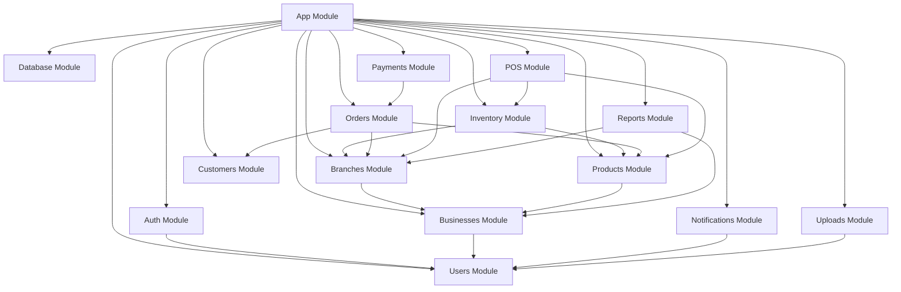

# DiveSeeks Ltd NestJS Module Structure - Layer 1

## 1. Project Structure Overview

### 1.1 Root Directory Structure
```
src/
├── app.module.ts
├── main.ts
├── common/
│   ├── decorators/
│   ├── filters/
│   ├── guards/
│   ├── interceptors/
│   ├── pipes/
│   ├── middleware/
│   └── utils/
├── config/
│   ├── database.config.ts
│   ├── jwt.config.ts
│   ├── stripe.config.ts
│   └── app.config.ts
├── modules/
│   ├── auth/
│   ├── users/
│   ├── businesses/
│   ├── branches/
│   ├── products/
│   ├── inventory/
│   ├── orders/
│   ├── pos/
│   ├── customers/
│   ├── payments/
│   ├── notifications/
│   ├── reports/
│   └── uploads/
├── database/
│   ├── entities/
│   ├── migrations/
│   ├── seeds/
│   └── database.module.ts
└── shared/
    ├── interfaces/
    ├── types/
    ├── constants/
    └── enums/
```

### 1.2 Module Dependencies Graph


## 2. Core Module Specifications

### 2.1 Authentication Module (auth/)

#### Structure
```
auth/
├── auth.module.ts
├── auth.controller.ts
├── auth.service.ts
├── strategies/
│   ├── jwt.strategy.ts
│   ├── jwt-refresh.strategy.ts
│   └── local.strategy.ts
├── guards/
│   ├── jwt-auth.guard.ts
│   ├── jwt-refresh.guard.ts
│   ├── local-auth.guard.ts
│   └── roles.guard.ts
├── decorators/
│   ├── current-user.decorator.ts
│   ├── roles.decorator.ts
│   └── public.decorator.ts
└── dto/
    ├── login.dto.ts
    ├── register.dto.ts
    ├── refresh-token.dto.ts
    ├── forgot-password.dto.ts
    └── reset-password.dto.ts
```

#### Key Features
- JWT-based authentication with refresh tokens
- Role-based access control (RBAC)
- Password reset functionality
- Session management
- Multi-factor authentication support

#### Dependencies
```typescript
// auth.module.ts
@Module({
  imports: [
    UsersModule,
    JwtModule.registerAsync({
      imports: [ConfigModule],
      useFactory: async (configService: ConfigService) => ({
        secret: configService.get('JWT_SECRET'),
        signOptions: { expiresIn: '15m' },
      }),
      inject: [ConfigService],
    }),
    PassportModule,
  ],
  controllers: [AuthController],
  providers: [
    AuthService,
    LocalStrategy,
    JwtStrategy,
    JwtRefreshStrategy,
    JwtAuthGuard,
    RolesGuard,
  ],
  exports: [AuthService, JwtAuthGuard, RolesGuard],
})
export class AuthModule {}
```

### 2.2 Users Module (users/)

#### Structure
```
users/
├── users.module.ts
├── users.controller.ts
├── users.service.ts
├── entities/
│   ├── user.entity.ts
│   ├── user-session.entity.ts
│   └── password-reset-token.entity.ts
├── dto/
│   ├── create-user.dto.ts
│   ├── update-user.dto.ts
│   ├── change-password.dto.ts
│   └── user-profile.dto.ts
└── repositories/
    ├── users.repository.ts
    ├── user-sessions.repository.ts
    └── password-reset-tokens.repository.ts
```

#### Key Features
- User CRUD operations
- Profile management
- Password management
- Session tracking
- User role management

#### Entity Example
```typescript
// entities/user.entity.ts
@Entity('users', { schema: 'auth' })
export class User {
  @PrimaryGeneratedColumn('uuid')
  id: string;

  @Column({ unique: true })
  email: string;

  @Column({ name: 'password_hash' })
  passwordHash: string;

  @Column({ name: 'first_name' })
  firstName: string;

  @Column({ name: 'last_name' })
  lastName: string;

  @Column({ nullable: true })
  phone: string;

  @Column({ name: 'avatar_url', nullable: true })
  avatarUrl: string;

  @Column({ type: 'enum', enum: UserRole })
  role: UserRole;

  @Column({ type: 'enum', enum: UserStatus, default: UserStatus.PENDING_VERIFICATION })
  status: UserStatus;

  @Column({ name: 'email_verified_at', nullable: true })
  emailVerifiedAt: Date;

  @Column({ name: 'last_login_at', nullable: true })
  lastLoginAt: Date;

  @Column({ name: 'failed_login_attempts', default: 0 })
  failedLoginAttempts: number;

  @Column({ name: 'locked_until', nullable: true })
  lockedUntil: Date;

  @CreateDateColumn({ name: 'created_at' })
  createdAt: Date;

  @UpdateDateColumn({ name: 'updated_at' })
  updatedAt: Date;

  // Relations
  @OneToMany(() => UserSession, session => session.user)
  sessions: UserSession[];

  @OneToMany(() => Business, business => business.owner)
  ownedBusinesses: Business[];

  @OneToMany(() => Business, business => business.broker)
  managedBusinesses: Business[];

  @OneToMany(() => UserBusinessPermission, permission => permission.user)
  businessPermissions: UserBusinessPermission[];
}
```

### 2.3 Businesses Module (businesses/)

#### Structure
```
businesses/
├── businesses.module.ts
├── businesses.controller.ts
├── businesses.service.ts
├── entities/
│   ├── business.entity.ts
│   ├── category.entity.ts
│   └── user-business-permission.entity.ts
├── dto/
│   ├── create-business.dto.ts
│   ├── update-business.dto.ts
│   ├── business-settings.dto.ts
│   └── assign-permission.dto.ts
└── repositories/
    ├── businesses.repository.ts
    ├── categories.repository.ts
    └── user-business-permissions.repository.ts
```

#### Key Features
- Business registration and management
- Category management
- User permission assignment
- Business settings configuration
- Multi-tenant data isolation

### 2.4 Branches Module (branches/)

#### Structure
```
branches/
├── branches.module.ts
├── branches.controller.ts
├── branches.service.ts
├── entities/
│   └── branch.entity.ts
├── dto/
│   ├── create-branch.dto.ts
│   ├── update-branch.dto.ts
│   ├── branch-settings.dto.ts
│   └── operating-hours.dto.ts
└── repositories/
    └── branches.repository.ts
```

#### Key Features
- Branch CRUD operations
- Operating hours management
- Delivery zone configuration
- Staff assignment
- Operational status control

### 2.5 Products Module (products/)

#### Structure
```
products/
├── products.module.ts
├── products.controller.ts
├── products.service.ts
├── entities/
│   └── product.entity.ts
├── dto/
│   ├── create-product.dto.ts
│   ├── update-product.dto.ts
│   ├── product-modifier.dto.ts
│   └── bulk-update.dto.ts
└── repositories/
    └── products.repository.ts
```

#### Key Features
- Product catalog management
- SKU and barcode support
- Product modifiers
- Image management
- Bulk operations

### 2.6 Inventory Module (inventory/)

#### Structure
```
inventory/
├── inventory.module.ts
├── inventory.controller.ts
├── inventory.service.ts
├── entities/
│   ├── branch-inventory.entity.ts
│   └── stock-movement.entity.ts
├── dto/
│   ├── update-stock.dto.ts
│   ├── stock-movement.dto.ts
│   ├── bulk-stock-update.dto.ts
│   └── low-stock-alert.dto.ts
└── repositories/
    ├── branch-inventory.repository.ts
    └── stock-movements.repository.ts
```

#### Key Features
- Real-time stock tracking
- Stock movement logging
- Low stock alerts
- Automatic stock status updates
- Bulk inventory operations

### 2.7 Orders Module (orders/)

#### Structure
```
orders/
├── orders.module.ts
├── orders.controller.ts
├── orders.service.ts
├── entities/
│   ├── order.entity.ts
│   ├── order-item.entity.ts
│   └── order-status-history.entity.ts
├── dto/
│   ├── create-order.dto.ts
│   ├── update-order.dto.ts
│   ├── order-item.dto.ts
│   └── order-status.dto.ts
├── repositories/
│   ├── orders.repository.ts
│   ├── order-items.repository.ts
│   └── order-status-history.repository.ts
└── services/
    ├── order-lifecycle.service.ts
    └── delivery.service.ts
```

#### Key Features
- Order lifecycle management
- Real-time status updates
- Delivery tracking
- Order history
- Kitchen display integration

### 2.8 POS Module (pos/)

#### Structure
```
pos/
├── pos.module.ts
├── pos.controller.ts
├── pos.service.ts
├── entities/
│   ├── pos-cart.entity.ts
│   └── pos-cart-item.entity.ts
├── dto/
│   ├── create-cart.dto.ts
│   ├── add-cart-item.dto.ts
│   ├── update-cart-item.dto.ts
│   └── checkout.dto.ts
├── repositories/
│   ├── pos-carts.repository.ts
│   └── pos-cart-items.repository.ts
└── services/
    ├── cart.service.ts
    └── checkout.service.ts
```

#### Key Features
- Cart management
- Barcode scanning support
- Multiple payment methods
- Split payments
- Receipt generation

### 2.9 Customers Module (customers/)

#### Structure
```
customers/
├── customers.module.ts
├── customers.controller.ts
├── customers.service.ts
├── entities/
│   └── customer.entity.ts
├── dto/
│   ├── create-customer.dto.ts
│   ├── update-customer.dto.ts
│   └── customer-address.dto.ts
└── repositories/
    └── customers.repository.ts
```

#### Key Features
- Customer profile management
- Address management
- Loyalty points tracking
- Order history
- Customer preferences

### 2.10 Payments Module (payments/)

#### Structure
```
payments/
├── payments.module.ts
├── payments.controller.ts
├── payments.service.ts
├── entities/
│   ├── transaction.entity.ts
│   └── commission-tracking.entity.ts
├── dto/
│   ├── create-payment.dto.ts
│   ├── refund.dto.ts
│   └── commission.dto.ts
├── repositories/
│   ├── transactions.repository.ts
│   └── commission-tracking.repository.ts
└── services/
    ├── stripe.service.ts
    └── commission.service.ts
```

#### Key Features
- Stripe integration
- Payment processing
- Refund handling
- Commission tracking
- Transaction logging

### 2.11 Notifications Module (notifications/)

#### Structure
```
notifications/
├── notifications.module.ts
├── notifications.controller.ts
├── notifications.service.ts
├── entities/
│   └── notification.entity.ts
├── dto/
│   ├── create-notification.dto.ts
│   ├── send-notification.dto.ts
│   └── notification-preferences.dto.ts
├── repositories/
│   └── notifications.repository.ts
└── services/
    ├── email.service.ts
    ├── sms.service.ts
    └── push.service.ts
```

#### Key Features
- Multi-channel notifications
- Real-time updates
- Notification preferences
- Template management
- Delivery tracking

### 2.12 Reports Module (reports/)

#### Structure
```
reports/
├── reports.module.ts
├── reports.controller.ts
├── reports.service.ts
├── entities/
│   └── daily-report.entity.ts
├── dto/
│   ├── generate-report.dto.ts
│   ├── report-filter.dto.ts
│   └── export-report.dto.ts
├── repositories/
│   └── daily-reports.repository.ts
└── services/
    ├── sales-report.service.ts
    ├── inventory-report.service.ts
    └── export.service.ts
```

#### Key Features
- Sales reporting
- Inventory reports
- Financial summaries
- Export functionality
- Scheduled reports

### 2.13 Uploads Module (uploads/)

#### Structure
```
uploads/
├── uploads.module.ts
├── uploads.controller.ts
├── uploads.service.ts
├── entities/
│   └── file-upload.entity.ts
├── dto/
│   ├── upload-file.dto.ts
│   └── file-metadata.dto.ts
├── repositories/
│   └── file-uploads.repository.ts
└── services/
    ├── file-storage.service.ts
    └── image-processing.service.ts
```

#### Key Features
- File upload handling
- Image processing
- File validation
- Storage management
- CDN integration

## 3. Common Module Components

### 3.1 Common Decorators

```typescript
// common/decorators/current-user.decorator.ts
export const CurrentUser = createParamDecorator(
  (data: unknown, ctx: ExecutionContext) => {
    const request = ctx.switchToHttp().getRequest();
    return request.user;
  },
);

// common/decorators/roles.decorator.ts
export const Roles = (...roles: UserRole[]) => SetMetadata('roles', roles);

// common/decorators/business-context.decorator.ts
export const BusinessContext = createParamDecorator(
  (data: unknown, ctx: ExecutionContext) => {
    const request = ctx.switchToHttp().getRequest();
    return {
      businessId: request.businessId,
      branchId: request.branchId,
    };
  },
);
```

### 3.2 Common Guards

```typescript
// common/guards/business-access.guard.ts
@Injectable()
export class BusinessAccessGuard implements CanActivate {
  constructor(
    private readonly businessService: BusinessesService,
  ) {}

  async canActivate(context: ExecutionContext): Promise<boolean> {
    const request = context.switchToHttp().getRequest();
    const user = request.user;
    const businessId = request.params.businessId || request.body.businessId;

    if (!businessId) {
      return false;
    }

    // Check if user has access to this business
    const hasAccess = await this.businessService.checkUserAccess(
      user.id,
      businessId,
    );

    if (hasAccess) {
      request.businessId = businessId;
    }

    return hasAccess;
  }
}
```

### 3.3 Common Interceptors

```typescript
// common/interceptors/business-context.interceptor.ts
@Injectable()
export class BusinessContextInterceptor implements NestInterceptor {
  intercept(context: ExecutionContext, next: CallHandler): Observable<any> {
    const request = context.switchToHttp().getRequest();
    const businessId = request.params.businessId || request.query.businessId;
    const branchId = request.params.branchId || request.query.branchId;

    if (businessId) {
      request.businessId = businessId;
    }
    if (branchId) {
      request.branchId = branchId;
    }

    return next.handle();
  }
}
```

### 3.4 Common Pipes

```typescript
// common/pipes/business-validation.pipe.ts
@Injectable()
export class BusinessValidationPipe implements PipeTransform {
  constructor(private readonly businessService: BusinessesService) {}

  async transform(value: any, metadata: ArgumentMetadata) {
    if (metadata.type === 'param' && metadata.data === 'businessId') {
      const business = await this.businessService.findOne(value);
      if (!business) {
        throw new NotFoundException('Business not found');
      }
    }
    return value;
  }
}
```

## 4. Module Configuration

### 4.1 App Module

```typescript
// app.module.ts
@Module({
  imports: [
    ConfigModule.forRoot({
      isGlobal: true,
      envFilePath: '.env',
    }),
    DatabaseModule,
    AuthModule,
    UsersModule,
    BusinessesModule,
    BranchesModule,
    ProductsModule,
    InventoryModule,
    OrdersModule,
    PosModule,
    CustomersModule,
    PaymentsModule,
    NotificationsModule,
    ReportsModule,
    UploadsModule,
  ],
  controllers: [],
  providers: [
    {
      provide: APP_GUARD,
      useClass: JwtAuthGuard,
    },
    {
      provide: APP_GUARD,
      useClass: RolesGuard,
    },
    {
      provide: APP_INTERCEPTOR,
      useClass: BusinessContextInterceptor,
    },
  ],
})
export class AppModule {}
```

### 4.2 Database Module

```typescript
// database/database.module.ts
@Module({
  imports: [
    TypeOrmModule.forRootAsync({
      imports: [ConfigModule],
      useFactory: (configService: ConfigService) => ({
        type: 'postgres',
        host: configService.get('DB_HOST'),
        port: configService.get('DB_PORT'),
        username: configService.get('DB_USERNAME'),
        password: configService.get('DB_PASSWORD'),
        database: configService.get('DB_NAME'),
        entities: [__dirname + '/../**/*.entity{.ts,.js}'],
        migrations: [__dirname + '/migrations/*{.ts,.js}'],
        synchronize: false,
        logging: configService.get('NODE_ENV') === 'development',
        ssl: configService.get('NODE_ENV') === 'production',
      }),
      inject: [ConfigService],
    }),
  ],
})
export class DatabaseModule {}
```

## 5. Shared Types and Interfaces

### 5.1 Enums

```typescript
// shared/enums/user-role.enum.ts
export enum UserRole {
  SUPER_ADMIN = 'super_admin',
  BROKER = 'broker',
  BUSINESS_OWNER = 'business_owner',
  BRANCH_MANAGER = 'branch_manager',
  CASHIER = 'cashier',
  KITCHEN_STAFF = 'kitchen_staff',
  DELIVERY_DRIVER = 'delivery_driver',
  INVENTORY_MANAGER = 'inventory_manager',
}

// shared/enums/order-status.enum.ts
export enum OrderStatus {
  PENDING = 'pending',
  ACCEPTED = 'accepted',
  PREPARING = 'preparing',
  READY = 'ready',
  OUT_FOR_DELIVERY = 'out_for_delivery',
  COMPLETED = 'completed',
  CANCELLED = 'cancelled',
}
```

### 5.2 Interfaces

```typescript
// shared/interfaces/business-context.interface.ts
export interface BusinessContext {
  businessId: string;
  branchId?: string;
  userId: string;
  userRole: UserRole;
}

// shared/interfaces/pagination.interface.ts
export interface PaginationOptions {
  page: number;
  limit: number;
  sortBy?: string;
  sortOrder?: 'ASC' | 'DESC';
}

export interface PaginatedResult<T> {
  data: T[];
  total: number;
  page: number;
  limit: number;
  totalPages: number;
}
```

### 5.3 Constants

```typescript
// shared/constants/permissions.constant.ts
export const PERMISSIONS = {
  // Business permissions
  BUSINESS_READ: 'business:read',
  BUSINESS_WRITE: 'business:write',
  BUSINESS_DELETE: 'business:delete',
  
  // Branch permissions
  BRANCH_READ: 'branch:read',
  BRANCH_WRITE: 'branch:write',
  BRANCH_MANAGE: 'branch:manage',
  
  // Order permissions
  ORDER_READ: 'order:read',
  ORDER_WRITE: 'order:write',
  ORDER_MANAGE: 'order:manage',
  
  // Inventory permissions
  INVENTORY_READ: 'inventory:read',
  INVENTORY_WRITE: 'inventory:write',
  INVENTORY_MANAGE: 'inventory:manage',
  
  // POS permissions
  POS_ACCESS: 'pos:access',
  POS_MANAGE: 'pos:manage',
  
  // Report permissions
  REPORTS_READ: 'reports:read',
  REPORTS_EXPORT: 'reports:export',
} as const;
```

## 6. Development Guidelines

### 6.1 Module Development Standards

1. **Naming Conventions**
   - Use kebab-case for file names
   - Use PascalCase for class names
   - Use camelCase for method and property names

2. **File Organization**
   - Group related files in subdirectories
   - Keep controllers, services, and repositories separate
   - Use barrel exports (index.ts) for clean imports

3. **Error Handling**
   - Use NestJS built-in exceptions
   - Implement global exception filters
   - Provide meaningful error messages

4. **Validation**
   - Use class-validator for DTO validation
   - Implement custom validators when needed
   - Validate at the controller level

5. **Testing**
   - Write unit tests for services
   - Write integration tests for controllers
   - Use test databases for integration tests

### 6.2 Security Considerations

1. **Authentication & Authorization**
   - Always verify JWT tokens
   - Implement role-based access control
   - Use business context for data isolation

2. **Data Validation**
   - Validate all input data
   - Sanitize user inputs
   - Use parameterized queries

3. **Rate Limiting**
   - Implement rate limiting on API endpoints
   - Use different limits for different user roles
   - Monitor for suspicious activity

This modular structure provides a scalable foundation for the DiveSeeks Ltd backend system, ensuring maintainability, testability, and clear separation of concerns across all business domains.