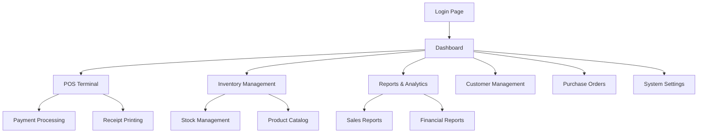

# Smart POS System - Product Requirements Document

## 1. Product Overview

The Smart POS System is an enterprise-grade point-of-sale solution designed for multi-store retail operations with advanced inventory management, comprehensive reporting, and AI-powered automation features. The system provides seamless online/offline functionality, multi-payment processing, and integrated CRM capabilities to optimize retail operations and enhance customer experience.

The platform addresses complex retail challenges including inventory tracking across multiple locations, real-time sales analytics, automated stock management, and customer loyalty programs while maintaining robust security and compliance standards.

## 2. Core Features

### 2.1 User Roles

| Role | Registration Method | Core Permissions |
|------|---------------------|------------------|
| Admin | System invitation with 2FA setup | Full system access, user management, configuration settings |
| Manager | Admin invitation with role assignment | Store management, reporting, inventory oversight |
| Cashier | Manager invitation with limited scope | POS operations, basic inventory lookup, customer service |
| Warehouse | Admin/Manager invitation | Inventory management, stock transfers, purchase orders |

### 2.2 Feature Module

Our Smart POS System consists of the following main modules:

1. **Authentication & Security Dashboard**: JWT authentication, 2FA setup, role management, activity monitoring
2. **POS Sales Interface**: Transaction processing, payment handling, receipt printing, order management
3. **Inventory Management**: Product catalog, stock tracking, batch management, supplier relations
4. **Multi-Store Operations**: Branch management, stock transfers, centralized pricing control
5. **Reporting & Analytics Dashboard**: Sales reports, performance metrics, financial summaries, visual charts
6. **Customer Management**: CRM interface, loyalty programs, customer analytics, communication tools
7. **Purchase & Vendor Management**: Purchase orders, vendor performance, cost tracking
8. **Accounting & Finance**: Daily closing, expense tracking, tax management, financial reports
9. **System Administration**: Configuration settings, audit logs, template editor, printer management
10. **AI & Automation Hub**: Stock forecasting, trend analysis, automated categorization

### 2.3 Page Details

| Page Name | Module Name | Feature description |
|-----------|-------------|---------------------|
| Login Page | Authentication | JWT login with 2FA support, role-based redirection, session management |
| Dashboard | Main Interface | Dynamic dashboard with branch/date filters, key metrics, quick actions |
| POS Terminal | Sales Processing | Barcode scanning, multi-payment processing, discount application, receipt printing |
| Product Catalog | Inventory Management | Product CRUD operations, barcode management, variation handling, batch tracking |
| Stock Management | Inventory Control | Stock levels monitoring, reorder alerts, transfer requests, expiry tracking |
| Sales Reports | Analytics | Filterable sales data, performance charts, profit calculations, export options |
| Customer Database | CRM System | Customer profiles, purchase history, loyalty points, communication logs |
| Purchase Orders | Vendor Management | PO creation/tracking, vendor performance, cost analysis, approval workflows |
| Financial Reports | Accounting | Daily closing reports, expense tracking, tax calculations, P&L statements |
| Store Management | Multi-Store Operations | Branch configuration, staff assignment, pricing control, transfer management |
| System Settings | Administration | Tax configuration, discount rules, user management, audit logs |
| AI Insights | Automation Hub | Stock forecasting, trend analysis, automated recommendations, dead stock alerts |

## 3. Core Process

### Admin Flow
1. Admin logs in with 2FA authentication
2. Accesses system configuration and user management
3. Sets up stores, products, and pricing rules
4. Monitors system-wide performance and generates reports
5. Manages vendor relationships and purchase orders

### Manager Flow
1. Manager logs in and selects store branch
2. Reviews daily sales and inventory status
3. Processes stock transfers and purchase requests
4. Generates store-specific reports and analytics
5. Manages local staff and customer relationships

### Cashier Flow
1. Cashier logs in to POS terminal
2. Processes customer transactions with barcode scanning
3. Applies discounts and handles multiple payment methods
4. Manages parked orders and processes refunds
5. Prints receipts and updates loyalty points

### Warehouse Flow
1. Warehouse staff logs in to inventory system
2. Receives and processes incoming stock
3. Updates batch information and expiry dates
4. Processes inter-store transfer requests
5. Monitors stock levels and generates reorder alerts

## 4. User Interface Design

### 4.1 Design Style

- **Primary Colors**: Deep blue (#1e40af) for headers and primary actions, light blue (#3b82f6) for secondary elements
- **Secondary Colors**: Green (#10b981) for success states, red (#ef4444) for alerts, gray (#6b7280) for neutral elements
- **Button Style**: Rounded corners (8px radius) with subtle shadows and hover effects
- **Typography**: Inter font family, 14px base size for body text, 16px for buttons, 24px+ for headings
- **Layout Style**: Card-based design with clean spacing, top navigation with sidebar for main modules
- **Icons**: Heroicons for consistency, with contextual colors and 20px standard size

### 4.2 Page Design Overview

| Page Name | Module Name | UI Elements |
|-----------|-------------|-------------|
| Login Page | Authentication | Centered card layout, gradient background, 2FA input fields, company branding |
| Dashboard | Main Interface | Grid layout with metric cards, chart widgets, quick action buttons, responsive design |
| POS Terminal | Sales Processing | Split-screen layout, product grid, cart summary, payment panel, receipt preview |
| Product Catalog | Inventory | Data table with search/filter, modal forms, image upload, barcode display |
| Reports Page | Analytics | Filter sidebar, chart containers, export buttons, date range pickers |
| Customer Management | CRM | Contact cards, timeline view, loyalty status indicators, communication buttons |

### 4.3 Responsiveness

The system is designed desktop-first with mobile-adaptive layouts for management functions. POS terminals are optimized for touch interaction with larger buttons and simplified navigation. Tablet support is prioritized for inventory management and reporting modules.

## 5. Technical Requirements

### 5.1 Performance Requirements
- POS transactions must complete within 2 seconds
- Dashboard loading time under 3 seconds
- Offline mode support for up to 1000 cached transactions
- Real-time sync when connection is restored

### 5.2 Security Requirements
- JWT tokens with 15-minute expiry and refresh token rotation
- 2FA mandatory for admin and manager roles
- Activity logging for all user actions
- IP-based access restrictions for sensitive operations

### 5.3 Integration Requirements
- Payment gateway integration (Stripe/PayPal)
- SMS/WhatsApp API for customer communication
- Barcode scanner hardware compatibility
- Receipt printer support (Bluetooth/USB/Network)
- Optional e-commerce platform sync (Shopify/WooCommerce)

### 5.4 Data Requirements
- PostgreSQL database with daily automated backups
- Real-time inventory synchronization across stores
- Historical data retention for 7 years
- GDPR compliance for customer data handling