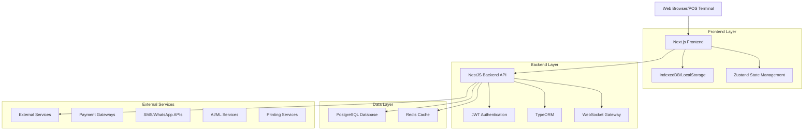
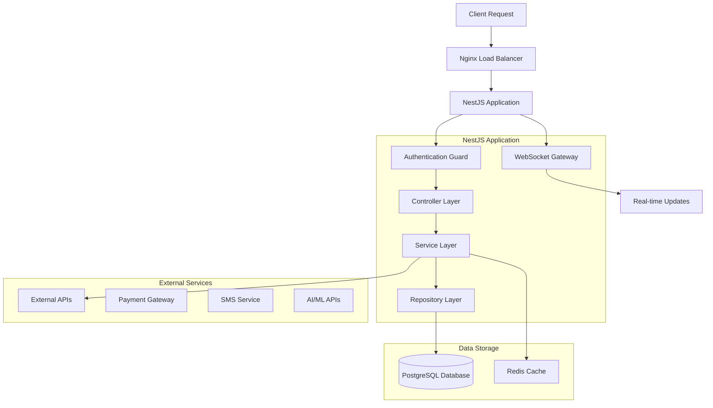
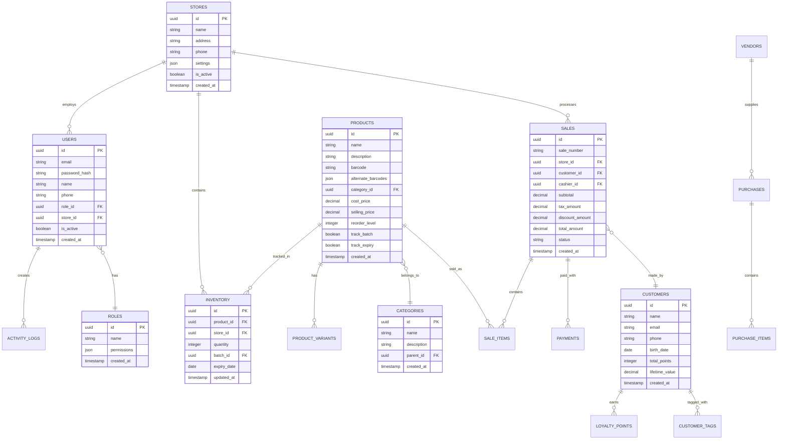

# Smart POS System - Technical Architecture Document

## 1. Architecture Design



## 2. Technology Description

- **Frontend**: Next.js@14 + TypeScript + Tailwind CSS@3 + Zustand + React Query
- **Backend**: NestJS@10 + TypeORM + PostgreSQL@15 + Redis@7
- **Authentication**: JWT + bcrypt + TOTP (2FA)
- **Real-time**: WebSocket + Socket.IO
- **Caching**: Redis for session management and frequently accessed data
- **File Storage**: Local storage with optional AWS S3 integration
- **Deployment**: Docker + PM2 + Nginx + CI/CD pipeline

## 3. Route Definitions

| Route | Purpose |
|-------|----------|
| / | Dashboard home page with role-based content |
| /login | Authentication page with 2FA support |
| /pos | POS terminal interface for sales transactions |
| /inventory | Product and stock management interface |
| /inventory/products | Product catalog and management |
| /inventory/stock | Stock levels and transfer management |
| /sales | Sales history and transaction management |
| /reports | Analytics dashboard and report generation |
| /reports/sales | Sales performance and analytics |
| /reports/financial | Financial reports and accounting |
| /customers | Customer relationship management |
| /customers/loyalty | Loyalty program management |
| /purchases | Purchase order and vendor management |
| /stores | Multi-store management and configuration |
| /settings | System configuration and administration |
| /settings/users | User management and role assignment |
| /settings/taxes | Tax configuration and rules |
| /ai-insights | AI-powered analytics and recommendations |

## 4. API Definitions

### 4.1 Authentication APIs

**User Login**
```
POST /api/auth/login
```

Request:
| Param Name | Param Type | isRequired | Description |
|------------|------------|------------|-------------|
| email | string | true | User email address |
| password | string | true | User password |
| totpCode | string | false | 2FA TOTP code (required for admin/manager) |

Response:
| Param Name | Param Type | Description |
|------------|------------|-------------|
| accessToken | string | JWT access token (15min expiry) |
| refreshToken | string | Refresh token for token renewal |
| user | object | User profile with role and permissions |

**Token Refresh**
```
POST /api/auth/refresh
```

### 4.2 Product Management APIs

**Get Products**
```
GET /api/products
```

Query Parameters:
| Param Name | Param Type | Description |
|------------|------------|-------------|
| page | number | Page number for pagination |
| limit | number | Items per page (default: 50) |
| search | string | Search term for product name/barcode |
| category | string | Filter by category ID |
| storeId | string | Filter by store location |

**Create Product**
```
POST /api/products
```

Request:
| Param Name | Param Type | isRequired | Description |
|------------|------------|------------|-------------|
| name | string | true | Product name |
| description | string | false | Product description |
| barcode | string | true | Primary barcode |
| alternateBarcodes | string[] | false | Additional barcodes |
| categoryId | string | true | Product category |
| costPrice | number | true | Purchase cost |
| sellingPrice | number | true | Retail price |
| reorderLevel | number | true | Minimum stock level |
| trackBatch | boolean | false | Enable batch tracking |
| trackExpiry | boolean | false | Enable expiry date tracking |

### 4.3 Sales Transaction APIs

**Create Sale**
```
POST /api/sales
```

Request:
| Param Name | Param Type | isRequired | Description |
|------------|------------|------------|-------------|
| storeId | string | true | Store location ID |
| customerId | string | false | Customer ID (for loyalty) |
| items | array | true | Array of sale items |
| payments | array | true | Payment method details |
| discounts | array | false | Applied discounts |
| taxAmount | number | true | Total tax amount |
| totalAmount | number | true | Final total amount |

**Sale Item Structure:**
```json
{
  "productId": "uuid",
  "quantity": 2,
  "unitPrice": 15.99,
  "discount": 0,
  "batchId": "uuid",
  "lineTotal": 31.98
}
```

### 4.4 Inventory Management APIs

**Stock Transfer**
```
POST /api/inventory/transfers
```

**Stock Adjustment**
```
POST /api/inventory/adjustments
```

### 4.5 Reporting APIs

**Sales Report**
```
GET /api/reports/sales
```

Query Parameters:
| Param Name | Param Type | Description |
|------------|------------|-------------|
| startDate | string | Report start date (ISO format) |
| endDate | string | Report end date (ISO format) |
| storeId | string | Filter by store |
| groupBy | string | Group by: day, week, month |
| format | string | Response format: json, csv, pdf |

## 5. Server Architecture Diagram



## 6. Data Model

### 6.1 Data Model Definition



### 6.2 Data Definition Language

**Users Table**
```sql
-- Create users table
CREATE TABLE users (
    id UUID PRIMARY KEY DEFAULT gen_random_uuid(),
    email VARCHAR(255) UNIQUE NOT NULL,
    password_hash VARCHAR(255) NOT NULL,
    name VARCHAR(100) NOT NULL,
    phone VARCHAR(20),
    role_id UUID NOT NULL REFERENCES roles(id),
    store_id UUID REFERENCES stores(id),
    totp_secret VARCHAR(32),
    is_active BOOLEAN DEFAULT true,
    last_login TIMESTAMP WITH TIME ZONE,
    created_at TIMESTAMP WITH TIME ZONE DEFAULT NOW(),
    updated_at TIMESTAMP WITH TIME ZONE DEFAULT NOW()
);

-- Create indexes
CREATE INDEX idx_users_email ON users(email);
CREATE INDEX idx_users_role_id ON users(role_id);
CREATE INDEX idx_users_store_id ON users(store_id);
```

**Products Table**
```sql
-- Create products table
CREATE TABLE products (
    id UUID PRIMARY KEY DEFAULT gen_random_uuid(),
    name VARCHAR(255) NOT NULL,
    description TEXT,
    barcode VARCHAR(50) UNIQUE NOT NULL,
    alternate_barcodes JSONB DEFAULT '[]',
    category_id UUID NOT NULL REFERENCES categories(id),
    cost_price DECIMAL(10,2) NOT NULL,
    selling_price DECIMAL(10,2) NOT NULL,
    reorder_level INTEGER DEFAULT 0,
    track_batch BOOLEAN DEFAULT false,
    track_expiry BOOLEAN DEFAULT false,
    is_active BOOLEAN DEFAULT true,
    created_at TIMESTAMP WITH TIME ZONE DEFAULT NOW(),
    updated_at TIMESTAMP WITH TIME ZONE DEFAULT NOW()
);

-- Create indexes
CREATE INDEX idx_products_barcode ON products(barcode);
CREATE INDEX idx_products_category_id ON products(category_id);
CREATE INDEX idx_products_name ON products USING gin(to_tsvector('english', name));
```

**Sales Table**
```sql
-- Create sales table
CREATE TABLE sales (
    id UUID PRIMARY KEY DEFAULT gen_random_uuid(),
    sale_number VARCHAR(20) UNIQUE NOT NULL,
    store_id UUID NOT NULL REFERENCES stores(id),
    customer_id UUID REFERENCES customers(id),
    cashier_id UUID NOT NULL REFERENCES users(id),
    subtotal DECIMAL(10,2) NOT NULL,
    tax_amount DECIMAL(10,2) DEFAULT 0,
    discount_amount DECIMAL(10,2) DEFAULT 0,
    total_amount DECIMAL(10,2) NOT NULL,
    status VARCHAR(20) DEFAULT 'completed',
    payment_status VARCHAR(20) DEFAULT 'paid',
    notes TEXT,
    created_at TIMESTAMP WITH TIME ZONE DEFAULT NOW(),
    updated_at TIMESTAMP WITH TIME ZONE DEFAULT NOW()
);

-- Create indexes
CREATE INDEX idx_sales_store_id ON sales(store_id);
CREATE INDEX idx_sales_customer_id ON sales(customer_id);
CREATE INDEX idx_sales_created_at ON sales(created_at DESC);
CREATE INDEX idx_sales_sale_number ON sales(sale_number);
```

**Inventory Table**
```sql
-- Create inventory table
CREATE TABLE inventory (
    id UUID PRIMARY KEY DEFAULT gen_random_uuid(),
    product_id UUID NOT NULL REFERENCES products(id),
    store_id UUID NOT NULL REFERENCES stores(id),
    quantity INTEGER NOT NULL DEFAULT 0,
    batch_id UUID REFERENCES batches(id),
    expiry_date DATE,
    cost_price DECIMAL(10,2),
    updated_at TIMESTAMP WITH TIME ZONE DEFAULT NOW(),
    UNIQUE(product_id, store_id, batch_id)
);

-- Create indexes
CREATE INDEX idx_inventory_product_store ON inventory(product_id, store_id);
CREATE INDEX idx_inventory_expiry_date ON inventory(expiry_date) WHERE expiry_date IS NOT NULL;
CREATE INDEX idx_inventory_quantity ON inventory(quantity);
```

**Initial Data**
```sql
-- Insert default roles
INSERT INTO roles (id, name, permissions) VALUES
('550e8400-e29b-41d4-a716-446655440001', 'admin', '{"all": true}'),
('550e8400-e29b-41d4-a716-446655440002', 'manager', '{"stores": ["read", "write"], "reports": ["read"], "inventory": ["read", "write"]}'),
('550e8400-e29b-41d4-a716-446655440003', 'cashier', '{"pos": ["read", "write"], "customers": ["read", "write"]}'),
('550e8400-e29b-41d4-a716-446655440004', 'warehouse', '{"inventory": ["read", "write"], "purchases": ["read", "write"]}');

-- Insert default categories
INSERT INTO categories (id, name, description) VALUES
('650e8400-e29b-41d4-a716-446655440001', 'Electronics', 'Electronic devices and accessories'),
('650e8400-e29b-41d4-a716-446655440002', 'Clothing', 'Apparel and fashion items'),
('650e8400-e29b-41d4-a716-446655440003', 'Food & Beverages', 'Consumable products'),
('650e8400-e29b-41d4-a716-446655440004', 'Health & Beauty', 'Personal care and cosmetics');

-- Insert default admin user
INSERT INTO users (id, email, password_hash, name, role_id) VALUES
('450e8400-e29b-41d4-a716-446655440001', 'admin@smartpos.com', '$2b$10$example_hash', 'System Administrator', '550e8400-e29b-41d4-a716-446655440001');
```

## 7. Security Implementation

### 7.1 Authentication Flow
1. User submits credentials to `/api/auth/login`
2. Server validates credentials and 2FA code (if required)
3. JWT access token (15min) and refresh token (7 days) are generated
4. Tokens are returned with user profile and permissions
5. Client stores tokens securely and includes access token in API requests
6. Server validates JWT on each request using authentication guard

### 7.2 Authorization
- Role-based permissions stored in database
- Guards check user permissions for each endpoint
- Resource-level authorization (e.g., store-specific access)
- Activity logging for audit trails

### 7.3 Data Protection
- All passwords hashed with bcrypt (salt rounds: 12)
- Sensitive data encrypted at rest
- HTTPS enforced for all communications
- Input validation and sanitization
- SQL injection prevention through parameterized queries

## 8. Deployment Architecture

### 8.1 Production Environment
- **Load Balancer**: Nginx with SSL termination
- **Application**: NestJS running on PM2 cluster mode
- **Database**: PostgreSQL with read replicas
- **Cache**: Redis cluster for session management
- **File Storage**: Local storage with S3 backup
- **Monitoring**: Application logs, performance metrics, error tracking

### 8.2 CI/CD Pipeline
1. Code push triggers GitHub Actions
2. Automated testing (unit, integration, e2e)
3. Docker image build and push to registry
4. Deployment to staging environment
5. Automated smoke tests
6. Production deployment with zero-downtime strategy

### 8.3 Scalability Considerations
- Horizontal scaling with load balancer
- Database connection pooling
- Redis caching for frequently accessed data
- CDN for static assets
- Microservices architecture for future expansion