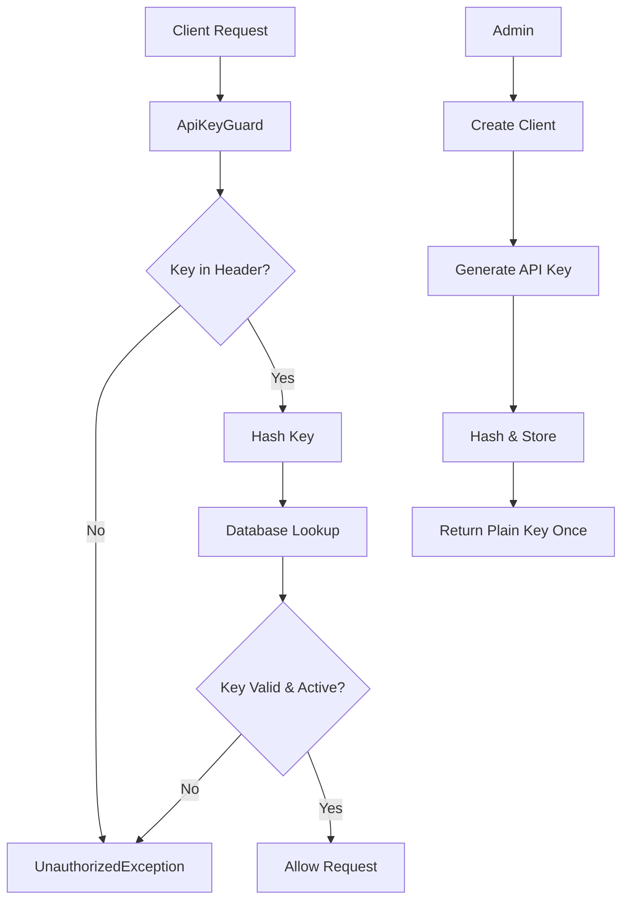

# DiveSeeks API Key Access Control Layer

## 1. Product Overview

This document outlines the implementation of a comprehensive API Key Access Control Layer for the DiveSeeks backend system. The layer provides secure API authentication using custom API keys, enabling external clients and services to access protected endpoints through x-api-key header validation.

The system manages client registrations, generates secure API keys with expiration and revocation capabilities, and integrates seamlessly with NestJS guards and Swagger documentation. It uses only core NestJS features, @nestjs/config, and TypeORM without requiring external security libraries.

## 2. Core Features

### 2.1 User Roles

| Role | Registration Method | Core Permissions |
|------|---------------------|------------------|
| API Client | Admin-created client record | Can access protected endpoints with valid API key |
| System Admin | Internal access | Can create clients, generate/revoke API keys, view all keys |

### 2.2 Feature Module

Our API Key Access Control system consists of the following main components:

1. **Guard Implementation**: Custom ApiKeyGuard for x-api-key header validation
2. **Database Entities**: Client and ApiKey models with TypeORM relationships
3. **Key Management Service**: Secure key generation, hashing, and validation
4. **Management Endpoints**: API endpoints for key creation, listing, and revocation
5. **Swagger Integration**: Documentation and security configuration

### 2.3 Page Details

| Component | Module Name | Feature Description |
|-----------|-------------|--------------------|
| Guard Implementation | ApiKeyGuard | Validates x-api-key header, checks database for active/unexpired keys, throws UnauthorizedException for invalid keys |
| Database Layer | Client Entity | Stores client information (id, name, email, timestamps) |
| Database Layer | ApiKey Entity | Stores hashed API keys with client relationship, expiration, and active status |
| Key Management | ApiKeyService | Generates secure 32+ character keys, hashes with SHA-256, manages key lifecycle |
| API Endpoints | ApiKeyController | Provides endpoints to create, list, and revoke API keys for clients |
| Documentation | Swagger Integration | Configures API key security scheme and endpoint documentation |

## 3. Core Process

### 3.1 API Key Authentication Flow

1. Client sends request with x-api-key header
2. ApiKeyGuard intercepts request and extracts key
3. Guard hashes the provided key and queries database
4. System validates key exists, is active, and not expired
5. If valid, request proceeds; if invalid, UnauthorizedException is thrown

### 3.2 Key Management Flow

1. Admin creates client record in system
2. Admin generates API key for client
3. System creates secure random key, hashes it, and stores in database
4. Plain text key is returned once to admin/client
5. Client uses key for API access
6. Admin can list, revoke, or rotate keys as needed



## 4. User Interface Design

### 4.1 Design Style

- **Primary Colors**: Professional blue (#2563eb) and success green (#16a34a)
- **Secondary Colors**: Warning amber (#f59e0b) and error red (#dc2626)
- **Button Style**: Rounded corners with subtle shadows
- **Font**: System fonts (Inter, Roboto) with 14px base size
- **Layout Style**: Clean card-based design with consistent spacing
- **Icons**: Feather icons for consistency and clarity

### 4.2 API Documentation Design

| Component | Module Name | UI Elements |
|-----------|-------------|-------------|
| Swagger UI | Security Scheme | API Key input field with lock icon, clear labeling for x-api-key header |
| Endpoint Documentation | Protected Routes | Security badge indicating API key requirement, example headers |
| Error Responses | Exception Handling | Consistent error format with status codes and descriptive messages |

### 4.3 Responsiveness

The API documentation is designed to be responsive and accessible across desktop and mobile devices, with touch-friendly interface elements for testing endpoints.

## 5. Technical Implementation

### 5.1 Database Schema

```sql
-- Client table
CREATE TABLE clients (
    id UUID PRIMARY KEY DEFAULT gen_random_uuid(),
    name VARCHAR(255) NOT NULL,
    email VARCHAR(255) UNIQUE NOT NULL,
    created_at TIMESTAMP WITH TIME ZONE DEFAULT NOW(),
    updated_at TIMESTAMP WITH TIME ZONE DEFAULT NOW()
);

-- API Key table
CREATE TABLE api_keys (
    id UUID PRIMARY KEY DEFAULT gen_random_uuid(),
    key VARCHAR(255) NOT NULL UNIQUE,
    client_id UUID NOT NULL REFERENCES clients(id) ON DELETE CASCADE,
    expires_at TIMESTAMP WITH TIME ZONE,
    is_active BOOLEAN DEFAULT true,
    created_at TIMESTAMP WITH TIME ZONE DEFAULT NOW()
);

-- Indexes for performance
CREATE INDEX idx_api_keys_key ON api_keys(key);
CREATE INDEX idx_api_keys_client_id ON api_keys(client_id);
CREATE INDEX idx_api_keys_active ON api_keys(is_active);
```

### 5.2 TypeORM Entities

```typescript
// client.entity.ts
import { Entity, PrimaryGeneratedColumn, Column, CreateDateColumn, UpdateDateColumn, OneToMany } from 'typeorm';
import { ApiKey } from './api-key.entity';

@Entity('clients')
export class Client {
  @PrimaryGeneratedColumn('uuid')
  id: string;

  @Column({ length: 255 })
  name: string;

  @Column({ length: 255, unique: true })
  email: string;

  @CreateDateColumn()
  createdAt: Date;

  @UpdateDateColumn()
  updatedAt: Date;

  @OneToMany(() => ApiKey, apiKey => apiKey.client)
  apiKeys: ApiKey[];
}

// api-key.entity.ts
import { Entity, PrimaryGeneratedColumn, Column, CreateDateColumn, ManyToOne, JoinColumn } from 'typeorm';
import { Client } from './client.entity';

@Entity('api_keys')
export class ApiKey {
  @PrimaryGeneratedColumn('uuid')
  id: string;

  @Column({ length: 255, unique: true })
  key: string;

  @Column('uuid')
  clientId: string;

  @Column({ type: 'timestamp with time zone', nullable: true })
  expiresAt: Date;

  @Column({ default: true })
  isActive: boolean;

  @CreateDateColumn()
  createdAt: Date;

  @ManyToOne(() => Client, client => client.apiKeys, { onDelete: 'CASCADE' })
  @JoinColumn({ name: 'client_id' })
  client: Client;
}
```

### 5.3 API Key Service

```typescript
// api-key.service.ts
import { Injectable, NotFoundException } from '@nestjs/common';
import { InjectRepository } from '@nestjs/typeorm';
import { Repository } from 'typeorm';
import { createHash, randomBytes } from 'crypto';
import { ApiKey } from './entities/api-key.entity';
import { Client } from './entities/client.entity';

@Injectable()
export class ApiKeyService {
  constructor(
    @InjectRepository(ApiKey)
    private apiKeyRepository: Repository<ApiKey>,
    @InjectRepository(Client)
    private clientRepository: Repository<Client>,
  ) {}

  /**
   * Generate a secure random API key (32+ characters)
   */
  private generateSecureKey(): string {
    return randomBytes(32).toString('hex'); // 64 characters
  }

  /**
   * Hash API key using SHA-256
   */
  private hashKey(key: string): string {
    return createHash('sha256').update(key).digest('hex');
  }

  /**
   * Create a new API key for a client
   */
  async createApiKey(clientId: string, expiresAt?: Date): Promise<{ key: string; apiKey: ApiKey }> {
    const client = await this.clientRepository.findOne({ where: { id: clientId } });
    if (!client) {
      throw new NotFoundException('Client not found');
    }

    const plainKey = this.generateSecureKey();
    const hashedKey = this.hashKey(plainKey);

    const apiKey = this.apiKeyRepository.create({
      key: hashedKey,
      clientId,
      expiresAt,
      isActive: true,
    });

    await this.apiKeyRepository.save(apiKey);

    return { key: plainKey, apiKey };
  }

  /**
   * Validate API key from request
   */
  async validateApiKey(key: string): Promise<ApiKey | null> {
    const hashedKey = this.hashKey(key);
    
    const apiKey = await this.apiKeyRepository.findOne({
      where: { 
        key: hashedKey,
        isActive: true 
      },
      relations: ['client']
    });

    if (!apiKey) {
      return null;
    }

    // Check if key is expired
    if (apiKey.expiresAt && new Date() > apiKey.expiresAt) {
      return null;
    }

    return apiKey;
  }

  /**
   * List all API keys for a client
   */
  async getClientApiKeys(clientId: string): Promise<ApiKey[]> {
    return this.apiKeyRepository.find({
      where: { clientId },
      order: { createdAt: 'DESC' }
    });
  }

  /**
   * Revoke an API key
   */
  async revokeApiKey(keyId: string): Promise<void> {
    await this.apiKeyRepository.update(keyId, { isActive: false });
  }

  /**
   * Delete an API key permanently
   */
  async deleteApiKey(keyId: string): Promise<void> {
    await this.apiKeyRepository.delete(keyId);
  }
}
```

### 5.4 API Key Guard

```typescript
// api-key.guard.ts
import { Injectable, CanActivate, ExecutionContext, UnauthorizedException } from '@nestjs/common';
import { ApiKeyService } from '../api-key/api-key.service';

@Injectable()
export class ApiKeyGuard implements CanActivate {
  constructor(private readonly apiKeyService: ApiKeyService) {}

  async canActivate(context: ExecutionContext): Promise<boolean> {
    const request = context.switchToHttp().getRequest();
    const apiKey = request.headers['x-api-key'];

    if (!apiKey) {
      throw new UnauthorizedException('API key is required');
    }

    const validKey = await this.apiKeyService.validateApiKey(apiKey);
    
    if (!validKey) {
      throw new UnauthorizedException('Invalid or expired API key');
    }

    // Attach client info to request for use in controllers
    request.client = validKey.client;
    request.apiKey = validKey;

    return true;
  }
}
```

### 5.5 API Key Controller

```typescript
// api-key.controller.ts
import { Controller, Post, Get, Delete, Param, Body, UseGuards } from '@nestjs/common';
import { ApiTags, ApiOperation, ApiResponse, ApiSecurity } from '@nestjs/swagger';
import { ApiKeyService } from './api-key.service';
import { CreateApiKeyDto } from './dto/create-api-key.dto';
import { ApiKeyGuard } from '../guards/api-key.guard';

@ApiTags('API Keys')
@Controller('api-keys')
export class ApiKeyController {
  constructor(private readonly apiKeyService: ApiKeyService) {}

  @Post()
  @ApiOperation({ summary: 'Create a new API key for a client' })
  @ApiResponse({ status: 201, description: 'API key created successfully' })
  @ApiResponse({ status: 404, description: 'Client not found' })
  async createApiKey(@Body() createApiKeyDto: CreateApiKeyDto) {
    const result = await this.apiKeyService.createApiKey(
      createApiKeyDto.clientId,
      createApiKeyDto.expiresAt
    );
    
    return {
      message: 'API key created successfully',
      key: result.key, // Return plain key only once
      keyId: result.apiKey.id,
      expiresAt: result.apiKey.expiresAt
    };
  }

  @Get('client/:clientId')
  @ApiOperation({ summary: 'List all API keys for a client' })
  @ApiResponse({ status: 200, description: 'API keys retrieved successfully' })
  async getClientApiKeys(@Param('clientId') clientId: string) {
    const apiKeys = await this.apiKeyService.getClientApiKeys(clientId);
    
    // Don't return the actual key values
    return apiKeys.map(key => ({
      id: key.id,
      clientId: key.clientId,
      isActive: key.isActive,
      expiresAt: key.expiresAt,
      createdAt: key.createdAt,
      keyPreview: key.key.substring(0, 8) + '...' // Show only first 8 chars
    }));
  }

  @Delete(':keyId/revoke')
  @ApiOperation({ summary: 'Revoke an API key' })
  @ApiResponse({ status: 200, description: 'API key revoked successfully' })
  async revokeApiKey(@Param('keyId') keyId: string) {
    await this.apiKeyService.revokeApiKey(keyId);
    return { message: 'API key revoked successfully' };
  }

  @Get('protected-example')
  @UseGuards(ApiKeyGuard)
  @ApiOperation({ summary: 'Example protected endpoint' })
  @ApiSecurity('api-key')
  @ApiResponse({ status: 200, description: 'Access granted' })
  @ApiResponse({ status: 401, description: 'Unauthorized - Invalid API key' })
  async protectedEndpoint() {
    return { message: 'Access granted to protected resource' };
  }
}
```

### 5.6 DTOs

```typescript
// dto/create-api-key.dto.ts
import { IsUUID, IsOptional, IsDateString } from 'class-validator';
import { ApiProperty } from '@nestjs/swagger';

export class CreateApiKeyDto {
  @ApiProperty({ description: 'Client ID to create API key for' })
  @IsUUID()
  clientId: string;

  @ApiProperty({ description: 'Optional expiration date', required: false })
  @IsOptional()
  @IsDateString()
  expiresAt?: Date;
}

// dto/create-client.dto.ts
import { IsString, IsEmail, Length } from 'class-validator';
import { ApiProperty } from '@nestjs/swagger';

export class CreateClientDto {
  @ApiProperty({ description: 'Client name' })
  @IsString()
  @Length(1, 255)
  name: string;

  @ApiProperty({ description: 'Client email address' })
  @IsEmail()
  email: string;
}
```

### 5.7 Swagger Configuration

```typescript
// main.ts
import { NestFactory } from '@nestjs/core';
import { DocumentBuilder, SwaggerModule } from '@nestjs/swagger';
import { AppModule } from './app.module';

async function bootstrap() {
  const app = await NestFactory.create(AppModule);

  // Swagger configuration
  const config = new DocumentBuilder()
    .setTitle('DiveSeeks API')
    .setDescription('DiveSeeks Backend API with API Key Authentication')
    .setVersion('1.0')
    .addApiKey(
      {
        type: 'apiKey',
        name: 'x-api-key',
        in: 'header',
        description: 'API Key for authentication'
      },
      'api-key'
    )
    .build();

  const document = SwaggerModule.createDocument(app, config);
  SwaggerModule.setup('api', app, document);

  await app.listen(3000);
}
bootstrap();
```

### 5.8 Module Configuration

```typescript
// api-key.module.ts
import { Module } from '@nestjs/common';
import { TypeOrmModule } from '@nestjs/typeorm';
import { ApiKeyService } from './api-key.service';
import { ApiKeyController } from './api-key.controller';
import { ApiKey } from './entities/api-key.entity';
import { Client } from './entities/client.entity';

@Module({
  imports: [TypeOrmModule.forFeature([ApiKey, Client])],
  controllers: [ApiKeyController],
  providers: [ApiKeyService],
  exports: [ApiKeyService],
})
export class ApiKeyModule {}

// app.module.ts (partial)
import { Module } from '@nestjs/common';
import { ConfigModule } from '@nestjs/config';
import { TypeOrmModule } from '@nestjs/typeorm';
import { ApiKeyModule } from './api-key/api-key.module';

@Module({
  imports: [
    ConfigModule.forRoot({
      isGlobal: true,
    }),
    TypeOrmModule.forRoot({
      // database configuration
    }),
    ApiKeyModule,
  ],
})
export class AppModule {}
```

## 6. Usage Examples

### 6.1 Protecting Individual Routes

```typescript
@Controller('products')
export class ProductsController {
  @Get()
  @UseGuards(ApiKeyGuard)
  @ApiSecurity('api-key')
  @ApiOperation({ summary: 'Get all products (requires API key)' })
  async findAll() {
    return this.productsService.findAll();
  }

  @Get('public')
  @ApiOperation({ summary: 'Get public products (no API key required)' })
  async findPublic() {
    return this.productsService.findPublic();
  }
}
```

### 6.2 Global Guard Application

```typescript
// app.module.ts
import { APP_GUARD } from '@nestjs/core';
import { ApiKeyGuard } from './guards/api-key.guard';

@Module({
  providers: [
    {
      provide: APP_GUARD,
      useClass: ApiKeyGuard,
    },
  ],
})
export class AppModule {}

// To bypass global guard on specific routes
@Controller('public')
export class PublicController {
  @Get()
  @SetMetadata('isPublic', true) // Custom decorator to bypass guard
  async getPublicData() {
    return { message: 'This is public data' };
  }
}
```

### 6.3 Testing with cURL

```bash
# Test protected endpoint without API key (should fail)
curl -X GET http://localhost:3000/api-keys/protected-example

# Test with valid API key
curl -X GET http://localhost:3000/api-keys/protected-example \
  -H "x-api-key: your-generated-api-key-here"

# Create new API key
curl -X POST http://localhost:3000/api-keys \
  -H "Content-Type: application/json" \
  -d '{"clientId":"client-uuid-here"}'

# List client API keys
curl -X GET http://localhost:3000/api-keys/client/client-uuid-here

# Revoke API key
curl -X DELETE http://localhost:3000/api-keys/key-uuid-here/revoke
```

### 6.4 Testing with HTTPie

```bash
# Install HTTPie
pip install httpie

# Test protected endpoint
http GET localhost:3000/api-keys/protected-example x-api-key:your-api-key

# Create API key
http POST localhost:3000/api-keys clientId=client-uuid-here

# List keys
http GET localhost:3000/api-keys/client/client-uuid-here
```

## 7. Best Practices

### 7.1 API Key Security

1. **Secure Generation**: Use cryptographically secure random number generation
2. **Hashing**: Always store hashed keys, never plain text
3. **One-time Display**: Show plain text key only once during creation
4. **Expiration**: Set reasonable expiration dates for keys
5. **Rotation**: Implement regular key rotation policies
6. **Revocation**: Provide immediate revocation capabilities

### 7.2 Environment Configuration

```typescript
// config/api-key.config.ts
import { registerAs } from '@nestjs/config';

export default registerAs('apiKey', () => ({
  defaultExpirationDays: parseInt(process.env.API_KEY_DEFAULT_EXPIRATION_DAYS, 10) || 365,
  maxKeysPerClient: parseInt(process.env.API_KEY_MAX_PER_CLIENT, 10) || 5,
  keyLength: parseInt(process.env.API_KEY_LENGTH, 10) || 32,
}));
```

### 7.3 Error Handling

```typescript
// exceptions/api-key.exceptions.ts
import { HttpException, HttpStatus } from '@nestjs/common';

export class ApiKeyExpiredException extends HttpException {
  constructor() {
    super('API key has expired', HttpStatus.UNAUTHORIZED);
  }
}

export class ApiKeyRevokedException extends HttpException {
  constructor() {
    super('API key has been revoked', HttpStatus.UNAUTHORIZED);
  }
}

export class ApiKeyNotFoundException extends HttpException {
  constructor() {
    super('API key not found', HttpStatus.UNAUTHORIZED);
  }
}
```

### 7.4 Monitoring and Logging

```typescript
// Enhanced guard with logging
@Injectable()
export class ApiKeyGuard implements CanActivate {
  private readonly logger = new Logger(ApiKeyGuard.name);

  async canActivate(context: ExecutionContext): Promise<boolean> {
    const request = context.switchToHttp().getRequest();
    const apiKey = request.headers['x-api-key'];
    const clientIp = request.ip;
    const userAgent = request.headers['user-agent'];

    if (!apiKey) {
      this.logger.warn(`API key missing from ${clientIp}`);
      throw new UnauthorizedException('API key is required');
    }

    const validKey = await this.apiKeyService.validateApiKey(apiKey);
    
    if (!validKey) {
      this.logger.warn(`Invalid API key attempt from ${clientIp}`);
      throw new UnauthorizedException('Invalid or expired API key');
    }

    this.logger.log(`Valid API key used by client ${validKey.client.name} from ${clientIp}`);
    
    request.client = validKey.client;
    request.apiKey = validKey;

    return true;
  }
}
```

### 7.5 Rate Limiting Integration

```typescript
// Enhanced service with usage tracking
@Injectable()
export class ApiKeyService {
  async trackKeyUsage(keyId: string, endpoint: string): Promise<void> {
    // Implement usage tracking for rate limiting
    // This could be stored in Redis or a separate usage table
  }

  async checkRateLimit(keyId: string): Promise<boolean> {
    // Implement rate limiting logic
    // Return false if rate limit exceeded
    return true;
  }
}
```

## 8. Testing Strategy

### 8.1 Unit Tests

```typescript
// api-key.service.spec.ts
describe('ApiKeyService', () => {
  let service: ApiKeyService;
  let apiKeyRepository: Repository<ApiKey>;

  beforeEach(async () => {
    const module: TestingModule = await Test.createTestingModule({
      providers: [
        ApiKeyService,
        {
          provide: getRepositoryToken(ApiKey),
          useClass: Repository,
        },
        {
          provide: getRepositoryToken(Client),
          useClass: Repository,
        },
      ],
    }).compile();

    service = module.get<ApiKeyService>(ApiKeyService);
    apiKeyRepository = module.get<Repository<ApiKey>>(getRepositoryToken(ApiKey));
  });

  it('should generate secure API key', async () => {
    const clientId = 'test-client-id';
    jest.spyOn(apiKeyRepository, 'create').mockReturnValue({} as ApiKey);
    jest.spyOn(apiKeyRepository, 'save').mockResolvedValue({} as ApiKey);

    const result = await service.createApiKey(clientId);
    
    expect(result.key).toHaveLength(64); // 32 bytes = 64 hex chars
    expect(result.key).toMatch(/^[a-f0-9]{64}$/);
  });

  it('should validate API key correctly', async () => {
    const testKey = 'test-key';
    const hashedKey = createHash('sha256').update(testKey).digest('hex');
    
    jest.spyOn(apiKeyRepository, 'findOne').mockResolvedValue({
      id: 'test-id',
      key: hashedKey,
      isActive: true,
      expiresAt: new Date(Date.now() + 86400000), // 24 hours from now
    } as ApiKey);

    const result = await service.validateApiKey(testKey);
    expect(result).toBeDefined();
    expect(result.isActive).toBe(true);
  });
});
```

### 8.2 Integration Tests

```typescript
// api-key.controller.e2e-spec.ts
describe('ApiKeyController (e2e)', () => {
  let app: INestApplication;
  let apiKeyService: ApiKeyService;

  beforeEach(async () => {
    const moduleFixture: TestingModule = await Test.createTestingModule({
      imports: [AppModule],
    }).compile();

    app = moduleFixture.createNestApplication();
    apiKeyService = moduleFixture.get<ApiKeyService>(ApiKeyService);
    await app.init();
  });

  it('/api-keys/protected-example (GET) should require API key', () => {
    return request(app.getHttpServer())
      .get('/api-keys/protected-example')
      .expect(401)
      .expect({
        statusCode: 401,
        message: 'API key is required',
        error: 'Unauthorized'
      });
  });

  it('/api-keys/protected-example (GET) should allow valid API key', async () => {
    const { key } = await apiKeyService.createApiKey('test-client-id');
    
    return request(app.getHttpServer())
      .get('/api-keys/protected-example')
      .set('x-api-key', key)
      .expect(200)
      .expect({
        message: 'Access granted to protected resource'
      });
  });
});
```

This comprehensive API Key Access Control Layer provides secure, scalable authentication for the DiveSeeks backend while maintaining simplicity and following NestJS best practices.