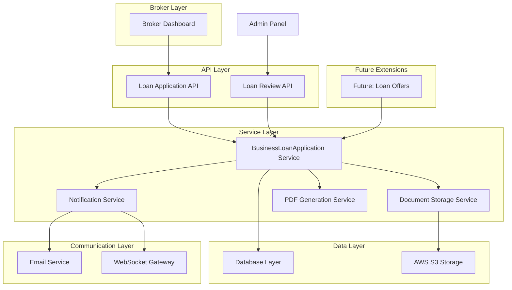

# DiveSeeks Ltd Backend Architecture - Business Loan Application Module (Layer 5)

## 1. Module Overview

This document defines the **Business Loan Application Module** for DiveSeeks Ltd's multi-tenant backend system. This fifth layer builds upon the existing broker platform to provide comprehensive business loan application capabilities, allowing brokers to apply for business loans on behalf of their clients with full tracking, processing, and management features.

### 1.1 Business Loan Application Foundation
This module extends the system with:
- **Business Loan Applications**: Complete loan application management for brokers and clients
- **Document Management**: Secure storage and handling of loan-related documents
- **Review Workflow**: Admin-controlled approval/rejection process with officer assignment
- **Notification System**: Automated notifications for all stakeholders
- **Loan Offers Management**: Future-ready system for managing loan offers and terms
- **PDF Generation**: Export capabilities for application summaries

### 1.2 Core Business Loan Objectives
- **Streamlined Loan Process**: Simplify business loan applications through broker intermediaries
- **Comprehensive Tracking**: Full lifecycle tracking from application to approval/rejection
- **Secure Document Handling**: Enterprise-grade security for sensitive financial documents
- **Admin Workflow**: Efficient review and approval processes for loan officers
- **Client Communication**: Automated notifications and status updates
- **Future Scalability**: Ready for integration with external lending partners

### 1.3 Integration Architecture


## 2. Database Schema - Business Loan Application Module

### 2.1 BusinessLoanApplication Table
```sql
-- Business loan applications submitted by brokers for clients
CREATE TABLE business_loan_applications (
    id UUID PRIMARY KEY DEFAULT gen_random_uuid(),
    broker_id UUID REFERENCES users(id) NOT NULL,
    client_id UUID REFERENCES users(id) NOT NULL,
    
    -- Business Information
    business_name VARCHAR(255) NOT NULL,
    business_type VARCHAR(100) NOT NULL CHECK (business_type IN (
        'retail', 'restaurant', 'services', 'manufacturing', 'technology', 
        'healthcare', 'construction', 'transportation', 'agriculture', 'other'
    )),
    
    -- Financial Information
    monthly_revenue DECIMAL(12,2) NOT NULL,
    loan_amount_requested DECIMAL(12,2) NOT NULL,
    loan_purpose VARCHAR(100) NOT NULL CHECK (loan_purpose IN (
        'expansion', 'equipment', 'marketing', 'inventory', 'working_capital',
        'renovation', 'technology_upgrade', 'debt_consolidation', 'other'
    )),
    
    -- Additional Business Details
    business_details JSONB,
    -- {
    --   "yearsInBusiness": number,
    --   "numberOfEmployees": number,
    --   "annualRevenue": number,
    --   "existingDebt": number,
    --   "creditScore": number,
    --   "businessAddress": {
    --     "street": "string",
    --     "city": "string",
    --     "state": "string",
    --     "zipCode": "string",
    --     "country": "string"
    --   },
    --   "ownerInfo": {
    --     "firstName": "string",
    --     "lastName": "string",
    --     "ssn": "string", // encrypted
    --     "dateOfBirth": "date",
    --     "ownershipPercentage": number
    --   }
    -- }
    
    -- Document Management
    documents JSONB DEFAULT '[]',
    -- [
    --   {
    --     "type": "financial_statements|tax_returns|bank_statements|business_license|other",
    --     "fileName": "string",
    --     "originalFileName": "string",
    --     "s3Key": "string",
    --     "s3Bucket": "string",
    --     "fileSize": number,
    --     "mimeType": "string",
    --     "uploadedAt": "timestamp",
    --     "uploadedBy": "uuid",
    --     "verified": boolean,
    --     "verifiedAt": "timestamp",
    --     "verifiedBy": "uuid"
    --   }
    -- ]
    
    -- Application Status
    status VARCHAR(20) DEFAULT 'pending' CHECK (status IN (
        'pending', 'in_review', 'approved', 'rejected', 'cancelled', 'funded'
    )),
    
    -- Review Information
    review_notes TEXT,
    assigned_officer_id UUID REFERENCES users(id),
    reviewed_by UUID REFERENCES users(id),
    reviewed_at TIMESTAMP,
    
    -- Approval Details
    approved_amount DECIMAL(12,2),
    approval_conditions TEXT,
    rejection_reason TEXT,
    
    -- Priority and Processing
    priority VARCHAR(10) DEFAULT 'normal' CHECK (priority IN ('low', 'normal', 'high', 'urgent')),
    processing_notes TEXT,
    
    -- External References
    external_application_id VARCHAR(100), -- For integration with external lenders
    lender_reference VARCHAR(100),
    
    -- Metadata
    created_at TIMESTAMP DEFAULT NOW(),
    updated_at TIMESTAMP DEFAULT NOW()
);

-- Indexes for performance
CREATE INDEX idx_loan_applications_broker ON business_loan_applications(broker_id);
CREATE INDEX idx_loan_applications_client ON business_loan_applications(client_id);
CREATE INDEX idx_loan_applications_status ON business_loan_applications(status);
CREATE INDEX idx_loan_applications_officer ON business_loan_applications(assigned_officer_id);
CREATE INDEX idx_loan_applications_created ON business_loan_applications(created_at DESC);
CREATE INDEX idx_loan_applications_amount ON business_loan_applications(loan_amount_requested);
CREATE INDEX idx_loan_applications_business_type ON business_loan_applications(business_type);
CREATE INDEX idx_loan_applications_priority ON business_loan_applications(priority, status);
```

### 2.2 Loan Application Documents Table
```sql
-- Detailed document tracking for loan applications
CREATE TABLE loan_application_documents (
    id UUID PRIMARY KEY DEFAULT gen_random_uuid(),
    application_id UUID REFERENCES business_loan_applications(id) ON DELETE CASCADE,
    
    -- Document Details
    document_type VARCHAR(50) NOT NULL,
    file_name VARCHAR(255) NOT NULL,
    original_file_name VARCHAR(255) NOT NULL,
    s3_bucket VARCHAR(100) NOT NULL,
    s3_key VARCHAR(500) NOT NULL,
    
    -- File Metadata
    file_size BIGINT NOT NULL,
    mime_type VARCHAR(100) NOT NULL,
    file_hash VARCHAR(64), -- SHA-256 hash for integrity
    
    -- Upload Tracking
    uploaded_by UUID REFERENCES users(id) NOT NULL,
    uploaded_at TIMESTAMP DEFAULT NOW(),
    
    -- Security and Access
    is_encrypted BOOLEAN DEFAULT true,
    access_level VARCHAR(20) DEFAULT 'confidential' CHECK (access_level IN ('public', 'restricted', 'confidential')),
    
    -- Verification Status
    verification_status VARCHAR(20) DEFAULT 'pending' CHECK (verification_status IN (
        'pending', 'verified', 'rejected', 'requires_update'
    )),
    verified_by UUID REFERENCES users(id),
    verified_at TIMESTAMP,
    verification_notes TEXT,
    
    -- Document Requirements
    is_required BOOLEAN DEFAULT false,
    requirement_notes TEXT,
    
    -- Metadata
    created_at TIMESTAMP DEFAULT NOW(),
    updated_at TIMESTAMP DEFAULT NOW()
);

-- Indexes for performance
CREATE INDEX idx_loan_docs_application ON loan_application_documents(application_id);
CREATE INDEX idx_loan_docs_type ON loan_application_documents(document_type);
CREATE INDEX idx_loan_docs_verification ON loan_application_documents(verification_status);
CREATE INDEX idx_loan_docs_uploaded ON loan_application_documents(uploaded_at DESC);
```

### 2.3 Loan Application Status History Table
```sql
-- Track status changes and workflow history
CREATE TABLE loan_application_status_history (
    id UUID PRIMARY KEY DEFAULT gen_random_uuid(),
    application_id UUID REFERENCES business_loan_applications(id) ON DELETE CASCADE,
    
    -- Status Change Details
    old_status VARCHAR(20),
    new_status VARCHAR(20) NOT NULL,
    changed_by UUID REFERENCES users(id) NOT NULL,
    changed_at TIMESTAMP DEFAULT NOW(),
    
    -- Change Context
    change_reason TEXT,
    notes TEXT,
    
    -- Additional Data
    metadata JSONB DEFAULT '{}',
    
    -- Metadata
    created_at TIMESTAMP DEFAULT NOW()
);

-- Indexes for performance
CREATE INDEX idx_loan_status_history_application ON loan_application_status_history(application_id);
CREATE INDEX idx_loan_status_history_changed ON loan_application_status_history(changed_at DESC);
CREATE INDEX idx_loan_status_history_status ON loan_application_status_history(new_status);
```

### 2.4 Future: Loan Offers Table
```sql
-- Future implementation: Store loan offers from lenders
CREATE TABLE loan_offers (
    id UUID PRIMARY KEY DEFAULT gen_random_uuid(),
    application_id UUID REFERENCES business_loan_applications(id) ON DELETE CASCADE,
    
    -- Offer Details
    offer_amount DECIMAL(12,2) NOT NULL,
    interest_rate DECIMAL(5,4) NOT NULL, -- e.g., 0.0575 for 5.75%
    term_months INTEGER NOT NULL,
    
    -- Lender Information
    lender_name VARCHAR(255) NOT NULL,
    lender_id VARCHAR(100),
    lender_contact_info JSONB,
    
    -- Offer Terms
    offer_terms JSONB,
    -- {
    --   "paymentFrequency": "monthly|weekly|bi-weekly",
    --   "collateralRequired": boolean,
    --   "personalGuaranteeRequired": boolean,
    --   "prepaymentPenalty": boolean,
    --   "originationFee": number,
    --   "conditions": ["string"],
    --   "specialTerms": "string"
    -- }
    
    -- Offer Status
    status VARCHAR(20) DEFAULT 'pending' CHECK (status IN (
        'pending', 'accepted', 'rejected', 'expired', 'withdrawn'
    )),
    
    -- Response Tracking
    client_response VARCHAR(20) CHECK (client_response IN ('accepted', 'rejected', 'counter_offer')),
    response_notes TEXT,
    responded_at TIMESTAMP,
    
    -- Validity
    expires_at TIMESTAMP NOT NULL,
    
    -- Metadata
    created_at TIMESTAMP DEFAULT NOW(),
    updated_at TIMESTAMP DEFAULT NOW()
);

-- Indexes for performance
CREATE INDEX idx_loan_offers_application ON loan_offers(application_id);
CREATE INDEX idx_loan_offers_status ON loan_offers(status);
CREATE INDEX idx_loan_offers_expires ON loan_offers(expires_at);
CREATE INDEX idx_loan_offers_amount ON loan_offers(offer_amount);
```

## 3. NestJS API Endpoints - Business Loan Application

### 3.1 Loan Application Submission

#### 3.1.1 Submit Loan Application
```typescript
// POST /api/loans/apply
// Submit a new business loan application

interface BusinessLoanApplicationRequest {
  brokerId: string;
  clientId: string;
  businessName: string;
  businessType: 'retail' | 'restaurant' | 'services' | 'manufacturing' | 'technology' | 'healthcare' | 'construction' | 'transportation' | 'agriculture' | 'other';
  monthlyRevenue: number;
  loanAmountRequested: number;
  loanPurpose: 'expansion' | 'equipment' | 'marketing' | 'inventory' | 'working_capital' | 'renovation' | 'technology_upgrade' | 'debt_consolidation' | 'other';
  businessDetails?: {
    yearsInBusiness?: number;
    numberOfEmployees?: number;
    annualRevenue?: number;
    existingDebt?: number;
    creditScore?: number;
    businessAddress?: {
      street: string;
      city: string;
      state: string;
      zipCode: string;
      country: string;
    };
    ownerInfo?: {
      firstName: string;
      lastName: string;
      ssn?: string; // Will be encrypted
      dateOfBirth?: string;
      ownershipPercentage?: number;
    };
  };
  documents?: {
    type: 'financial_statements' | 'tax_returns' | 'bank_statements' | 'business_license' | 'other';
    fileName: string;
    s3Key: string;
  }[];
  priority?: 'low' | 'normal' | 'high' | 'urgent';
  processingNotes?: string;
}

interface BusinessLoanApplicationResponse {
  success: boolean;
  data: {
    applicationId: string;
    status: string;
    submittedAt: string;
    estimatedReviewTime: string;
    applicationNumber: string;
    nextSteps: string[];
  };
  message: string;
}
```

#### 3.1.2 Get Broker's Loan Applications
```typescript
// GET /api/loans/broker/{brokerId}
// Retrieve all loan applications submitted by a broker

interface GetBrokerLoanApplicationsQuery {
  status?: 'pending' | 'in_review' | 'approved' | 'rejected' | 'cancelled' | 'funded';
  page?: number;
  limit?: number;
  sortBy?: 'created_at' | 'updated_at' | 'loan_amount_requested' | 'business_name';
  sortOrder?: 'asc' | 'desc';
  clientId?: string;
  businessType?: string;
  amountMin?: number;
  amountMax?: number;
  dateFrom?: string;
  dateTo?: string;
}

interface GetBrokerLoanApplicationsResponse {
  success: boolean;
  data: {
    applications: {
      id: string;
      businessName: string;
      businessType: string;
      clientInfo: {
        firstName: string;
        lastName: string;
        email: string;
      };
      loanAmountRequested: number;
      loanPurpose: string;
      status: string;
      priority: string;
      assignedOfficer?: {
        firstName: string;
        lastName: string;
        email: string;
      };
      submittedAt: string;
      updatedAt: string;
      reviewedAt?: string;
    }[];
    pagination: {
      total: number;
      page: number;
      limit: number;
      totalPages: number;
    };
    summary: {
      totalApplications: number;
      totalRequested: number;
      averageAmount: number;
      approvalRate: number;
      statusBreakdown: Record<string, number>;
    };
  };
}
```

#### 3.1.3 Get Loan Application Details
```typescript
// GET /api/loans/{loanId}
// Get detailed information about a specific loan application

interface LoanApplicationDetailsResponse {
  success: boolean;
  data: {
    id: string;
    broker: {
      id: string;
      firstName: string;
      lastName: string;
      email: string;
      phone: string;
    };
    client: {
      id: string;
      firstName: string;
      lastName: string;
      email: string;
      phone: string;
    };
    businessName: string;
    businessType: string;
    monthlyRevenue: number;
    loanAmountRequested: number;
    loanPurpose: string;
    businessDetails: Record<string, any>;
    documents: {
      id: string;
      type: string;
      fileName: string;
      originalFileName: string;
      fileSize: number;
      uploadedAt: string;
      verificationStatus: string;
      isRequired: boolean;
    }[];
    status: string;
    priority: string;
    reviewNotes?: string;
    assignedOfficer?: {
      id: string;
      firstName: string;
      lastName: string;
      email: string;
    };
    approvedAmount?: number;
    approvalConditions?: string;
    rejectionReason?: string;
    timeline: {
      event: string;
      timestamp: string;
      performedBy?: string;
      notes?: string;
    }[];
    createdAt: string;
    updatedAt: string;
  };
}
```

### 3.2 Admin Panel Endpoints

#### 3.2.1 Get All Loan Applications (Admin)
```typescript
// GET /api/loans/admin
// Admin panel view of all loan applications with filtering and pagination

interface GetAdminLoanApplicationsQuery {
  status?: string;
  brokerId?: string;
  assignedOfficerId?: string;
  businessType?: string;
  priority?: string;
  amountMin?: number;
  amountMax?: number;
  dateFrom?: string;
  dateTo?: string;
  page?: number;
  limit?: number;
  sortBy?: string;
  sortOrder?: 'asc' | 'desc';
  search?: string; // Search in business name, broker name, client name
}

interface GetAdminLoanApplicationsResponse {
  success: boolean;
  data: {
    applications: {
      id: string;
      businessName: string;
      businessType: string;
      broker: {
        firstName: string;
        lastName: string;
        email: string;
      };
      client: {
        firstName: string;
        lastName: string;
        email: string;
      };
      loanAmountRequested: number;
      loanPurpose: string;
      status: string;
      priority: string;
      assignedOfficer?: {
        firstName: string;
        lastName: string;
      };
      submittedAt: string;
      updatedAt: string;
      daysSinceSubmission: number;
    }[];
    pagination: {
      total: number;
      page: number;
      limit: number;
      totalPages: number;
    };
    analytics: {
      totalApplications: number;
      totalRequested: number;
      averageAmount: number;
      approvalRate: number;
      averageProcessingTime: number;
      statusBreakdown: Record<string, number>;
      priorityBreakdown: Record<string, number>;
      businessTypeBreakdown: Record<string, number>;
    };
  };
}
```

#### 3.2.2 Review Loan Application
```typescript
// PATCH /api/loans/{loanId}/review
// Admin endpoint to approve/reject loan application

interface ReviewLoanApplicationRequest {
  status: 'approved' | 'rejected' | 'in_review';
  reviewNotes?: string;
  approvedAmount?: number; // If different from requested amount
  approvalConditions?: string;
  rejectionReason?: string;
  assignedOfficerId?: string;
  priority?: 'low' | 'normal' | 'high' | 'urgent';
  processingNotes?: string;
}

interface ReviewLoanApplicationResponse {
  success: boolean;
  data: {
    applicationId: string;
    status: string;
    reviewedAt: string;
    reviewedBy: string;
    approvedAmount?: number;
    nextSteps: string[];
  };
  message: string;
}
```

#### 3.2.3 Assign Loan Officer
```typescript
// PATCH /api/loans/{loanId}/assign
// Assign a loan officer to review the application

interface AssignLoanOfficerRequest {
  assignedOfficerId: string;
  notes?: string;
}

interface AssignLoanOfficerResponse {
  success: boolean;
  data: {
    applicationId: string;
    assignedOfficer: {
      id: string;
      firstName: string;
      lastName: string;
      email: string;
    };
    assignedAt: string;
  };
  message: string;
}
```

### 3.3 Document Management Endpoints

#### 3.3.1 Upload Loan Document
```typescript
// POST /api/loans/{loanId}/documents
// Upload a document for a loan application

interface UploadLoanDocumentRequest {
  documentType: 'financial_statements' | 'tax_returns' | 'bank_statements' | 'business_license' | 'other';
  file: File; // Multipart form data
  description?: string;
  isRequired?: boolean;
}

interface UploadLoanDocumentResponse {
  success: boolean;
  data: {
    documentId: string;
    fileName: string;
    s3Key: string;
    uploadedAt: string;
    fileSize: number;
    verificationStatus: string;
  };
  message: string;
}
```

#### 3.3.2 Get Document Download URL
```typescript
// GET /api/loans/{loanId}/documents/{documentId}/download
// Get a secure download URL for a loan document

interface LoanDocumentDownloadResponse {
  success: boolean;
  data: {
    downloadUrl: string;
    expiresAt: string;
    fileName: string;
    fileSize: number;
  };
}
```

## 4. NestJS Service Implementation

### 4.1 Business Loan Application Service
```typescript
@Injectable()
export class BusinessLoanApplicationService {
  constructor(
    @InjectRepository(BusinessLoanApplication)
    private loanApplicationRepository: Repository<BusinessLoanApplication>,
    @InjectRepository(LoanApplicationDocument)
    private documentRepository: Repository<LoanApplicationDocument>,
    @InjectRepository(LoanApplicationStatusHistory)
    private statusHistoryRepository: Repository<LoanApplicationStatusHistory>,
    private userService: UserService,
    private notificationService: NotificationService,
    private documentService: LoanDocumentService,
    private pdfService: PDFGenerationService
  ) {}
  
  async submitLoanApplication(
    applicationData: BusinessLoanApplicationRequest,
    submittedBy: string
  ): Promise<BusinessLoanApplication> {
    // Validate broker permissions
    await this.validateBrokerPermissions(applicationData.brokerId, submittedBy);
    
    // Validate client exists and belongs to broker
    await this.validateClientAccess(applicationData.clientId, applicationData.brokerId);
    
    // Generate application number
    const applicationNumber = await this.generateApplicationNumber();
    
    // Encrypt sensitive data
    const encryptedBusinessDetails = await this.encryptSensitiveData(
      applicationData.businessDetails
    );
    
    // Create loan application
    const loanApplication = await this.loanApplicationRepository.save({
      ...applicationData,
      businessDetails: encryptedBusinessDetails,
      status: 'pending',
      priority: applicationData.priority || 'normal',
      applicationNumber,
      createdAt: new Date(),
      updatedAt: new Date()
    });
    
    // Process documents if provided
    if (applicationData.documents && applicationData.documents.length > 0) {
      await this.processApplicationDocuments(
        loanApplication.id,
        applicationData.documents,
        submittedBy
      );
    }
    
    // Record initial status
    await this.recordStatusChange(
      loanApplication.id,
      null,
      'pending',
      submittedBy,
      'Application submitted'
    );
    
    // Send notifications
    await this.sendApplicationSubmittedNotifications(loanApplication);
    
    return loanApplication;
  }
  
  async getBrokerApplications(
    brokerId: string,
    query: GetBrokerLoanApplicationsQuery
  ): Promise<GetBrokerLoanApplicationsResponse> {
    const queryBuilder = this.loanApplicationRepository
      .createQueryBuilder('app')
      .leftJoinAndSelect('app.client', 'client')
      .leftJoinAndSelect('app.assignedOfficer', 'officer')
      .where('app.brokerId = :brokerId', { brokerId });
    
    // Apply filters
    if (query.status) {
      queryBuilder.andWhere('app.status = :status', { status: query.status });
    }
    
    if (query.clientId) {
      queryBuilder.andWhere('app.clientId = :clientId', { clientId: query.clientId });
    }
    
    if (query.businessType) {
      queryBuilder.andWhere('app.businessType = :businessType', { businessType: query.businessType });
    }
    
    if (query.amountMin) {
      queryBuilder.andWhere('app.loanAmountRequested >= :amountMin', { amountMin: query.amountMin });
    }
    
    if (query.amountMax) {
      queryBuilder.andWhere('app.loanAmountRequested <= :amountMax', { amountMax: query.amountMax });
    }
    
    if (query.dateFrom) {
      queryBuilder.andWhere('app.createdAt >= :dateFrom', { dateFrom: query.dateFrom });
    }
    
    if (query.dateTo) {
      queryBuilder.andWhere('app.createdAt <= :dateTo', { dateTo: query.dateTo });
    }
    
    // Apply sorting
    const sortBy = query.sortBy || 'createdAt';
    const sortOrder = query.sortOrder || 'desc';
    queryBuilder.orderBy(`app.${sortBy}`, sortOrder.toUpperCase() as 'ASC' | 'DESC');
    
    // Apply pagination
    const page = query.page || 1;
    const limit = query.limit || 20;
    const offset = (page - 1) * limit;
    
    queryBuilder.skip(offset).take(limit);
    
    const [applications, total] = await queryBuilder.getManyAndCount();
    
    // Calculate summary statistics
    const summary = await this.calculateBrokerSummary(brokerId);
    
    return {
      success: true,
      data: {
        applications: applications.map(app => this.formatApplicationSummary(app)),
        pagination: {
          total,
          page,
          limit,
          totalPages: Math.ceil(total / limit)
        },
        summary
      }
    };
  }
  
  async reviewApplication(
    applicationId: string,
    reviewData: ReviewLoanApplicationRequest,
    reviewedBy: string
  ): Promise<BusinessLoanApplication> {
    const application = await this.loanApplicationRepository.findOne({
      where: { id: applicationId },
      relations: ['broker', 'client']
    });
    
    if (!application) {
      throw new NotFoundException('Loan application not found');
    }
    
    const oldStatus = application.status;
    
    // Update application
    await this.loanApplicationRepository.update(applicationId, {
      status: reviewData.status,
      reviewNotes: reviewData.reviewNotes,
      reviewedBy,
      reviewedAt: new Date(),
      approvedAmount: reviewData.approvedAmount,
      approvalConditions: reviewData.approvalConditions,
      rejectionReason: reviewData.rejectionReason,
      assignedOfficerId: reviewData.assignedOfficerId,
      priority: reviewData.priority || application.priority,
      processingNotes: reviewData.processingNotes,
      updatedAt: new Date()
    });
    
    // Record status change
    await this.recordStatusChange(
      applicationId,
      oldStatus,
      reviewData.status,
      reviewedBy,
      reviewData.reviewNotes
    );
    
    // Send notifications based on status
    await this.handleStatusChangeNotifications(application, reviewData.status, reviewData);
    
    // Generate PDF if approved
    if (reviewData.status === 'approved') {
      await this.generateApprovalPDF(application, reviewData);
    }
    
    return await this.loanApplicationRepository.findOne({
      where: { id: applicationId },
      relations: ['broker', 'client', 'assignedOfficer']
    });
  }
  
  private async validateBrokerPermissions(brokerId: string, userId: string): Promise<void> {
    const user = await this.userService.findById(userId);
    
    if (!user.roles.some(role => ['BrokerAdmin', 'AgencyStaff'].includes(role.name))) {
      throw new ForbiddenException('Only brokers can submit loan applications');
    }
    
    if (brokerId !== userId && !await this.userService.isAgencyMember(userId, brokerId)) {
      throw new ForbiddenException('Cannot submit applications for other brokers');
    }
  }
  
  private async validateClientAccess(clientId: string, brokerId: string): Promise<void> {
    const client = await this.userService.findById(clientId);
    
    if (!client) {
      throw new NotFoundException('Client not found');
    }
    
    // Verify client belongs to broker's agency
    const hasAccess = await this.userService.hasClientAccess(brokerId, clientId);
    
    if (!hasAccess) {
      throw new ForbiddenException('No access to this client');
    }
  }
  
  private async generateApplicationNumber(): Promise<string> {
    const year = new Date().getFullYear();
    const count = await this.loanApplicationRepository.count({
      where: {
        createdAt: Between(
          new Date(`${year}-01-01`),
          new Date(`${year}-12-31`)
        )
      }
    });
    
    return `LOAN-${year}-${String(count + 1).padStart(6, '0')}`;
  }
  
  private async encryptSensitiveData(businessDetails: any): Promise<any> {
    if (!businessDetails) return businessDetails;
    
    const encrypted = { ...businessDetails };
    
    // Encrypt SSN if provided
    if (encrypted.ownerInfo?.ssn) {
      encrypted.ownerInfo.ssn = await this.encryptionService.encrypt(
        encrypted.ownerInfo.ssn
      );
    }
    
    return encrypted;
  }
  
  private async recordStatusChange(
    applicationId: string,
    oldStatus: string,
    newStatus: string,
    changedBy: string,
    notes?: string
  ): Promise<void> {
    await this.statusHistoryRepository.save({
      applicationId,
      oldStatus,
      newStatus,
      changedBy,
      changeReason: notes,
      changedAt: new Date()
    });
  }
  
  private async sendApplicationSubmittedNotifications(
    application: BusinessLoanApplication
  ): Promise<void> {
    // Notify admin team
    await this.notificationService.sendAdminNotification({
      type: 'loan_application_submitted',
      title: 'New Business Loan Application',
      message: `New loan application for $${application.loanAmountRequested.toLocaleString()} submitted by ${application.broker.firstName} ${application.broker.lastName}`,
      data: {
        applicationId: application.id,
        businessName: application.businessName,
        amount: application.loanAmountRequested,
        broker: `${application.broker.firstName} ${application.broker.lastName}`
      },
      actionUrl: `/admin/loans/${application.id}`
    });
    
    // Send email to broker
    await this.notificationService.sendEmail({
      to: application.broker.email,
      template: 'loan_application_submitted',
      data: {
        brokerName: `${application.broker.firstName} ${application.broker.lastName}`,
        businessName: application.businessName,
        applicationNumber: application.applicationNumber,
        amount: application.loanAmountRequested,
        trackingUrl: `${process.env.BROKER_PORTAL_URL}/loans/${application.id}`
      }
    });
  }
  
  private async handleStatusChangeNotifications(
    application: BusinessLoanApplication,
    newStatus: string,
    reviewData: ReviewLoanApplicationRequest
  ): Promise<void> {
    switch (newStatus) {
      case 'approved':
        await this.sendApprovalNotifications(application, reviewData);
        break;
      case 'rejected':
        await this.sendRejectionNotifications(application, reviewData);
        break;
      case 'in_review':
        await this.sendReviewStartedNotifications(application);
        break;
    }
  }
  
  private async sendApprovalNotifications(
    application: BusinessLoanApplication,
    reviewData: ReviewLoanApplicationRequest
  ): Promise<void> {
    // Notify broker
    await this.notificationService.sendEmail({
      to: application.broker.email,
      template: 'loan_application_approved',
      data: {
        brokerName: `${application.broker.firstName} ${application.broker.lastName}`,
        clientName: `${application.client.firstName} ${application.client.lastName}`,
        businessName: application.businessName,
        approvedAmount: reviewData.approvedAmount || application.loanAmountRequested,
        conditions: reviewData.approvalConditions,
        applicationNumber: application.applicationNumber
      }
    });
    
    // Notify client
    await this.notificationService.sendEmail({
      to: application.client.email,
      template: 'loan_approved_client',
      data: {
        clientName: `${application.client.firstName} ${application.client.lastName}`,
        businessName: application.businessName,
        approvedAmount: reviewData.approvedAmount || application.loanAmountRequested,
        brokerName: `${application.broker.firstName} ${application.broker.lastName}`,
        brokerEmail: application.broker.email
      }
    });
  }
  
  private async generateApprovalPDF(
    application: BusinessLoanApplication,
    reviewData: ReviewLoanApplicationRequest
  ): Promise<void> {
    const pdfData = {
      applicationNumber: application.applicationNumber,
      businessName: application.businessName,
      clientName: `${application.client.firstName} ${application.client.lastName}`,
      brokerName: `${application.broker.firstName} ${application.broker.lastName}`,
      requestedAmount: application.loanAmountRequested,
      approvedAmount: reviewData.approvedAmount || application.loanAmountRequested,
      approvalConditions: reviewData.approvalConditions,
      approvedAt: new Date(),
      applicationDetails: application.businessDetails
    };
    
    await this.pdfService.generateLoanApprovalPDF(application.id, pdfData);
  }
}
```

### 4.2 Loan Document Service
```typescript
@Injectable()
export class LoanDocumentService {
  constructor(
    @InjectRepository(LoanApplicationDocument)
    private documentRepository: Repository<LoanApplicationDocument>,
    private s3Service: S3Service,
    private encryptionService: EncryptionService
  ) {}
  
  async uploadDocument(
    applicationId: string,
    file: Express.Multer.File,
    documentType: string,
    uploadedBy: string,
    isRequired: boolean = false
  ): Promise<LoanApplicationDocument> {
    // Validate file
    this.validateFile(file);
    
    // Generate secure file name
    const fileExtension = path.extname(file.originalname);
    const fileName = `${Date.now()}-${Math.random().toString(36).substring(7)}${fileExtension}`;
    const s3Key = `loan-applications/${applicationId}/documents/${documentType}/${fileName}`;
    
    // Encrypt file content
    const encryptedBuffer = await this.encryptionService.encryptFile(file.buffer);
    
    // Upload to S3
    const uploadResult = await this.s3Service.uploadFile({
      bucket: process.env.LOAN_DOCUMENTS_BUCKET,
      key: s3Key,
      body: encryptedBuffer,
      contentType: file.mimetype,
      metadata: {
        'original-name': file.originalname,
        'uploaded-by': uploadedBy,
        'application-id': applicationId,
        'document-type': documentType,
        'upload-timestamp': new Date().toISOString()
      }
    });
    
    // Calculate file hash
    const fileHash = crypto.createHash('sha256').update(file.buffer).digest('hex');
    
    // Save document record
    const document = await this.documentRepository.save({
      applicationId,
      documentType,
      fileName,
      originalFileName: file.originalname,
      s3Bucket: process.env.LOAN_DOCUMENTS_BUCKET,
      s3Key,
      fileSize: file.size,
      mimeType: file.mimetype,
      fileHash,
      uploadedBy,
      isEncrypted: true,
      accessLevel: 'confidential',
      isRequired,
      verificationStatus: 'pending',
      uploadedAt: new Date(),
      createdAt: new Date(),
      updatedAt: new Date()
    });
    
    return document;
  }
  
  async generateDownloadUrl(
    documentId: string,
    userId: string,
    expiresIn: number = 3600
  ): Promise<string> {
    const document = await this.documentRepository.findOne({
      where: { id: documentId },
      relations: ['application']
    });
    
    if (!document) {
      throw new NotFoundException('Document not found');
    }
    
    // Validate access
    await this.validateDocumentAccess(document, userId);
    
    // Generate presigned URL
    return await this.s3Service.generatePresignedUrl(
      document.s3Bucket,
      document.s3Key,
      expiresIn
    );
  }
  
  async verifyDocument(
    documentId: string,
    verificationStatus: 'verified' | 'rejected' | 'requires_update',
    verifiedBy: string,
    notes?: string
  ): Promise<void> {
    await this.documentRepository.update(documentId, {
      verificationStatus,
      verifiedBy,
      verifiedAt: new Date(),
      verificationNotes: notes,
      updatedAt: new Date()
    });
  }
  
  private validateFile(file: Express.Multer.File): void {
    const allowedMimeTypes = [
      'application/pdf',
      'image/jpeg',
      'image/png',
      'application/msword',
      'application/vnd.openxmlformats-officedocument.wordprocessingml.document',
      'application/vnd.ms-excel',
      'application/vnd.openxmlformats-officedocument.spreadsheetml.sheet'
    ];
    
    if (!allowedMimeTypes.includes(file.mimetype)) {
      throw new BadRequestException('Invalid file type');
    }
    
    if (file.size > 10 * 1024 * 1024) { // 10MB limit
      throw new BadRequestException('File size too large');
    }
  }
  
  private async validateDocumentAccess(
    document: LoanApplicationDocument,
    userId: string
  ): Promise<void> {
    const user = await this.userService.findById(userId);
    
    // Admin can access all documents
    if (user.roles.some(role => ['Admin', 'SuperAdmin', 'LoanOfficer'].includes(role.name))) {
      return;
    }
    
    // Broker can access their own application documents
    if (document.application.brokerId === userId) {
      return;
    }
    
    // Client can access their own application documents
    if (document.application.clientId === userId) {
      return;
    }
    
    throw new ForbiddenException('Access denied to this document');
  }
}
```

## 5. Business Logic Rules Implementation

### 5.1 Role-Based Access Control
```typescript
@Injectable()
export class LoanApplicationGuard implements CanActivate {
  constructor(
    private reflector: Reflector,
    private userService: UserService
  ) {}
  
  async canActivate(context: ExecutionContext): Promise<boolean> {
    const requiredRoles = this.reflector.getAllAndOverride<string[]>('roles', [
      context.getHandler(),
      context.getClass(),
    ]);
    
    if (!requiredRoles) {
      return true;
    }
    
    const request = context.switchToHttp().getRequest();
    const user = request.user;
    
    // Check if user has required roles
    const hasRole = requiredRoles.some(role => 
      user.roles.some(userRole => userRole.name === role)
    );
    
    if (!hasRole) {
      return false;
    }
    
    // Additional checks for broker operations
    if (requiredRoles.includes('BrokerAdmin') || requiredRoles.includes('AgencyStaff')) {
      const brokerId = request.params.brokerId || request.body.brokerId;
      
      if (brokerId && user.id !== brokerId) {
        // Check if user is agency member
        const isAgencyMember = await this.userService.isAgencyMember(user.id, brokerId);
        if (!isAgencyMember) {
          return false;
        }
      }
    }
    
    return true;
  }
}

// Usage in controllers
@Controller('loans')
@UseGuards(JwtAuthGuard, LoanApplicationGuard)
export class LoanApplicationController {
  
  @Post('apply')
  @Roles('BrokerAdmin', 'AgencyStaff')
  async submitApplication(
    @Body() applicationData: BusinessLoanApplicationRequest,
    @CurrentUser() user: any
  ): Promise<BusinessLoanApplicationResponse> {
    // Implementation
  }
  
  @Get('admin')
  @Roles('Admin', 'SuperAdmin', 'LoanOfficer')
  async getAdminApplications(
    @Query() query: GetAdminLoanApplicationsQuery
  ): Promise<GetAdminLoanApplicationsResponse> {
    // Implementation
  }
  
  @Patch(':loanId/review')
  @Roles('Admin', 'SuperAdmin', 'LoanOfficer')
  async reviewApplication(
    @Param('loanId') loanId: string,
    @Body() reviewData: ReviewLoanApplicationRequest,
    @CurrentUser() user: any
  ): Promise<ReviewLoanApplicationResponse> {
    // Implementation
  }
}
```

### 5.2 Notification System Integration
```typescript
@Injectable()
export class LoanNotificationService {
  constructor(
    private emailService: EmailService,
    private webSocketGateway: AdminWebSocketGateway,
    private notificationRepository: Repository<Notification>
  ) {}
  
  async sendAdminNotification(notificationData: any): Promise<void> {
    // Save notification to database
    const notification = await this.notificationRepository.save({
      type: notificationData.type,
      title: notificationData.title,
      message: notificationData.message,
      data: notificationData.data,
      actionUrl: notificationData.actionUrl,
      priority: this.calculatePriority(notificationData),
      createdAt: new Date()
    });
    
    // Send real-time notification to admin panel
    this.webSocketGateway.sendToAdmins('new_loan_application', notification);
    
    // Send email to admin team
    await this.emailService.sendEmail({
      to: process.env.LOAN_ADMIN_EMAIL,
      template: 'admin_new_loan_application',
      data: notificationData.data
    });
    
    // Send SMS for high-priority applications
    if (notification.priority === 'high') {
      await this.sendHighPriorityAlert(notificationData);
    }
  }
  
  private calculatePriority(notificationData: any): string {
    const amount = notificationData.data.amount;
    
    if (amount >= 500000) return 'high';
    if (amount >= 100000) return 'medium';
    return 'normal';
  }
  
  private async sendHighPriorityAlert(notificationData: any): Promise<void> {
    // Implementation for SMS or other urgent notification methods
  }
}
```

### 5.3 PDF Generation Service
```typescript
@Injectable()
export class PDFGenerationService {
  constructor(
    private s3Service: S3Service
  ) {}
  
  async generateLoanApprovalPDF(
    applicationId: string,
    data: any
  ): Promise<string> {
    const pdfContent = await this.createApprovalPDFContent(data);
    
    // Generate PDF using a library like puppeteer or pdfkit
    const pdfBuffer = await this.generatePDF(pdfContent);
    
    // Upload to S3
    const s3Key = `loan-applications/${applicationId}/approval-letter.pdf`;
    
    await this.s3Service.uploadFile({
      bucket: process.env.LOAN_DOCUMENTS_BUCKET,
      key: s3Key,
      body: pdfBuffer,
      contentType: 'application/pdf',
      metadata: {
        'document-type': 'approval-letter',
        'application-id': applicationId,
        'generated-at': new Date().toISOString()
      }
    });
    
    return s3Key;
  }
  
  private async createApprovalPDFContent(data: any): Promise<string> {
    return `
      <!DOCTYPE html>
      <html>
      <head>
        <title>Loan Approval Letter</title>
        <style>
          body { font-family: Arial, sans-serif; margin: 40px; }
          .header { text-align: center; margin-bottom: 40px; }
          .content { line-height: 1.6; }
          .amount { font-size: 24px; font-weight: bold; color: #2563eb; }
        </style>
      </head>
      <body>
        <div class="header">
          <h1>DiveSeeks Ltd</h1>
          <h2>Business Loan Approval Letter</h2>
        </div>
        
        <div class="content">
          <p><strong>Application Number:</strong> ${data.applicationNumber}</p>
          <p><strong>Date:</strong> ${data.approvedAt.toLocaleDateString()}</p>
          
          <p>Dear ${data.clientName},</p>
          
          <p>We are pleased to inform you that your business loan application for <strong>${data.businessName}</strong> has been approved.</p>
          
          <p><strong>Approved Amount:</strong> <span class="amount">$${data.approvedAmount.toLocaleString()}</span></p>
          
          ${data.approvalConditions ? `<p><strong>Conditions:</strong> ${data.approvalConditions}</p>` : ''}
          
          <p>Your broker, ${data.brokerName}, will be in contact with you regarding the next steps.</p>
          
          <p>Congratulations on your approval!</p>
          
          <p>Sincerely,<br>DiveSeeks Ltd Loan Department</p>
        </div>
      </body>
      </html>
    `;
  }
  
  private async generatePDF(htmlContent: string): Promise<Buffer> {
    // Implementation using puppeteer or similar
    const puppeteer = require('puppeteer');
    
    const browser = await puppeteer.launch();
    const page = await browser.newPage();
    
    await page.setContent(htmlContent);
    
    const pdfBuffer = await page.pdf({
      format: 'A4',
      printBackground: true,
      margin: {
        top: '20mm',
        right: '20mm',
        bottom: '20mm',
        left: '20mm'
      }
    });
    
    await browser.close();
    
    return pdfBuffer;
  }
}
```

## 6. Admin Panel Integration

### 6.1 Admin Dashboard Components
```typescript
// Admin dashboard service for loan applications
@Injectable()
export class LoanAdminService {
  constructor(
    @InjectRepository(BusinessLoanApplication)
    private loanApplicationRepository: Repository<BusinessLoanApplication>,
    private userService: UserService
  ) {}
  
  async getAdminDashboardData(): Promise<any> {
    const [applications, analytics] = await Promise.all([
      this.getRecentApplications(),
      this.getAnalytics()
    ]);
    
    return {
      recentApplications: applications,
      analytics,
      pendingReviews: await this.getPendingReviews(),
      highPriorityApplications: await this.getHighPriorityApplications()
    };
  }
  
  private async getRecentApplications(): Promise<any[]> {
    const applications = await this.loanApplicationRepository.find({
      relations: ['broker', 'client', 'assignedOfficer'],
      order: { createdAt: 'DESC' },
      take: 10
    });
    
    return applications.map(app => ({
      id: app.id,
      businessName: app.businessName,
      broker: `${app.broker.firstName} ${app.broker.lastName}`,
      amount: app.loanAmountRequested,
      status: app.status,
      priority: app.priority,
      submittedAt: app.createdAt,
      daysSinceSubmission: Math.floor(
        (Date.now() - app.createdAt.getTime()) / (1000 * 60 * 60 * 24)
      )
    }));
  }
  
  private async getAnalytics(): Promise<any> {
    const totalApplications = await this.loanApplicationRepository.count();
    
    const statusBreakdown = await this.loanApplicationRepository
      .createQueryBuilder('app')
      .select('app.status, COUNT(*) as count')
      .groupBy('app.status')
      .getRawMany();
    
    const totalRequested = await this.loanApplicationRepository
      .createQueryBuilder('app')
      .select('SUM(app.loanAmountRequested)', 'total')
      .getRawOne();
    
    const approvedApplications = await this.loanApplicationRepository.count({
      where: { status: 'approved' }
    });
    
    const approvalRate = totalApplications > 0 ? 
      (approvedApplications / totalApplications) * 100 : 0;
    
    return {
      totalApplications,
      totalRequested: parseFloat(totalRequested.total) || 0,
      approvalRate: Math.round(approvalRate * 100) / 100,
      statusBreakdown: statusBreakdown.reduce((acc, item) => {
        acc[item.status] = parseInt(item.count);
        return acc;
      }, {})
    };
  }
  
  private async getPendingReviews(): Promise<any[]> {
    return await this.loanApplicationRepository.find({
      where: { status: 'pending' },
      relations: ['broker', 'client'],
      order: { createdAt: 'ASC' },
      take: 5
    });
  }
  
  private async getHighPriorityApplications(): Promise<any[]> {
    return await this.loanApplicationRepository.find({
      where: { priority: 'high', status: In(['pending', 'in_review']) },
      relations: ['broker', 'client'],
      order: { createdAt: 'ASC' }
    });
  }
}
```

### 6.2 Admin Panel Controller
```typescript
@Controller('admin/loans')
@UseGuards(JwtAuthGuard, RoleGuard)
@Roles('Admin', 'SuperAdmin', 'LoanOfficer')
export class LoanAdminController {
  constructor(
    private loanAdminService: LoanAdminService,
    private loanApplicationService: BusinessLoanApplicationService
  ) {}
  
  @Get('dashboard')
  async getDashboardData(): Promise<any> {
    return await this.loanAdminService.getAdminDashboardData();
  }
  
  @Get()
  async getAllApplications(
    @Query() query: GetAdminLoanApplicationsQuery
  ): Promise<GetAdminLoanApplicationsResponse> {
    return await this.loanApplicationService.getAdminApplications(query);
  }
  
  @Get(':id')
  async getApplicationDetails(
    @Param('id') id: string
  ): Promise<LoanApplicationDetailsResponse> {
    return await this.loanApplicationService.getApplicationDetails(id);
  }
  
  @Patch(':id/review')
  async reviewApplication(
    @Param('id') id: string,
    @Body() reviewData: ReviewLoanApplicationRequest,
    @CurrentUser() user: any
  ): Promise<ReviewLoanApplicationResponse> {
    const result = await this.loanApplicationService.reviewApplication(
      id,
      reviewData,
      user.id
    );
    
    return {
      success: true,
      data: {
        applicationId: result.id,
        status: result.status,
        reviewedAt: result.reviewedAt.toISOString(),
        reviewedBy: user.id,
        approvedAmount: result.approvedAmount,
        nextSteps: this.getNextSteps(result.status)
      },
      message: `Application ${result.status} successfully`
    };
  }
  
  @Patch(':id/assign')
  async assignOfficer(
    @Param('id') id: string,
    @Body() assignData: AssignLoanOfficerRequest,
    @CurrentUser() user: any
  ): Promise<AssignLoanOfficerResponse> {
    const result = await this.loanApplicationService.assignOfficer(
      id,
      assignData.assignedOfficerId,
      user.id,
      assignData.notes
    );
    
    return {
      success: true,
      data: {
        applicationId: result.id,
        assignedOfficer: {
          id: result.assignedOfficer.id,
          firstName: result.assignedOfficer.firstName,
          lastName: result.assignedOfficer.lastName,
          email: result.assignedOfficer.email
        },
        assignedAt: new Date().toISOString()
      },
      message: 'Loan officer assigned successfully'
    };
  }
  
  private getNextSteps(status: string): string[] {
    switch (status) {
      case 'approved':
        return [
          'Generate approval letter',
          'Contact client with terms',
          'Prepare funding documentation',
          'Schedule funding disbursement'
        ];
      case 'rejected':
        return [
          'Send rejection notification',
          'Provide feedback to broker',
          'Archive application'
        ];
      case 'in_review':
        return [
          'Complete document verification',
          'Perform credit check',
          'Review financial statements',
          'Make approval decision'
        ];
      default:
        return [];
    }
  }
}
```

## 7. Integration with Existing Architecture

### 7.1 Database Integration
```sql
-- Add foreign key relationships to existing tables

-- Link loan applications to existing users table
ALTER TABLE business_loan_applications 
ADD CONSTRAINT fk_loan_broker 
FOREIGN KEY (broker_id) REFERENCES users(id);

ALTER TABLE business_loan_applications 
ADD CONSTRAINT fk_loan_client 
FOREIGN KEY (client_id) REFERENCES users(id);

ALTER TABLE business_loan_applications 
ADD CONSTRAINT fk_loan_officer 
FOREIGN KEY (assigned_officer_id) REFERENCES users(id);

ALTER TABLE business_loan_applications 
ADD CONSTRAINT fk_loan_reviewer 
FOREIGN KEY (reviewed_by) REFERENCES users(id);

-- Add permissions for loan application access
INSERT INTO permissions (name, description, resource, action) VALUES
('loan_applications.create', 'Submit loan applications', 'loan_applications', 'create'),
('loan_applications.read', 'View loan applications', 'loan_applications', 'read'),
('loan_applications.update', 'Update loan applications', 'loan_applications', 'update'),
('loan_applications.delete', 'Delete loan applications', 'loan_applications', 'delete'),
('loan_applications.review', 'Review and approve/reject loan applications', 'loan_applications', 'review'),
('loan_applications.assign', 'Assign loan officers', 'loan_applications', 'assign');

-- Grant permissions to roles
INSERT INTO role_permissions (role_id, permission_id)
SELECT r.id, p.id
FROM roles r, permissions p
WHERE r.name = 'BrokerAdmin' AND p.name IN ('loan_applications.create', 'loan_applications.read');

INSERT INTO role_permissions (role_id, permission_id)
SELECT r.id, p.id
FROM roles r, permissions p
WHERE r.name = 'AgencyStaff' AND p.name IN ('loan_applications.create', 'loan_applications.read');

INSERT INTO role_permissions (role_id, permission_id)
SELECT r.id, p.id
FROM roles r, permissions p
WHERE r.name IN ('Admin', 'SuperAdmin', 'LoanOfficer') AND p.name LIKE 'loan_applications.%';
```

### 7.2 Module Integration
```typescript
// Add to existing app.module.ts
@Module({
  imports: [
    // ... existing imports
    TypeOrmModule.forFeature([
      BusinessLoanApplication,
      LoanApplicationDocument,
      LoanApplicationStatusHistory,
      LoanOffer
    ]),
    LoanApplicationModule
  ],
  // ... rest of module configuration
})
export class AppModule {}

// Create loan-application.module.ts
@Module({
  imports: [
    TypeOrmModule.forFeature([
      BusinessLoanApplication,
      LoanApplicationDocument,
      LoanApplicationStatusHistory,
      LoanOffer
    ]),
    UserModule,
    NotificationModule,
    S3Module,
    EmailModule
  ],
  controllers: [
    LoanApplicationController,
    LoanAdminController,
    LoanDocumentController
  ],
  providers: [
    BusinessLoanApplicationService,
    LoanDocumentService,
    LoanNotificationService,
    PDFGenerationService,
    LoanAdminService,
    LoanApplicationGuard
  ],
  exports: [
    BusinessLoanApplicationService,
    LoanDocumentService
  ]
})
export class LoanApplicationModule {}
```

### 7.3 Security Integration
```typescript
// Add to existing security configuration
@Injectable()
export class LoanSecurityService {
  constructor(
    private encryptionService: EncryptionService,
    private auditService: AuditService
  ) {}
  
  async encryptSensitiveData(data: any): Promise<any> {
    const sensitiveFields = ['ssn', 'bankAccountNumber', 'routingNumber'];
    const encrypted = { ...data };
    
    for (const field of sensitiveFields) {
      if (encrypted[field]) {
        encrypted[field] = await this.encryptionService.encrypt(encrypted[field]);
      }
    }
    
    return encrypted;
  }
  
  async logLoanAccess(
    userId: string,
    applicationId: string,
    action: string,
    ipAddress: string
  ): Promise<void> {
    await this.auditService.log({
      userId,
      resource: 'loan_application',
      resourceId: applicationId,
      action,
      ipAddress,
      timestamp: new Date(),
      metadata: {
        module: 'business_loan_application'
      }
    });
  }
}
```

## 8. Future: Loan Offers Management

### 8.1 Loan Offers Service
```typescript
@Injectable()
export class LoanOffersService {
  constructor(
    @InjectRepository(LoanOffer)
    private loanOfferRepository: Repository<LoanOffer>,
    @InjectRepository(BusinessLoanApplication)
    private loanApplicationRepository: Repository<BusinessLoanApplication>,
    private notificationService: NotificationService
  ) {}
  
  async createLoanOffer(
    applicationId: string,
    offerData: CreateLoanOfferRequest
  ): Promise<LoanOffer> {
    const application = await this.loanApplicationRepository.findOne({
      where: { id: applicationId },
      relations: ['broker', 'client']
    });
    
    if (!application) {
      throw new NotFoundException('Loan application not found');
    }
    
    if (application.status !== 'approved') {
      throw new BadRequestException('Can only create offers for approved applications');
    }
    
    const offer = await this.loanOfferRepository.save({
      applicationId,
      offerAmount: offerData.offerAmount,
      interestRate: offerData.interestRate,
      termMonths: offerData.termMonths,
      lenderName: offerData.lenderName,
      lenderId: offerData.lenderId,
      lenderContactInfo: offerData.lenderContactInfo,
      offerTerms: offerData.offerTerms,
      status: 'pending',
      expiresAt: offerData.expiresAt,
      createdAt: new Date(),
      updatedAt: new Date()
    });
    
    // Notify broker and client
    await this.sendOfferNotifications(application, offer);
    
    return offer;
  }
  
  async respondToOffer(
    offerId: string,
    response: 'accepted' | 'rejected' | 'counter_offer',
    responseNotes?: string,
    userId?: string
  ): Promise<LoanOffer> {
    const offer = await this.loanOfferRepository.findOne({
      where: { id: offerId },
      relations: ['application', 'application.broker', 'application.client']
    });
    
    if (!offer) {
      throw new NotFoundException('Loan offer not found');
    }
    
    if (offer.status !== 'pending') {
      throw new BadRequestException('Offer is no longer pending');
    }
    
    if (new Date() > offer.expiresAt) {
      throw new BadRequestException('Offer has expired');
    }
    
    await this.loanOfferRepository.update(offerId, {
      clientResponse: response,
      responseNotes,
      respondedAt: new Date(),
      status: response === 'accepted' ? 'accepted' : 
              response === 'rejected' ? 'rejected' : 'pending',
      updatedAt: new Date()
    });
    
    // Send notifications based on response
    await this.handleOfferResponse(offer, response, responseNotes);
    
    return await this.loanOfferRepository.findOne({
      where: { id: offerId },
      relations: ['application']
    });
  }
  
  private async sendOfferNotifications(
    application: BusinessLoanApplication,
    offer: LoanOffer
  ): Promise<void> {
    // Notify broker
    await this.notificationService.sendEmail({
      to: application.broker.email,
      template: 'loan_offer_received',
      data: {
        brokerName: `${application.broker.firstName} ${application.broker.lastName}`,
        clientName: `${application.client.firstName} ${application.client.lastName}`,
        businessName: application.businessName,
        offerAmount: offer.offerAmount,
        interestRate: offer.interestRate,
        termMonths: offer.termMonths,
        lenderName: offer.lenderName,
        expiresAt: offer.expiresAt
      }
    });
    
    // Notify client
    await this.notificationService.sendEmail({
      to: application.client.email,
      template: 'loan_offer_client',
      data: {
        clientName: `${application.client.firstName} ${application.client.lastName}`,
        businessName: application.businessName,
        offerAmount: offer.offerAmount,
        interestRate: offer.interestRate,
        termMonths: offer.termMonths,
        lenderName: offer.lenderName,
        brokerName: `${application.broker.firstName} ${application.broker.lastName}`,
        brokerEmail: application.broker.email
      }
    });
  }
  
  private async handleOfferResponse(
    offer: LoanOffer,
    response: string,
    responseNotes?: string
  ): Promise<void> {
    switch (response) {
      case 'accepted':
        await this.handleOfferAcceptance(offer);
        break;
      case 'rejected':
        await this.handleOfferRejection(offer, responseNotes);
        break;
      case 'counter_offer':
        await this.handleCounterOffer(offer, responseNotes);
        break;
    }
  }
  
  private async handleOfferAcceptance(offer: LoanOffer): Promise<void> {
    // Update application status to funded
    await this.loanApplicationRepository.update(offer.applicationId, {
      status: 'funded',
      updatedAt: new Date()
    });
    
    // Send acceptance notifications
    // Implementation for funding process initiation
  }
  
  private async handleOfferRejection(
    offer: LoanOffer,
    responseNotes?: string
  ): Promise<void> {
    // Send rejection notifications
    // Implementation for offer rejection handling
  }
  
  private async handleCounterOffer(
    offer: LoanOffer,
    responseNotes?: string
  ): Promise<void> {
    // Send counter offer notifications
    // Implementation for counter offer handling
  }
}
```

## 9. Performance Optimization

### 9.1 Database Optimization
```sql
-- Additional indexes for performance
CREATE INDEX CONCURRENTLY idx_loan_applications_composite_status_date 
ON business_loan_applications(status, created_at DESC) 
WHERE status IN ('pending', 'in_review');

CREATE INDEX CONCURRENTLY idx_loan_applications_broker_status 
ON business_loan_applications(broker_id, status, created_at DESC);

CREATE INDEX CONCURRENTLY idx_loan_applications_amount_range 
ON business_loan_applications(loan_amount_requested) 
WHERE status = 'approved';

CREATE INDEX CONCURRENTLY idx_loan_documents_verification 
ON loan_application_documents(verification_status, uploaded_at DESC) 
WHERE verification_status = 'pending';

-- Partitioning for large datasets (future consideration)
CREATE TABLE business_loan_applications_2024 
PARTITION OF business_loan_applications 
FOR VALUES FROM ('2024-01-01') TO ('2025-01-01');
```

### 9.2 Caching Strategy
```typescript
@Injectable()
export class LoanApplicationCacheService {
  constructor(
    @Inject('REDIS_CLIENT') private redisClient: Redis
  ) {}
  
  async cacheApplicationSummary(
    brokerId: string,
    summary: any,
    ttl: number = 300
  ): Promise<void> {
    const key = `loan_summary:broker:${brokerId}`;
    await this.redisClient.setex(key, ttl, JSON.stringify(summary));
  }
  
  async getCachedApplicationSummary(brokerId: string): Promise<any | null> {
    const key = `loan_summary:broker:${brokerId}`;
    const cached = await this.redisClient.get(key);
    return cached ? JSON.parse(cached) : null;
  }
  
  async invalidateApplicationCache(brokerId: string): Promise<void> {
    const pattern = `loan_summary:broker:${brokerId}*`;
    const keys = await this.redisClient.keys(pattern);
    if (keys.length > 0) {
      await this.redisClient.del(...keys);
    }
  }
}
```

## 10. Monitoring and Analytics

### 10.1 Application Metrics
```typescript
@Injectable()
export class LoanApplicationMetricsService {
  constructor(
    @InjectRepository(BusinessLoanApplication)
    private loanApplicationRepository: Repository<BusinessLoanApplication>,
    private metricsService: MetricsService
  ) {}
  
  async trackApplicationSubmission(
    applicationId: string,
    amount: number,
    businessType: string
  ): Promise<void> {
    await this.metricsService.increment('loan_applications.submitted', {
      business_type: businessType,
      amount_range: this.getAmountRange(amount)
    });
  }
  
  async trackApplicationApproval(
    applicationId: string,
    amount: number,
    processingTime: number
  ): Promise<void> {
    await this.metricsService.increment('loan_applications.approved');
    await this.metricsService.histogram('loan_applications.processing_time', processingTime);
    await this.metricsService.histogram('loan_applications.approved_amount', amount);
  }
  
  async generateDailyReport(): Promise<any> {
    const today = new Date();
    const yesterday = new Date(today.getTime() - 24 * 60 * 60 * 1000);
    
    const [submitted, approved, rejected] = await Promise.all([
      this.loanApplicationRepository.count({
        where: {
          createdAt: Between(yesterday, today)
        }
      }),
      this.loanApplicationRepository.count({
        where: {
          status: 'approved',
          reviewedAt: Between(yesterday, today)
        }
      }),
      this.loanApplicationRepository.count({
        where: {
          status: 'rejected',
          reviewedAt: Between(yesterday, today)
        }
      })
    ]);
    
    return {
      date: today.toISOString().split('T')[0],
      submitted,
      approved,
      rejected,
      approvalRate: submitted > 0 ? (approved / submitted) * 100 : 0
    };
  }
  
  private getAmountRange(amount: number): string {
    if (amount < 25000) return 'under_25k';
    if (amount < 100000) return '25k_to_100k';
    if (amount < 500000) return '100k_to_500k';
    return 'over_500k';
  }
}
```

## 11. Testing Strategy

### 11.1 Unit Tests
```typescript
describe('BusinessLoanApplicationService', () => {
  let service: BusinessLoanApplicationService;
  let repository: Repository<BusinessLoanApplication>;
  
  beforeEach(async () => {
    const module: TestingModule = await Test.createTestingModule({
      providers: [
        BusinessLoanApplicationService,
        {
          provide: getRepositoryToken(BusinessLoanApplication),
          useClass: Repository
        },
        // ... other mocked dependencies
      ]
    }).compile();
    
    service = module.get<BusinessLoanApplicationService>(BusinessLoanApplicationService);
    repository = module.get<Repository<BusinessLoanApplication>>(getRepositoryToken(BusinessLoanApplication));
  });
  
  describe('submitLoanApplication', () => {
    it('should create a loan application successfully', async () => {
      const applicationData = {
        brokerId: 'broker-uuid',
        clientId: 'client-uuid',
        businessName: 'Test Business',
        businessType: 'retail',
        monthlyRevenue: 50000,
        loanAmountRequested: 100000,
        loanPurpose: 'expansion'
      };
      
      jest.spyOn(repository, 'save').mockResolvedValue({
        id: 'app-uuid',
        ...applicationData,
        status: 'pending',
        createdAt: new Date()
      } as BusinessLoanApplication);
      
      const result = await service.submitLoanApplication(applicationData, 'broker-uuid');
      
      expect(result.status).toBe('pending');
      expect(repository.save).toHaveBeenCalledWith(
        expect.objectContaining({
          ...applicationData,
          status: 'pending'
        })
      );
    });
    
    it('should throw error for invalid broker permissions', async () => {
      const applicationData = {
        brokerId: 'other-broker-uuid',
        clientId: 'client-uuid',
        businessName: 'Test Business',
        businessType: 'retail',
        monthlyRevenue: 50000,
        loanAmountRequested: 100000,
        loanPurpose: 'expansion'
      };
      
      await expect(
        service.submitLoanApplication(applicationData, 'broker-uuid')
      ).rejects.toThrow(ForbiddenException);
    });
  });
});
```

### 11.2 Integration Tests
```typescript
describe('Loan Application API (e2e)', () => {
  let app: INestApplication;
  let authToken: string;
  
  beforeAll(async () => {
    const moduleFixture: TestingModule = await Test.createTestingModule({
      imports: [AppModule]
    }).compile();
    
    app = moduleFixture.createNestApplication();
    await app.init();
    
    // Get auth token for broker user
    authToken = await getAuthToken(app, 'broker@test.com', 'password');
  });
  
  describe('/loans/apply (POST)', () => {
    it('should submit loan application successfully', () => {
      return request(app.getHttpServer())
        .post('/loans/apply')
        .set('Authorization', `Bearer ${authToken}`)
        .send({
          brokerId: 'broker-uuid',
          clientId: 'client-uuid',
          businessName: 'Test Business',
          businessType: 'retail',
          monthlyRevenue: 50000,
          loanAmountRequested: 100000,
          loanPurpose: 'expansion'
        })
        .expect(201)
        .expect((res) => {
          expect(res.body.success).toBe(true);
          expect(res.body.data.applicationId).toBeDefined();
          expect(res.body.data.status).toBe('pending');
        });
    });
  });
});
```

## 12. Deployment Considerations

### 12.1 Environment Configuration
```typescript
// loan-application.config.ts
export const loanApplicationConfig = {
  maxFileSize: process.env.LOAN_MAX_FILE_SIZE || '10MB',
  allowedFileTypes: [
    'application/pdf',
    'image/jpeg',
    'image/png',
    'application/msword',
    'application/vnd.openxmlformats-officedocument.wordprocessingml.document'
  ],
  documentsBucket: process.env.LOAN_DOCUMENTS_BUCKET || 'diveseeks-loan-documents',
  encryptionKey: process.env.LOAN_ENCRYPTION_KEY,
  adminNotificationEmail: process.env.LOAN_ADMIN_EMAIL,
  maxApplicationsPerDay: parseInt(process.env.MAX_APPLICATIONS_PER_DAY) || 50,
  autoApprovalThreshold: parseInt(process.env.AUTO_APPROVAL_THRESHOLD) || 25000
};
```

### 12.2 Migration Scripts
```sql
-- Migration: 001_create_loan_application_tables.sql
BEGIN;

-- Create business_loan_applications table
CREATE TABLE business_loan_applications (
    -- Table definition as shown above
);

-- Create loan_application_documents table
CREATE TABLE loan_application_documents (
    -- Table definition as shown above
);

-- Create loan_application_status_history table
CREATE TABLE loan_application_status_history (
    -- Table definition as shown above
);

-- Create loan_offers table
CREATE TABLE loan_offers (
    -- Table definition as shown above
);

-- Create indexes
-- Index definitions as shown above

-- Insert permissions and role assignments
-- Permission definitions as shown above

COMMIT;
```

## 13. Summary

The Business Loan Application Module provides a comprehensive solution for managing business loan applications within the DiveSeeks platform. Key features include:

### 13.1 Core Capabilities
- **Complete Application Management**: From submission to approval/rejection
- **Document Security**: Encrypted storage and secure access controls
- **Role-Based Access**: Proper permissions for brokers, clients, and administrators
- **Workflow Automation**: Automated notifications and status tracking
- **Admin Dashboard**: Comprehensive review and management interface
- **Future-Ready**: Prepared for loan offers and external lender integration

### 13.2 Security Features
- **Data Encryption**: Sensitive information encrypted at rest
- **Access Control**: Role-based permissions and audit trails
- **Document Security**: Secure upload, storage, and download
- **Compliance Ready**: Structured for financial industry compliance

### 13.3 Integration Points
- **User Management**: Seamless integration with existing user system
- **Notification System**: Email and real-time notifications
- **Document Storage**: AWS S3 integration for secure file storage
- **Admin Panel**: Integrated dashboard for loan management
- **Audit System**: Complete activity logging and tracking

This module establishes a solid foundation for business loan processing while maintaining the flexibility to integrate with external lending partners and expand functionality as business requirements evolve.

