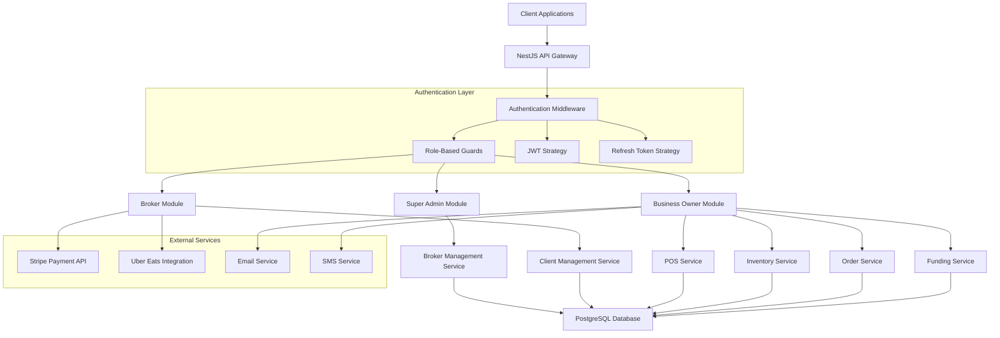
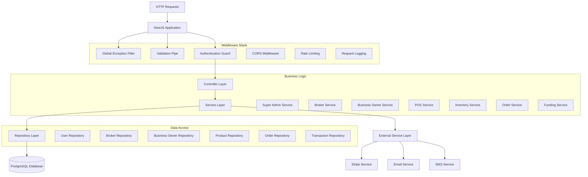
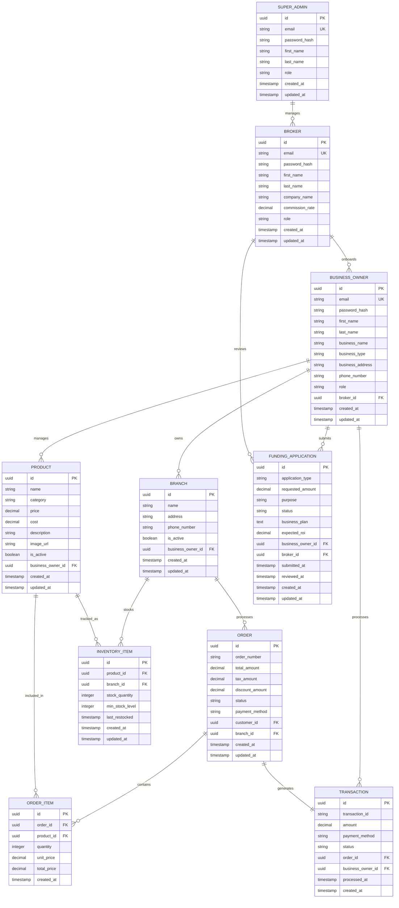

# DiveSeeks TODO7aug Technical Architecture Document

## 1. Architecture Design



## 2. Technology Description

* **Frontend**: React\@18 + TypeScript + Axios for API calls

* **Backend**: NestJS\@10 + TypeScript\@5 + TypeORM\@0.3

* **Database**: PostgreSQL\@15 with connection pooling

* **Authentication**: JWT + Passport strategies

* **Validation**: class-validator + class-transformer

* **Documentation**: Swagger/OpenAPI\@3

* **Testing**: Jest\@29 + Supertest for E2E

* **File Upload**: Multer for image handling

* **External APIs**: Stripe, Uber Eats, SendGrid

## 3. Route Definitions

| Route                      | Purpose                              |
| -------------------------- | ------------------------------------ |
| /auth/login                | User authentication for all roles    |
| /auth/refresh              | JWT token refresh                    |
| /auth/logout               | User logout and token invalidation   |
| /super-admin/brokers       | Super admin broker management        |
| /super-admin/permissions   | Role and permission management       |
| /super-admin/system        | System monitoring and configuration  |
| /brokers/profile           | Broker profile management            |
| /brokers/business-owners   | Broker client management             |
| /brokers/funding-rates     | Commission and funding configuration |
| /brokers/integrations      | External service setup               |
| /business-owners/dashboard | Owner dashboard and analytics        |
| /business-owners/pos       | POS transaction processing           |
| /business-owners/inventory | Inventory and menu management        |
| /business-owners/orders    | Order processing and tracking        |
| /business-owners/funding   | Funding application management       |
| /business-owners/reports   | Business reporting and analytics     |

## 4. API Definitions

### 4.1 Authentication APIs

**User Login**

```
POST /api/auth/login
```

Request:

| Param Name | Param Type | isRequired | Description                |
| ---------- | ---------- | ---------- | -------------------------- |
| email      | string     | true       | User email address         |
| password   | string     | true       | User password (plain text) |

Response:

| Param Name   | Param Type | Description                                       |
| ------------ | ---------- | ------------------------------------------------- |
| accessToken  | string     | JWT access token (15min expiry)                   |
| refreshToken | string     | Refresh token (7 days expiry)                     |
| user         | object     | User profile information                          |
| role         | string     | User role (SUPER\_ADMIN, BROKER, BUSINESS\_OWNER) |

Example:

```json
{
  "email": "admin@diveseeks.com",
  "password": "admin123"
}
```

**Token Refresh**

```
POST /api/auth/refresh
```

Request:

| Param Name   | Param Type | isRequired | Description         |
| ------------ | ---------- | ---------- | ------------------- |
| refreshToken | string     | true       | Valid refresh token |

Response:

| Param Name   | Param Type | Description          |
| ------------ | ---------- | -------------------- |
| accessToken  | string     | New JWT access token |
| refreshToken | string     | New refresh token    |

### 4.2 Super Admin APIs

**Create Broker**

```
POST /api/super-admin/brokers
```

Request:

| Param Name     | Param Type | isRequired | Description                     |
| -------------- | ---------- | ---------- | ------------------------------- |
| email          | string     | true       | Broker email address            |
| firstName      | string     | true       | Broker first name               |
| lastName       | string     | true       | Broker last name                |
| companyName    | string     | true       | Broker company name             |
| commissionRate | number     | false      | Default commission rate (0-100) |

Response:

| Param Name        | Param Type | Description                        |
| ----------------- | ---------- | ---------------------------------- |
| id                | string     | Broker UUID                        |
| email             | string     | Broker email                       |
| companyName       | string     | Company name                       |
| temporaryPassword | string     | Generated password for first login |

**Get All Brokers**

```
GET /api/super-admin/brokers
```

Query Parameters:

| Param Name | Param Type | isRequired | Description                  |
| ---------- | ---------- | ---------- | ---------------------------- |
| page       | number     | false      | Page number (default: 1)     |
| limit      | number     | false      | Items per page (default: 10) |
| search     | string     | false      | Search by name or email      |

Response:

| Param Name | Param Type | Description             |
| ---------- | ---------- | ----------------------- |
| data       | array      | Array of broker objects |
| total      | number     | Total number of brokers |
| page       | number     | Current page            |
| totalPages | number     | Total pages             |

### 4.3 Broker APIs

**Create Business Owner**

```
POST /api/brokers/business-owners
```

Request:

| Param Name      | Param Type | isRequired | Description                                 |
| --------------- | ---------- | ---------- | ------------------------------------------- |
| email           | string     | true       | Owner email address                         |
| firstName       | string     | true       | Owner first name                            |
| lastName        | string     | true       | Owner last name                             |
| businessName    | string     | true       | Business name                               |
| businessType    | string     | true       | Business type (RESTAURANT, RETAIL, SERVICE) |
| businessAddress | string     | false      | Business address                            |
| phoneNumber     | string     | false      | Contact phone number                        |

Response:

| Param Name        | Param Type | Description                           |
| ----------------- | ---------- | ------------------------------------- |
| id                | string     | Business owner UUID                   |
| email             | string     | Owner email                           |
| businessName      | string     | Business name                         |
| temporaryPassword | string     | Generated password for first login    |
| defaultSettings   | object     | Auto-generated default configurations |

**Update Broker Profile**

```
PUT /api/brokers/profile
```

Request:

| Param Name  | Param Type | isRequired | Description          |
| ----------- | ---------- | ---------- | -------------------- |
| firstName   | string     | false      | Updated first name   |
| lastName    | string     | false      | Updated last name    |
| companyName | string     | false      | Updated company name |
| phoneNumber | string     | false      | Contact phone        |
| address     | string     | false      | Company address      |
| website     | string     | false      | Company website      |

### 4.4 Business Owner APIs

**Get Dashboard Data**

```
GET /api/business-owners/dashboard
```

Response:

| Param Name      | Param Type | Description                  |
| --------------- | ---------- | ---------------------------- |
| todaySales      | object     | Today's sales summary        |
| weekSales       | object     | This week's sales            |
| monthSales      | object     | This month's sales           |
| topProducts     | array      | Best selling products        |
| recentOrders    | array      | Recent order list            |
| inventoryAlerts | array      | Low stock alerts             |
| pendingFunding  | array      | Pending funding applications |

**Process POS Transaction**

```
POST /api/business-owners/pos/transactions
```

Request:

| Param Name     | Param Type | isRequired | Description                          |
| -------------- | ---------- | ---------- | ------------------------------------ |
| items          | array      | true       | Array of transaction items           |
| total          | number     | true       | Total transaction amount             |
| paymentMethod  | string     | true       | Payment method (CASH, CARD, DIGITAL) |
| customerId     | string     | false      | Customer ID if registered            |
| discountAmount | number     | false      | Applied discount                     |
| taxAmount      | number     | false      | Tax amount                           |

Example:

```json
{
  "items": [
    {
      "productId": "uuid-123",
      "name": "Margherita Pizza",
      "quantity": 2,
      "unitPrice": 12.99,
      "totalPrice": 25.98
    }
  ],
  "total": 25.98,
  "paymentMethod": "CARD",
  "taxAmount": 2.08
}
```

**Add Inventory Item**

```
POST /api/business-owners/inventory
```

Request:

| Param Name  | Param Type | isRequired | Description               |
| ----------- | ---------- | ---------- | ------------------------- |
| name        | string     | true       | Product name              |
| category    | string     | true       | Product category          |
| price       | number     | true       | Product price             |
| cost        | number     | false      | Product cost              |
| stock       | number     | true       | Initial stock quantity    |
| minStock    | number     | false      | Minimum stock alert level |
| description | string     | false      | Product description       |
| image       | string     | false      | Product image URL         |

**Submit Funding Application**

```
POST /api/business-owners/funding/applications
```

Request:

| Param Name   | Param Type | isRequired | Description                                      |
| ------------ | ---------- | ---------- | ------------------------------------------------ |
| type         | string     | true       | Application type (LOAN, GRANT, INVOICE\_FINANCE) |
| amount       | number     | true       | Requested amount                                 |
| purpose      | string     | true       | Funding purpose                                  |
| documents    | array      | false      | Supporting documents                             |
| businessPlan | string     | false      | Business plan description                        |
| expectedROI  | number     | false      | Expected return on investment                    |

## 5. Server Architecture Diagram



## 6. Data Model

### 6.1 Data Model Definition



### 6.2 Data Definition Language

**Super Admins Table**

```sql
CREATE TABLE super_admins (
    id UUID PRIMARY KEY DEFAULT gen_random_uuid(),
    email VARCHAR(255) UNIQUE NOT NULL,
    password_hash VARCHAR(255) NOT NULL,
    first_name VARCHAR(100) NOT NULL,
    last_name VARCHAR(100) NOT NULL,
    role VARCHAR(20) DEFAULT 'SUPER_ADMIN' CHECK (role IN ('SUPER_ADMIN')),
    created_at TIMESTAMP WITH TIME ZONE DEFAULT NOW(),
    updated_at TIMESTAMP WITH TIME ZONE DEFAULT NOW()
);

CREATE INDEX idx_super_admins_email ON super_admins(email);
CREATE INDEX idx_super_admins_created_at ON super_admins(created_at DESC);
```

**Brokers Table**

```sql
CREATE TABLE brokers (
    id UUID PRIMARY KEY DEFAULT gen_random_uuid(),
    email VARCHAR(255) UNIQUE NOT NULL,
    password_hash VARCHAR(255) NOT NULL,
    first_name VARCHAR(100) NOT NULL,
    last_name VARCHAR(100) NOT NULL,
    company_name VARCHAR(255) NOT NULL,
    commission_rate DECIMAL(5,2) DEFAULT 0.00 CHECK (commission_rate >= 0 AND commission_rate <= 100),
    phone_number VARCHAR(20),
    address TEXT,
    website VARCHAR(255),
    role VARCHAR(20) DEFAULT 'BROKER' CHECK (role IN ('BROKER')),
    is_active BOOLEAN DEFAULT true,
    created_at TIMESTAMP WITH TIME ZONE DEFAULT NOW(),
    updated_at TIMESTAMP WITH TIME ZONE DEFAULT NOW()
);

CREATE INDEX idx_brokers_email ON brokers(email);
CREATE INDEX idx_brokers_company_name ON brokers(company_name);
CREATE INDEX idx_brokers_is_active ON brokers(is_active);
```

**Business Owners Table**

```sql
CREATE TABLE business_owners (
    id UUID PRIMARY KEY DEFAULT gen_random_uuid(),
    email VARCHAR(255) UNIQUE NOT NULL,
    password_hash VARCHAR(255) NOT NULL,
    first_name VARCHAR(100) NOT NULL,
    last_name VARCHAR(100) NOT NULL,
    business_name VARCHAR(255) NOT NULL,
    business_type VARCHAR(50) NOT NULL CHECK (business_type IN ('RESTAURANT', 'RETAIL', 'SERVICE')),
    business_address TEXT,
    phone_number VARCHAR(20),
    role VARCHAR(20) DEFAULT 'BUSINESS_OWNER' CHECK (role IN ('BUSINESS_OWNER')),
    broker_id UUID NOT NULL REFERENCES brokers(id) ON DELETE CASCADE,
    is_active BOOLEAN DEFAULT true,
    created_at TIMESTAMP WITH TIME ZONE DEFAULT NOW(),
    updated_at TIMESTAMP WITH TIME ZONE DEFAULT NOW()
);

CREATE INDEX idx_business_owners_email ON business_owners(email);
CREATE INDEX idx_business_owners_broker_id ON business_owners(broker_id);
CREATE INDEX idx_business_owners_business_type ON business_owners(business_type);
CREATE INDEX idx_business_owners_is_active ON business_owners(is_active);
```

**Branches Table**

```sql
CREATE TABLE branches (
    id UUID PRIMARY KEY DEFAULT gen_random_uuid(),
    name VARCHAR(255) NOT NULL,
    address TEXT NOT NULL,
    phone_number VARCHAR(20),
    is_active BOOLEAN DEFAULT true,
    business_owner_id UUID NOT NULL REFERENCES business_owners(id) ON DELETE CASCADE,
    created_at TIMESTAMP WITH TIME ZONE DEFAULT NOW(),
    updated_at TIMESTAMP WITH TIME ZONE DEFAULT NOW()
);

CREATE INDEX idx_branches_business_owner_id ON branches(business_owner_id);
CREATE INDEX idx_branches_is_active ON branches(is_active);
```

**Products Table**

```sql
CREATE TABLE products (
    id UUID PRIMARY KEY DEFAULT gen_random_uuid(),
    name VARCHAR(255) NOT NULL,
    category VARCHAR(100) NOT NULL,
    price DECIMAL(10,2) NOT NULL CHECK (price >= 0),
    cost DECIMAL(10,2) CHECK (cost >= 0),
    description TEXT,
    image_url VARCHAR(500),
    is_active BOOLEAN DEFAULT true,
    business_owner_id UUID NOT NULL REFERENCES business_owners(id) ON DELETE CASCADE,
    created_at TIMESTAMP WITH TIME ZONE DEFAULT NOW(),
    updated_at TIMESTAMP WITH TIME ZONE DEFAULT NOW()
);

CREATE INDEX idx_products_business_owner_id ON products(business_owner_id);
CREATE INDEX idx_products_category ON products(category);
CREATE INDEX idx_products_is_active ON products(is_active);
CREATE INDEX idx_products_name ON products(name);
```

**Inventory Items Table**

```sql
CREATE TABLE inventory_items (
    id UUID PRIMARY KEY DEFAULT gen_random_uuid(),
    product_id UUID NOT NULL REFERENCES products(id) ON DELETE CASCADE,
    branch_id UUID NOT NULL REFERENCES branches(id) ON DELETE CASCADE,
    stock_quantity INTEGER NOT NULL DEFAULT 0 CHECK (stock_quantity >= 0),
    min_stock_level INTEGER DEFAULT 10 CHECK (min_stock_level >= 0),
    last_restocked TIMESTAMP WITH TIME ZONE,
    created_at TIMESTAMP WITH TIME ZONE DEFAULT NOW(),
    updated_at TIMESTAMP WITH TIME ZONE DEFAULT NOW(),
    UNIQUE(product_id, branch_id)
);

CREATE INDEX idx_inventory_items_product_id ON inventory_items(product_id);
CREATE INDEX idx_inventory_items_branch_id ON inventory_items(branch_id);
CREATE INDEX idx_inventory_items_stock_quantity ON inventory_items(stock_quantity);
```

**Orders Table**

```sql
CREATE TABLE orders (
    id UUID PRIMARY KEY DEFAULT gen_random_uuid(),
    order_number VARCHAR(50) UNIQUE NOT NULL,
    total_amount DECIMAL(10,2) NOT NULL CHECK (total_amount >= 0),
    tax_amount DECIMAL(10,2) DEFAULT 0 CHECK (tax_amount >= 0),
    discount_amount DECIMAL(10,2) DEFAULT 0 CHECK (discount_amount >= 0),
    status VARCHAR(20) DEFAULT 'PENDING' CHECK (status IN ('PENDING', 'CONFIRMED', 'PREPARING', 'READY', 'DELIVERED', 'CANCELLED')),
    payment_method VARCHAR(20) NOT NULL CHECK (payment_method IN ('CASH', 'CARD', 'DIGITAL')),
    customer_id UUID,
    branch_id UUID NOT NULL REFERENCES branches(id),
    created_at TIMESTAMP WITH TIME ZONE DEFAULT NOW(),
    updated_at TIMESTAMP WITH TIME ZONE DEFAULT NOW()
);

CREATE INDEX idx_orders_order_number ON orders(order_number);
CREATE INDEX idx_orders_branch_id ON orders(branch_id);
CREATE INDEX idx_orders_status ON orders(status);
CREATE INDEX idx_orders_created_at ON orders(created_at DESC);
```

**Order Items Table**

```sql
CREATE TABLE order_items (
    id UUID PRIMARY KEY DEFAULT gen_random_uuid(),
    order_id UUID NOT NULL REFERENCES orders(id) ON DELETE CASCADE,
    product_id UUID NOT NULL REFERENCES products(id),
    quantity INTEGER NOT NULL CHECK (quantity > 0),
    unit_price DECIMAL(10,2) NOT NULL CHECK (unit_price >= 0),
    total_price DECIMAL(10,2) NOT NULL CHECK (total_price >= 0),
    created_at TIMESTAMP WITH TIME ZONE DEFAULT NOW()
);

CREATE INDEX idx_order_items_order_id ON order_items(order_id);
CREATE INDEX idx_order_items_product_id ON order_items(product_id);
```

**Transactions Table**

```sql
CREATE TABLE transactions (
    id UUID PRIMARY KEY DEFAULT gen_random_uuid(),
    transaction_id VARCHAR(100) UNIQUE NOT NULL,
    amount DECIMAL(10,2) NOT NULL CHECK (amount >= 0),
    payment_method VARCHAR(20) NOT NULL CHECK (payment_method IN ('CASH', 'CARD', 'DIGITAL')),
    status VARCHAR(20) DEFAULT 'COMPLETED' CHECK (status IN ('PENDING', 'COMPLETED', 'FAILED', 'REFUNDED')),
    order_id UUID REFERENCES orders(id),
    business_owner_id UUID NOT NULL REFERENCES business_owners(id),
    processed_at TIMESTAMP WITH TIME ZONE DEFAULT NOW(),
    created_at TIMESTAMP WITH TIME ZONE DEFAULT NOW()
);

CREATE INDEX idx_transactions_transaction_id ON transactions(transaction_id);
CREATE INDEX idx_transactions_business_owner_id ON transactions(business_owner_id);
CREATE INDEX idx_transactions_order_id ON transactions(order_id);
CREATE INDEX idx_transactions_processed_at ON transactions(processed_at DESC);
```

**Funding Applications Table**

```sql
CREATE TABLE funding_applications (
    id UUID PRIMARY KEY DEFAULT gen_random_uuid(),
    application_type VARCHAR(20) NOT NULL CHECK (application_type IN ('LOAN', 'GRANT', 'INVOICE_FINANCE')),
    requested_amount DECIMAL(12,2) NOT NULL CHECK (requested_amount > 0),
    purpose TEXT NOT NULL,
    status VARCHAR(20) DEFAULT 'SUBMITTED' CHECK (status IN ('SUBMITTED', 'UNDER_REVIEW', 'APPROVED', 'REJECTED', 'FUNDED')),
    business_plan TEXT,
    expected_roi DECIMAL(5,2) CHECK (expected_roi >= 0),
    business_owner_id UUID NOT NULL REFERENCES business_owners(id) ON DELETE CASCADE,
    broker_id UUID NOT NULL REFERENCES brokers(id),
    submitted_at TIMESTAMP WITH TIME ZONE DEFAULT NOW(),
    reviewed_at TIMESTAMP WITH TIME ZONE,
    created_at TIMESTAMP WITH TIME ZONE DEFAULT NOW(),
    updated_at TIMESTAMP WITH TIME ZONE DEFAULT NOW()
);

CREATE INDEX idx_funding_applications_business_owner_id ON funding_applications(business_owner_id);
CREATE INDEX idx_funding_applications_broker_id ON funding_applications(broker_id);
CREATE INDEX idx_funding_applications_status ON funding_applications(status);
CREATE INDEX idx_funding_applications_submitted_at ON funding_applications(submitted_at DESC);
```

**Initial Data**

```sql
-- Insert default super admin
INSERT INTO super_admins (email, password_hash, first_name, last_name) VALUES 
('admin@diveseeks.com', '$2b$12$LQv3c1yqBWVHxkd0LHAkCOYz6TtxMQJqhN8/LewdBPj6hsxq5S/kS', 'System', 'Administrator');

-- Insert sample broker
INSERT INTO brokers (email, password_hash, first_name, last_name, company_name, commission_rate) VALUES 
('broker@example.com', '$2b$12$LQv3c1yqBWVHxkd0LHAkCOYz6TtxMQJqhN8/LewdBPj6hsxq5S/kS', 'John', 'Doe', 'Broker Solutions LLC', 5.00);

-- Insert sample business owner
INSERT INTO business_owners (email, password_hash, first_name, last_name, business_name, business_type, broker_id) VALUES 
('owner@restaurant.com', '$2b$12$LQv3c1yqBWVHxkd0LHAkCOYz6TtxMQJqhN8/LewdBPj6hsxq5S/kS', 'Jane', 'Smith', 'Pizza Palace', 'RESTAURANT', 
 (SELECT id FROM brokers WHERE email = 'broker@example.com'));
```

This technical architecture
