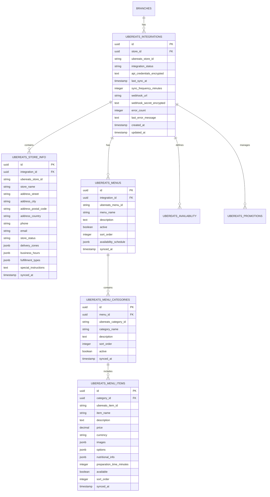
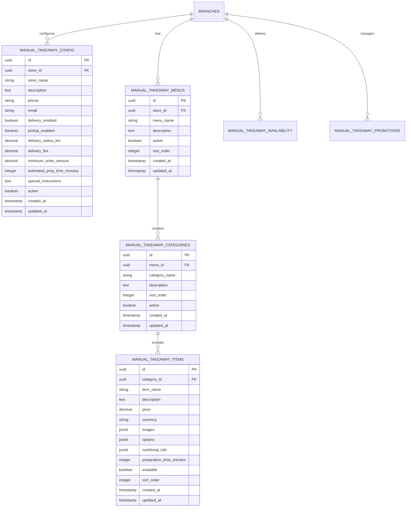

# DiveSeeks Ltd Uber Eats Integration Layer - Layer 5

## 1. Integration Overview

### 1.1 Purpose
This document defines the **Uber Eats Integration Layer (Layer 5)** for DiveSeeks Ltd's multi-tenant backend system. This layer extends the existing NestJS + PostgreSQL architecture to support takeaway-type stores through seamless integration with the Uber Eats Marketplace APIs. The integration provides automated data synchronization with manual fallback capabilities, ensuring robust operations regardless of API availability.

### 1.2 Integration Scope
The Uber Eats integration activates when a store's `business_type` is set to `"takeaway"` and includes:
- Store information synchronization
- Menu and category management
- Menu item details with pricing and options
- Availability hours and fulfillment types
- Promotional campaigns and featured items
- Real-time order processing integration
- AI-powered analytics and optimization

### 1.3 Architecture Principles
- **Dual-Mode Operation**: Automated API sync with manual entry fallback
- **Data Consistency**: Unified data models for both integration modes
- **Fault Tolerance**: Graceful degradation when API is unavailable
- **Multi-Tenant Compliance**: Full isolation and security per tenant
- **Performance Optimization**: Efficient caching and batch processing

## 2. Uber Eats API Integration Logic

### 2.1 Integration Trigger Conditions
```typescript
// Integration activation logic
if (store.business_type === 'takeaway' && store.ubereats_integration_enabled) {
  // Activate Uber Eats API integration
  await this.uberEatsService.syncStoreData(store.id);
} else {
  // Use manual entry mode
  await this.manualTakeawayService.initializeStore(store.id);
}
```

### 2.2 API Integration Components

#### 2.2.1 Store Information Sync
- **Endpoint**: `/stores/{store_id}`
- **Data Retrieved**:
  - Store name, address, and contact information
  - Operating status and availability
  - Delivery zones and service areas
  - Store configuration and settings
  - Business hours and special schedules

#### 2.2.2 Menu Management Sync
- **Endpoint**: `/stores/{store_id}/menus`
- **Data Retrieved**:
  - Menu structure and categories
  - Item hierarchy and organization
  - Pricing and availability status
  - Menu activation schedules

#### 2.2.3 Menu Items Sync
- **Endpoint**: `/stores/{store_id}/menus/{menu_id}/items`
- **Data Retrieved**:
  - Item details (name, description, images)
  - Pricing information and currency
  - Customization options and modifiers
  - Nutritional information
  - Availability and stock status

#### 2.2.4 Fulfillment Options
- **Endpoint**: `/stores/{store_id}/fulfillment`
- **Data Retrieved**:
  - Pickup availability and timing
  - Delivery zones and fees
  - Estimated preparation times
  - Special fulfillment requirements

#### 2.2.5 Promotions and Campaigns
- **Endpoint**: `/stores/{store_id}/promotions`
- **Data Retrieved**:
  - Active promotional campaigns
  - Discount rules and conditions
  - Featured item highlights
  - Campaign performance metrics

### 2.3 Sample Uber Eats API Responses

#### 2.3.1 Store Information Response
```json
{
  "store_id": "uber_store_12345",
  "name": "Tony's Pizza Palace",
  "address": {
    "street": "123 Main Street",
    "city": "London",
    "postal_code": "SW1A 1AA",
    "country": "GB"
  },
  "contact": {
    "phone": "+44 20 7946 0958",
    "email": "orders@tonyspizza.co.uk"
  },
  "status": "active",
  "delivery_zones": [
    {
      "zone_id": "zone_001",
      "radius_km": 5.0,
      "delivery_fee": 2.50
    }
  ],
  "business_hours": {
    "monday": {"open": "11:00", "close": "23:00"},
    "tuesday": {"open": "11:00", "close": "23:00"},
    "wednesday": {"open": "11:00", "close": "23:00"},
    "thursday": {"open": "11:00", "close": "23:00"},
    "friday": {"open": "11:00", "close": "00:00"},
    "saturday": {"open": "11:00", "close": "00:00"},
    "sunday": {"open": "12:00", "close": "22:00"}
  },
  "fulfillment_types": ["pickup", "delivery"]
}
```

#### 2.3.2 Menu Structure Response
```json
{
  "menu_id": "menu_67890",
  "name": "Main Menu",
  "description": "Our full selection of pizzas, sides, and drinks",
  "active": true,
  "categories": [
    {
      "category_id": "cat_001",
      "name": "Pizzas",
      "description": "Hand-tossed pizzas with fresh ingredients",
      "sort_order": 1,
      "active": true
    },
    {
      "category_id": "cat_002",
      "name": "Sides",
      "description": "Delicious sides to complement your meal",
      "sort_order": 2,
      "active": true
    }
  ]
}
```

#### 2.3.3 Menu Items Response
```json
{
  "items": [
    {
      "item_id": "item_001",
      "name": "Margherita Pizza",
      "description": "Classic pizza with tomato sauce, mozzarella, and fresh basil",
      "category_id": "cat_001",
      "price": 12.99,
      "currency": "GBP",
      "images": [
        {
          "url": "https://images.uber.com/pizza_margherita.jpg",
          "type": "primary"
        }
      ],
      "options": [
        {
          "option_group_id": "size",
          "name": "Size",
          "required": true,
          "max_selections": 1,
          "options": [
            {"id": "small", "name": "Small (10\")", "price": 0},
            {"id": "medium", "name": "Medium (12\")", "price": 3.00},
            {"id": "large", "name": "Large (14\")", "price": 6.00}
          ]
        }
      ],
      "nutritional_info": {
        "calories": 250,
        "protein_g": 12,
        "carbs_g": 30,
        "fat_g": 8
      },
      "available": true,
      "preparation_time_minutes": 15
    }
  ]
}
```

## 3. Database Schema Design

### 3.1 Uber Eats Integration Schema (Automated)

#### 3.1.1 Integration Tracking
```sql
-- Uber Eats integration metadata
CREATE TABLE ubereats_integrations (
    id UUID PRIMARY KEY DEFAULT gen_random_uuid(),
    store_id UUID NOT NULL REFERENCES business.branches(id) ON DELETE CASCADE,
    ubereats_store_id VARCHAR(100) NOT NULL,
    integration_status VARCHAR(20) DEFAULT 'active' CHECK (integration_status IN ('active', 'paused', 'error', 'disabled')),
    api_credentials_encrypted TEXT,
    last_sync_at TIMESTAMP,
    sync_frequency_minutes INTEGER DEFAULT 30,
    webhook_url VARCHAR(500),
    webhook_secret_encrypted TEXT,
    error_count INTEGER DEFAULT 0,
    last_error_message TEXT,
    created_at TIMESTAMP DEFAULT NOW(),
    updated_at TIMESTAMP DEFAULT NOW(),
    
    UNIQUE(store_id, ubereats_store_id)
);

-- Indexes
CREATE INDEX idx_ubereats_integrations_store_id ON ubereats_integrations(store_id);
CREATE INDEX idx_ubereats_integrations_status ON ubereats_integrations(integration_status);
CREATE INDEX idx_ubereats_integrations_sync ON ubereats_integrations(last_sync_at);
```

#### 3.1.2 Store Information
```sql
-- Uber Eats store information
CREATE TABLE ubereats_store_info (
    id UUID PRIMARY KEY DEFAULT gen_random_uuid(),
    integration_id UUID NOT NULL REFERENCES ubereats_integrations(id) ON DELETE CASCADE,
    ubereats_store_id VARCHAR(100) NOT NULL,
    store_name VARCHAR(255) NOT NULL,
    address_street VARCHAR(255),
    address_city VARCHAR(100),
    address_postal_code VARCHAR(20),
    address_country VARCHAR(5),
    phone VARCHAR(20),
    email VARCHAR(255),
    store_status VARCHAR(20) DEFAULT 'active',
    delivery_zones JSONB,
    business_hours JSONB,
    fulfillment_types JSONB,
    special_instructions TEXT,
    synced_at TIMESTAMP DEFAULT NOW(),
    
    UNIQUE(integration_id, ubereats_store_id)
);

-- Indexes
CREATE INDEX idx_ubereats_store_info_integration ON ubereats_store_info(integration_id);
CREATE INDEX idx_ubereats_store_info_status ON ubereats_store_info(store_status);
CREATE INDEX idx_ubereats_store_info_synced ON ubereats_store_info(synced_at);
```

#### 3.1.3 Menu Structure
```sql
-- Uber Eats menus
CREATE TABLE ubereats_menus (
    id UUID PRIMARY KEY DEFAULT gen_random_uuid(),
    integration_id UUID NOT NULL REFERENCES ubereats_integrations(id) ON DELETE CASCADE,
    ubereats_menu_id VARCHAR(100) NOT NULL,
    menu_name VARCHAR(255) NOT NULL,
    description TEXT,
    active BOOLEAN DEFAULT true,
    sort_order INTEGER DEFAULT 0,
    availability_schedule JSONB,
    synced_at TIMESTAMP DEFAULT NOW(),
    
    UNIQUE(integration_id, ubereats_menu_id)
);

-- Menu categories
CREATE TABLE ubereats_menu_categories (
    id UUID PRIMARY KEY DEFAULT gen_random_uuid(),
    menu_id UUID NOT NULL REFERENCES ubereats_menus(id) ON DELETE CASCADE,
    ubereats_category_id VARCHAR(100) NOT NULL,
    category_name VARCHAR(255) NOT NULL,
    description TEXT,
    sort_order INTEGER DEFAULT 0,
    active BOOLEAN DEFAULT true,
    synced_at TIMESTAMP DEFAULT NOW(),
    
    UNIQUE(menu_id, ubereats_category_id)
);

-- Indexes
CREATE INDEX idx_ubereats_menus_integration ON ubereats_menus(integration_id);
CREATE INDEX idx_ubereats_menus_active ON ubereats_menus(active);
CREATE INDEX idx_ubereats_categories_menu ON ubereats_menu_categories(menu_id);
CREATE INDEX idx_ubereats_categories_active ON ubereats_menu_categories(active);
```

#### 3.1.4 Menu Items
```sql
-- Uber Eats menu items
CREATE TABLE ubereats_menu_items (
    id UUID PRIMARY KEY DEFAULT gen_random_uuid(),
    category_id UUID NOT NULL REFERENCES ubereats_menu_categories(id) ON DELETE CASCADE,
    ubereats_item_id VARCHAR(100) NOT NULL,
    item_name VARCHAR(255) NOT NULL,
    description TEXT,
    price DECIMAL(10,2) NOT NULL,
    currency VARCHAR(3) DEFAULT 'GBP',
    images JSONB,
    options JSONB,
    nutritional_info JSONB,
    preparation_time_minutes INTEGER,
    available BOOLEAN DEFAULT true,
    sort_order INTEGER DEFAULT 0,
    synced_at TIMESTAMP DEFAULT NOW(),
    
    UNIQUE(category_id, ubereats_item_id)
);

-- Indexes
CREATE INDEX idx_ubereats_items_category ON ubereats_menu_items(category_id);
CREATE INDEX idx_ubereats_items_available ON ubereats_menu_items(available);
CREATE INDEX idx_ubereats_items_price ON ubereats_menu_items(price);
CREATE INDEX idx_ubereats_items_synced ON ubereats_menu_items(synced_at);
```

#### 3.1.5 Availability and Promotions
```sql
-- Uber Eats availability schedules
CREATE TABLE ubereats_availability (
    id UUID PRIMARY KEY DEFAULT gen_random_uuid(),
    integration_id UUID NOT NULL REFERENCES ubereats_integrations(id) ON DELETE CASCADE,
    entity_type VARCHAR(20) NOT NULL CHECK (entity_type IN ('store', 'menu', 'category', 'item')),
    entity_id VARCHAR(100) NOT NULL,
    day_of_week INTEGER CHECK (day_of_week BETWEEN 0 AND 6),
    start_time TIME,
    end_time TIME,
    available BOOLEAN DEFAULT true,
    special_date DATE,
    synced_at TIMESTAMP DEFAULT NOW()
);

-- Uber Eats promotions
CREATE TABLE ubereats_promotions (
    id UUID PRIMARY KEY DEFAULT gen_random_uuid(),
    integration_id UUID NOT NULL REFERENCES ubereats_integrations(id) ON DELETE CASCADE,
    ubereats_promotion_id VARCHAR(100) NOT NULL,
    promotion_name VARCHAR(255) NOT NULL,
    description TEXT,
    promotion_type VARCHAR(50),
    discount_amount DECIMAL(10,2),
    discount_percentage DECIMAL(5,2),
    minimum_order_amount DECIMAL(10,2),
    start_date TIMESTAMP,
    end_date TIMESTAMP,
    applicable_items JSONB,
    active BOOLEAN DEFAULT true,
    synced_at TIMESTAMP DEFAULT NOW(),
    
    UNIQUE(integration_id, ubereats_promotion_id)
);

-- Indexes
CREATE INDEX idx_ubereats_availability_integration ON ubereats_availability(integration_id);
CREATE INDEX idx_ubereats_availability_entity ON ubereats_availability(entity_type, entity_id);
CREATE INDEX idx_ubereats_promotions_integration ON ubereats_promotions(integration_id);
CREATE INDEX idx_ubereats_promotions_active ON ubereats_promotions(active);
CREATE INDEX idx_ubereats_promotions_dates ON ubereats_promotions(start_date, end_date);
```

### 3.2 Manual Entry Schema (Fallback)

#### 3.2.1 Manual Takeaway Configuration
```sql
-- Manual takeaway store configuration
CREATE TABLE manual_takeaway_config (
    id UUID PRIMARY KEY DEFAULT gen_random_uuid(),
    store_id UUID NOT NULL REFERENCES business.branches(id) ON DELETE CASCADE,
    store_name VARCHAR(255) NOT NULL,
    description TEXT,
    phone VARCHAR(20),
    email VARCHAR(255),
    delivery_enabled BOOLEAN DEFAULT true,
    pickup_enabled BOOLEAN DEFAULT true,
    delivery_radius_km DECIMAL(5,2) DEFAULT 5.0,
    delivery_fee DECIMAL(10,2) DEFAULT 0,
    minimum_order_amount DECIMAL(10,2) DEFAULT 0,
    estimated_prep_time_minutes INTEGER DEFAULT 30,
    special_instructions TEXT,
    active BOOLEAN DEFAULT true,
    created_at TIMESTAMP DEFAULT NOW(),
    updated_at TIMESTAMP DEFAULT NOW(),
    
    UNIQUE(store_id)
);

-- Indexes
CREATE INDEX idx_manual_takeaway_config_store ON manual_takeaway_config(store_id);
CREATE INDEX idx_manual_takeaway_config_active ON manual_takeaway_config(active);
```

#### 3.2.2 Manual Menu Management
```sql
-- Manual takeaway menus
CREATE TABLE manual_takeaway_menus (
    id UUID PRIMARY KEY DEFAULT gen_random_uuid(),
    store_id UUID NOT NULL REFERENCES business.branches(id) ON DELETE CASCADE,
    menu_name VARCHAR(255) NOT NULL,
    description TEXT,
    active BOOLEAN DEFAULT true,
    sort_order INTEGER DEFAULT 0,
    created_at TIMESTAMP DEFAULT NOW(),
    updated_at TIMESTAMP DEFAULT NOW()
);

-- Manual takeaway categories
CREATE TABLE manual_takeaway_categories (
    id UUID PRIMARY KEY DEFAULT gen_random_uuid(),
    menu_id UUID NOT NULL REFERENCES manual_takeaway_menus(id) ON DELETE CASCADE,
    category_name VARCHAR(255) NOT NULL,
    description TEXT,
    sort_order INTEGER DEFAULT 0,
    active BOOLEAN DEFAULT true,
    created_at TIMESTAMP DEFAULT NOW(),
    updated_at TIMESTAMP DEFAULT NOW()
);

-- Manual takeaway items
CREATE TABLE manual_takeaway_items (
    id UUID PRIMARY KEY DEFAULT gen_random_uuid(),
    category_id UUID NOT NULL REFERENCES manual_takeaway_categories(id) ON DELETE CASCADE,
    item_name VARCHAR(255) NOT NULL,
    description TEXT,
    price DECIMAL(10,2) NOT NULL,
    currency VARCHAR(3) DEFAULT 'GBP',
    images JSONB,
    options JSONB,
    nutritional_info JSONB,
    preparation_time_minutes INTEGER,
    available BOOLEAN DEFAULT true,
    sort_order INTEGER DEFAULT 0,
    created_at TIMESTAMP DEFAULT NOW(),
    updated_at TIMESTAMP DEFAULT NOW()
);

-- Indexes
CREATE INDEX idx_manual_takeaway_menus_store ON manual_takeaway_menus(store_id);
CREATE INDEX idx_manual_takeaway_categories_menu ON manual_takeaway_categories(menu_id);
CREATE INDEX idx_manual_takeaway_items_category ON manual_takeaway_items(category_id);
CREATE INDEX idx_manual_takeaway_items_available ON manual_takeaway_items(available);
```

#### 3.2.3 Manual Availability Management
```sql
-- Manual availability schedules
CREATE TABLE manual_takeaway_availability (
    id UUID PRIMARY KEY DEFAULT gen_random_uuid(),
    store_id UUID NOT NULL REFERENCES business.branches(id) ON DELETE CASCADE,
    entity_type VARCHAR(20) NOT NULL CHECK (entity_type IN ('store', 'menu', 'category', 'item')),
    entity_id UUID NOT NULL,
    day_of_week INTEGER CHECK (day_of_week BETWEEN 0 AND 6),
    start_time TIME,
    end_time TIME,
    available BOOLEAN DEFAULT true,
    special_date DATE,
    created_at TIMESTAMP DEFAULT NOW(),
    updated_at TIMESTAMP DEFAULT NOW()
);

-- Manual promotions
CREATE TABLE manual_takeaway_promotions (
    id UUID PRIMARY KEY DEFAULT gen_random_uuid(),
    store_id UUID NOT NULL REFERENCES business.branches(id) ON DELETE CASCADE,
    promotion_name VARCHAR(255) NOT NULL,
    description TEXT,
    promotion_type VARCHAR(50),
    discount_amount DECIMAL(10,2),
    discount_percentage DECIMAL(5,2),
    minimum_order_amount DECIMAL(10,2),
    start_date TIMESTAMP,
    end_date TIMESTAMP,
    applicable_items JSONB,
    active BOOLEAN DEFAULT true,
    created_at TIMESTAMP DEFAULT NOW(),
    updated_at TIMESTAMP DEFAULT NOW()
);

-- Indexes
CREATE INDEX idx_manual_availability_store ON manual_takeaway_availability(store_id);
CREATE INDEX idx_manual_availability_entity ON manual_takeaway_availability(entity_type, entity_id);
CREATE INDEX idx_manual_promotions_store ON manual_takeaway_promotions(store_id);
CREATE INDEX idx_manual_promotions_active ON manual_takeaway_promotions(active);
```

## 4. Entity Relationship Diagrams

### 4.1 Uber Eats Integration Schema ERD


### 4.2 Manual Entry Schema ERD


## 5. NestJS Module Structure

### 5.1 Uber Eats Integration Module

#### 5.1.1 Module Structure
```
modules/integrations/ubereats/
├── ubereats-integration.module.ts
├── controllers/
│   ├── ubereats-sync.controller.ts
│   ├── ubereats-store.controller.ts
│   └── ubereats-webhook.controller.ts
├── services/
│   ├── ubereats-api.service.ts
│   ├── ubereats-sync.service.ts
│   ├── ubereats-webhook.service.ts
│   └── ubereats-data-mapper.service.ts
├── entities/
│   ├── ubereats-integration.entity.ts
│   ├── ubereats-store-info.entity.ts
│   ├── ubereats-menu.entity.ts
│   ├── ubereats-menu-category.entity.ts
│   ├── ubereats-menu-item.entity.ts
│   ├── ubereats-availability.entity.ts
│   └── ubereats-promotion.entity.ts
├── dto/
│   ├── sync-request.dto.ts
│   ├── store-info.dto.ts
│   ├── menu-sync.dto.ts
│   └── webhook-payload.dto.ts
├── repositories/
│   ├── ubereats-integration.repository.ts
│   ├── ubereats-store.repository.ts
│   └── ubereats-menu.repository.ts
└── interfaces/
    ├── ubereats-api.interface.ts
    └── sync-result.interface.ts
```

### 5.2 Manual Takeaway Module

#### 5.2.1 Module Structure
```
modules/takeaway/manual/
├── manual-takeaway.module.ts
├── controllers/
│   ├── manual-menu.controller.ts
│   ├── manual-items.controller.ts
│   └── manual-config.controller.ts
├── services/
│   ├── manual-menu.service.ts
│   ├── manual-items.service.ts
│   └── manual-config.service.ts
├── entities/
│   ├── manual-takeaway-config.entity.ts
│   ├── manual-takeaway-menu.entity.ts
│   ├── manual-takeaway-category.entity.ts
│   ├── manual-takeaway-item.entity.ts
│   ├── manual-takeaway-availability.entity.ts
│   └── manual-takeaway-promotion.entity.ts
├── dto/
│   ├── create-menu.dto.ts
│   ├── create-item.dto.ts
│   ├── update-config.dto.ts
│   └── availability.dto.ts
└── repositories/
    ├── manual-menu.repository.ts
    ├── manual-items.repository.ts
    └── manual-config.repository.ts
```

## 6. API Endpoints Specification

### 6.1 Uber Eats Integration Endpoints

#### 6.1.1 Sync Operations
```typescript
// POST /api/v1/integrations/ubereats/sync
@Post('sync')
@UseGuards(JwtAuthGuard, RolesGuard)
@Roles('broker', 'business_owner', 'branch_manager')
async syncUberEatsData(
  @Body() syncRequest: SyncRequestDto,
  @CurrentUser() user: User
): Promise<SyncResultDto> {
  return this.uberEatsSyncService.syncStoreData(
    syncRequest.storeId,
    user.id,
    syncRequest.syncOptions
  );
}

// GET /api/v1/integrations/ubereats/sync/status/:storeId
@Get('sync/status/:storeId')
@UseGuards(JwtAuthGuard, RolesGuard)
@Roles('broker', 'business_owner', 'branch_manager')
async getSyncStatus(
  @Param('storeId') storeId: string,
  @CurrentUser() user: User
): Promise<SyncStatusDto> {
  return this.uberEatsSyncService.getSyncStatus(storeId, user.id);
}
```

#### 6.1.2 Store Information
```typescript
// GET /api/v1/integrations/ubereats/store/:storeId
@Get('store/:storeId')
@UseGuards(JwtAuthGuard, RolesGuard)
@Roles('broker', 'business_owner', 'branch_manager', 'cashier')
async getUberEatsStoreInfo(
  @Param('storeId') storeId: string,
  @CurrentUser() user: User
): Promise<UberEatsStoreInfoDto> {
  return this.uberEatsStoreService.getStoreInfo(storeId, user.id);
}

// GET /api/v1/integrations/ubereats/store/:storeId/menu
@Get('store/:storeId/menu')
@UseGuards(JwtAuthGuard, RolesGuard)
@Roles('broker', 'business_owner', 'branch_manager', 'cashier')
async getUberEatsMenu(
  @Param('storeId') storeId: string,
  @Query() filters: MenuFiltersDto,
  @CurrentUser() user: User
): Promise<UberEatsMenuDto> {
  return this.uberEatsMenuService.getMenu(storeId, filters, user.id);
}
```

#### 6.1.3 Webhook Endpoints
```typescript
// POST /api/v1/integrations/ubereats/webhook
@Post('webhook')
@UseGuards(UberEatsWebhookGuard)
async handleUberEatsWebhook(
  @Body() payload: UberEatsWebhookPayloadDto,
  @Headers('x-uber-signature') signature: string
): Promise<void> {
  return this.uberEatsWebhookService.processWebhook(payload, signature);
}
```

### 6.2 Manual Takeaway Endpoints

#### 6.2.1 Menu Management
```typescript
// POST /api/v1/takeaway/menu
@Post('menu')
@UseGuards(JwtAuthGuard, RolesGuard)
@Roles('broker', 'business_owner', 'branch_manager')
async createTakeawayMenu(
  @Body() createMenuDto: CreateTakeawayMenuDto,
  @CurrentUser() user: User
): Promise<TakeawayMenuDto> {
  return this.manualMenuService.createMenu(createMenuDto, user.id);
}

// GET /api/v1/takeaway/menu/:storeId
@Get('menu/:storeId')
@UseGuards(JwtAuthGuard, RolesGuard)
@Roles('broker', 'business_owner', 'branch_manager', 'cashier')
async getTakeawayMenu(
  @Param('storeId') storeId: string,
  @Query() filters: MenuFiltersDto,
  @CurrentUser() user: User
): Promise<TakeawayMenuDto[]> {
  return this.manualMenuService.getMenus(storeId, filters, user.id);
}

// PUT /api/v1/takeaway/menu/:menuId
@Put('menu/:menuId')
@UseGuards(JwtAuthGuard, RolesGuard)
@Roles('broker', 'business_owner', 'branch_manager')
async updateTakeawayMenu(
  @Param('menuId') menuId: string,
  @Body() updateMenuDto: UpdateTakeawayMenuDto,
  @CurrentUser() user: User
): Promise<TakeawayMenuDto> {
  return this.manualMenuService.updateMenu(menuId, updateMenuDto, user.id);
}
```

#### 6.2.2 Item Management
```typescript
// POST /api/v1/takeaway/items
@Post('items')
@UseGuards(JwtAuthGuard, RolesGuard)
@Roles('broker', 'business_owner', 'branch_manager')
async createTakeawayItem(
  @Body() createItemDto: CreateTakeawayItemDto,
  @CurrentUser() user: User
): Promise<TakeawayItemDto> {
  return this.manualItemsService.createItem(createItemDto, user.id);
}

// GET /api/v1/takeaway/items/:categoryId
@Get('items/:categoryId')
@UseGuards(JwtAuthGuard, RolesGuard)
@Roles('broker', 'business_owner', 'branch_manager', 'cashier')
async getTakeawayItems(
  @Param('categoryId') categoryId: string,
  @Query() filters: ItemFiltersDto,
  @CurrentUser() user: User
): Promise<TakeawayItemDto[]> {
  return this.manualItemsService.getItems(categoryId, filters, user.id);
}
```

## 7. Fallback Logic Implementation

### 7.1 Integration Mode Detection
```typescript
@Injectable()
export class TakeawayModeService {
  constructor(
    private readonly uberEatsIntegrationRepository: UberEatsIntegrationRepository,
    private readonly manualConfigRepository: ManualTakeawayConfigRepository,
    private readonly logger: Logger
  ) {}

  async determineTakeawayMode(storeId: string): Promise<TakeawayMode> {
    try {
      // Check if Uber Eats integration exists and is active
      const integration = await this.uberEatsIntegrationRepository.findOne({
        where: { store_id: storeId, integration_status: 'active' }
      });

      if (integration) {
        // Test API connectivity
        const isApiHealthy = await this.testUberEatsApiHealth(integration);
        
        if (isApiHealthy) {
          return TakeawayMode.UBER_EATS_INTEGRATION;
        } else {
          this.logger.warn(`Uber Eats API unhealthy for store ${storeId}, falling back to manual mode`);
          return TakeawayMode.MANUAL_FALLBACK;
        }
      }

      // Check if manual configuration exists
      const manualConfig = await this.manualConfigRepository.findOne({
        where: { store_id: storeId, active: true }
      });

      if (manualConfig) {
        return TakeawayMode.MANUAL_ENTRY;
      }

      // No configuration found
      return TakeawayMode.NOT_CONFIGURED;
    } catch (error) {
      this.logger.error(`Error determining takeaway mode for store ${storeId}:`, error);
      return TakeawayMode.MANUAL_FALLBACK;
    }
  }

  private async testUberEatsApiHealth(integration: UberEatsIntegration): Promise<boolean> {
    try {
      // Implement API health check
      const response = await this.uberEatsApiService.getStoreStatus(
        integration.ubereats_store_id,
        integration.api_credentials_encrypted
      );
      return response.status === 'success';
    } catch (error) {
      this.logger.error('Uber Eats API health check failed:', error);
      return false;
    }
  }
}

enum TakeawayMode {
  UBER_EATS_INTEGRATION = 'ubereats_integration',
  MANUAL_ENTRY = 'manual_entry',
  MANUAL_FALLBACK = 'manual_fallback',
  NOT_CONFIGURED = 'not_configured'
}
```

### 7.2 Unified Data Access Layer
```typescript
@Injectable()
export class UnifiedTakeawayService {
  constructor(
    private readonly takeawayModeService: TakeawayModeService,
    private readonly uberEatsMenuService: UberEatsMenuService,
    private readonly manualMenuService: ManualMenuService,
    private readonly logger: Logger
  ) {}

  async getStoreMenu(storeId: string, userId: string): Promise<UnifiedMenuDto> {
    const mode = await this.takeawayModeService.determineTakeawayMode(storeId);
    
    switch (mode) {
      case TakeawayMode.UBER_EATS_INTEGRATION:
        return this.getUberEatsMenu(storeId, userId);
      
      case TakeawayMode.MANUAL_ENTRY:
      case TakeawayMode.MANUAL_FALLBACK:
        return this.getManualMenu(storeId, userId);
      
      case TakeawayMode.NOT_CONFIGURED:
        throw new BadRequestException('Takeaway service not configured for this store');
      
      default:
        throw new InternalServerErrorException('Unknown takeaway mode');
    }
  }

  private async getUberEatsMenu(storeId: string, userId: string): Promise<UnifiedMenuDto> {
    try {
      const uberEatsMenu = await this.uberEatsMenuService.getMenu(storeId, {}, userId);
      return this.mapUberEatsToUnified(uberEatsMenu);
    } catch (error) {
      this.logger.error(`Failed to fetch Uber Eats menu for store ${storeId}:`, error);
      // Fallback to manual if available
      return this.getManualMenu(storeId, userId);
    }
  }

  private async getManualMenu(storeId: string, userId: string): Promise<UnifiedMenuDto> {
    const manualMenus = await this.manualMenuService.getMenus(storeId, {}, userId);
    return this.mapManualToUnified(manualMenus);
  }

  private mapUberEatsToUnified(uberEatsMenu: UberEatsMenuDto): UnifiedMenuDto {
    // Implementation for mapping Uber Eats data to unified format
    return {
      source: 'ubereats',
      storeId: uberEatsMenu.storeId,
      menus: uberEatsMenu.menus.map(menu => ({
        id: menu.id,
        name: menu.name,
        description: menu.description,
        categories: menu.categories.map(category => ({
          id: category.id,
          name: category.name,
          description: category.description,
          items: category.items.map(item => ({
            id: item.id,
            name: item.name,
            description: item.description,
            price: item.price,
            currency: item.currency,
            images: item.images,
            options: item.options,
            available: item.available
          }))
        }))
      }))
    };
  }

  private mapManualToUnified(manualMenus: TakeawayMenuDto[]): UnifiedMenuDto {
    // Implementation for mapping manual data to unified format
    return {
      source: 'manual',
      storeId: manualMenus[0]?.storeId,
      menus: manualMenus.map(menu => ({
        id: menu.id,
        name: menu.name,
        description: menu.description,
        categories: menu.categories.map(category => ({
          id: category.id,
          name: category.name,
          description: category.description,
          items: category.items.map(item => ({
            id: item.id,
            name: item.name,
            description: item.description,
            price: item.price,
            currency: item.currency,
            images: item.images,
            options: item.options,
            available: item.available
          }))
        }))
      }))
    };
  }
}
```

### 10.2 Webhook Security
```typescript
@Injectable()
export class UberEatsWebhookGuard implements CanActivate {
  constructor(
    private readonly configService: ConfigService,
    private readonly logger: Logger
  ) {}

  async canActivate(context: ExecutionContext): Promise<boolean> {
    const request = context.switchToHttp().getRequest();
    const signature = request.headers['x-uber-signature'];
    const payload = JSON.stringify(request.body);

    if (!signature) {
      this.logger.warn('Webhook request missing signature');
      return false;
    }

    try {
      const expectedSignature = this.generateSignature(
        payload,
        this.configService.get('UBEREATS_WEBHOOK_SECRET')
      );

      const isValid = this.verifySignature(signature, expectedSignature);
      
      if (!isValid) {
        this.logger.warn('Invalid webhook signature');
      }

      return isValid;
    } catch (error) {
      this.logger.error('Webhook signature verification failed:', error);
      return false;
    }
  }

  private generateSignature(payload: string, secret: string): string {
    return crypto
      .createHmac('sha256', secret)
      .update(payload)
      .digest('hex');
  }

  private verifySignature(received: string, expected: string): boolean {
    return crypto.timingSafeEqual(
      Buffer.from(received, 'hex'),
      Buffer.from(expected, 'hex')
    );
  }
}
```

## 11. Testing Strategy

### 11.1 Integration Testing
```typescript
describe('UberEats Integration', () => {
  let app: INestApplication;
  let uberEatsService: UberEatsApiService;
  let testStore: Branch;

  beforeAll(async () => {
    const moduleFixture: TestingModule = await Test.createTestingModule({
      imports: [UberEatsIntegrationModule, TestDatabaseModule],
    }).compile();

    app = moduleFixture.createNestApplication();
    uberEatsService = moduleFixture.get<UberEatsApiService>(UberEatsApiService);
    await app.init();

    testStore = await createTestStore({ business_type: 'takeaway' });
  });

  describe('Sync Operations', () => {
    it('should sync store data successfully', async () => {
      // Mock Uber Eats API responses
      jest.spyOn(uberEatsService, 'getStoreInfo').mockResolvedValue(mockStoreInfo);
      jest.spyOn(uberEatsService, 'getMenus').mockResolvedValue(mockMenus);

      const response = await request(app.getHttpServer())
        .post('/api/v1/integrations/ubereats/sync')
        .send({ storeId: testStore.id })
        .expect(201);

      expect(response.body.success).toBe(true);
      expect(response.body.syncedItems).toBeGreaterThan(0);
    });

    it('should handle API failures gracefully', async () => {
      jest.spyOn(uberEatsService, 'getStoreInfo').mockRejectedValue(new Error('API Error'));

      const response = await request(app.getHttpServer())
        .post('/api/v1/integrations/ubereats/sync')
        .send({ storeId: testStore.id })
        .expect(500);

      expect(response.body.message).toContain('Sync failed');
    });
  });

  describe('Fallback Logic', () => {
    it('should fallback to manual mode when API is unavailable', async () => {
      // Simulate API unavailability
      jest.spyOn(uberEatsService, 'getStoreInfo').mockRejectedValue(new Error('Service Unavailable'));

      const response = await request(app.getHttpServer())
        .get(`/api/v1/takeaway/menu/${testStore.id}`)
        .expect(200);

      expect(response.body.source).toBe('manual');
    });
  });
});
```

## 12. Deployment and Configuration

### 12.1 Environment Variables
```bash
# Uber Eats API Configuration
UBEREATS_API_BASE_URL=https://api.uber.com/v1/eats
UBEREATS_CLIENT_ID=your_client_id
UBEREATS_CLIENT_SECRET=your_client_secret
UBEREATS_WEBHOOK_SECRET=your_webhook_secret
UBEREATS_ENCRYPTION_KEY=your_encryption_key

# Integration Settings
UBEREATS_SYNC_INTERVAL_MINUTES=30
UBEREATS_MAX_RETRY_ATTEMPTS=3
UBEREATS_HEALTH_CHECK_INTERVAL_MINUTES=5
UBEREATS_WEBHOOK_TIMEOUT_SECONDS=30

# Fallback Configuration
MANUAL_TAKEAWAY_ENABLED=true
AUTO_FALLBACK_ENABLED=true
FALLBACK_NOTIFICATION_ENABLED=true
```

### 12.2 Database Migrations
```sql
-- Migration: 001_create_ubereats_integration_tables.sql
BEGIN;

-- Create integration tables
-- (Include all table creation statements from section 3.1)

-- Create manual entry tables
-- (Include all table creation statements from section 3.2)

-- Create indexes
-- (Include all index creation statements)

-- Insert initial data
INSERT INTO system.feature_flags (name, enabled, description) VALUES 
('ubereats_integration', true, 'Enable Uber Eats API integration'),
('manual_takeaway', true, 'Enable manual takeaway menu management'),
('auto_fallback', true, 'Enable automatic fallback to manual mode');

COMMIT;
```

## 13. Monitoring and Analytics

### 13.1 Integration Metrics
```typescript
@Injectable()
export class UberEatsMetricsService {
  constructor(
    private readonly metricsService: MetricsService,
    private readonly logger: Logger
  ) {}

  recordSyncOperation(storeId: string, success: boolean, duration: number) {
    this.metricsService.increment('ubereats.sync.total', {
      store_id: storeId,
      success: success.toString()
    });

    this.metricsService.histogram('ubereats.sync.duration', duration, {
      store_id: storeId
    });
  }

  recordApiCall(endpoint: string, statusCode: number, responseTime: number) {
    this.metricsService.increment('ubereats.api.calls', {
      endpoint,
      status_code: statusCode.toString()
    });

    this.metricsService.histogram('ubereats.api.response_time', responseTime, {
      endpoint
    });
  }

  recordFallbackActivation(storeId: string, reason: string) {
    this.metricsService.increment('ubereats.fallback.activated', {
      store_id: storeId,
      reason
    });

    this.logger.warn(`Fallback activated for store ${storeId}: ${reason}`);
  }
}
```

### 13.2 Business Intelligence
```typescript
@Injectable()
export class TakeawayAnalyticsService {
  constructor(
    private readonly dataSource: DataSource,
    private readonly cacheService: CacheService
  ) {}

  async getPopularItems(storeId: string, period: 'day' | 'week' | 'month') {
    const cacheKey = `popular_items:${storeId}:${period}`;
    const cached = await this.cacheService.get(cacheKey);
    
    if (cached) return cached;

    const query = `
      SELECT 
        mi.id,
        mi.name,
        mi.price,
        COUNT(oi.id) as order_count,
        SUM(oi.quantity) as total_quantity,
        AVG(oi.unit_price) as avg_price
      FROM ubereats_menu_items mi
      LEFT JOIN order_items oi ON mi.external_id = oi.item_external_id
      WHERE mi.store_id = $1
        AND oi.created_at >= NOW() - INTERVAL '1 ${period}'
      GROUP BY mi.id, mi.name, mi.price
      ORDER BY order_count DESC
      LIMIT 20
    `;

    const result = await this.dataSource.query(query, [storeId]);
    await this.cacheService.set(cacheKey, result, 3600); // Cache for 1 hour
    
    return result;
  }

  async getRevenueAnalytics(storeId: string) {
    const query = `
      SELECT 
        DATE(o.created_at) as date,
        COUNT(o.id) as order_count,
        SUM(o.total_amount) as revenue,
        AVG(o.total_amount) as avg_order_value
      FROM orders o
      WHERE o.store_id = $1
        AND o.created_at >= NOW() - INTERVAL '30 days'
      GROUP BY DATE(o.created_at)
      ORDER BY date DESC
    `;

    return await this.dataSource.query(query, [storeId]);
  }
}
```

## 14. Cache Management

### 14.1 Cache Invalidation Strategy
```typescript
@Injectable()
export class UberEatsCacheService {
  constructor(
    private readonly cacheService: CacheService,
    private readonly logger: Logger
  ) {}

  async invalidateStoreCache(storeId: string) {
    const patterns = [
      `ubereats:store:${storeId}:*`,
      `ubereats:menu:${storeId}:*`,
      `ubereats:items:${storeId}:*`,
      `popular_items:${storeId}:*`,
      `takeaway_mode:${storeId}`
    ];

    for (const pattern of patterns) {
      await this.cacheService.deleteByPattern(pattern);
    }

    this.logger.log(`Cache invalidated for store ${storeId}`);
  }

  async warmupCache(storeId: string) {
    try {
      // Pre-load frequently accessed data
      await Promise.all([
        this.cacheStoreInfo(storeId),
        this.cacheMenuData(storeId),
        this.cacheAvailability(storeId)
      ]);

      this.logger.log(`Cache warmed up for store ${storeId}`);
    } catch (error) {
      this.logger.error(`Cache warmup failed for store ${storeId}:`, error);
    }
  }

  private async cacheStoreInfo(storeId: string) {
    // Implementation for caching store info
  }

  private async cacheMenuData(storeId: string) {
    // Implementation for caching menu data
  }

  private async cacheAvailability(storeId: string) {
    // Implementation for caching availability data
  }
}
```

## 15. Documentation and Support

### 15.1 API Documentation
```yaml
# OpenAPI specification for Uber Eats Integration endpoints
openapi: 3.0.0
info:
  title: DiveSeeks Uber Eats Integration API
  version: 1.0.0
  description: API endpoints for managing Uber Eats integration and manual takeaway operations

paths:
  /api/v1/integrations/ubereats/sync:
    post:
      summary: Sync Uber Eats data
      tags: [Uber Eats Integration]
      requestBody:
        required: true
        content:
          application/json:
            schema:
              type: object
              properties:
                storeId:
                  type: string
                  format: uuid
                syncType:
                  type: string
                  enum: [full, incremental]
      responses:
        '201':
          description: Sync completed successfully
        '400':
          description: Invalid request parameters
        '500':
          description: Sync operation failed
```

### 15.2 Troubleshooting Guide
```markdown
# Uber Eats Integration Troubleshooting

## Common Issues

### 1. Sync Failures
**Symptoms:** Sync operations fail with API errors
**Solutions:**
- Check API credentials and permissions
- Verify network connectivity
- Review rate limiting settings
- Check Uber Eats API status

### 2. Webhook Delivery Issues
**Symptoms:** Webhooks not received or processed
**Solutions:**
- Verify webhook URL accessibility
- Check signature validation
- Review webhook timeout settings
- Examine webhook logs

### 3. Fallback Mode Activation
**Symptoms:** System automatically switches to manual mode
**Solutions:**
- Check integration health status
- Review error logs
- Verify API service availability
- Test manual override settings
```

## 16. Future Enhancements

### 16.1 Planned Features
- **Real-time Menu Updates**: WebSocket-based real-time synchronization
- **Advanced Analytics**: Machine learning-powered demand forecasting
- **Multi-Platform Integration**: Support for additional delivery platforms
- **Automated Pricing**: Dynamic pricing based on demand and competition
- **Inventory Management**: Real-time stock level synchronization

### 16.2 Scalability Improvements
- **Microservices Architecture**: Split integration logic into dedicated services
- **Event-Driven Architecture**: Implement event sourcing for better auditability
- **Horizontal Scaling**: Support for multiple integration service instances
- **Database Sharding**: Partition data by geographic regions

## 17. Compliance and Security

### 17.1 Data Privacy
- **GDPR Compliance**: Implement data retention and deletion policies
- **PCI DSS**: Secure handling of payment-related data
- **Data Encryption**: End-to-end encryption for sensitive data
- **Access Controls**: Role-based access to integration features

### 17.2 Security Best Practices
- **API Key Rotation**: Regular rotation of API credentials
- **Rate Limiting**: Implement rate limiting for all endpoints
- **Input Validation**: Comprehensive validation of all inputs
- **Audit Logging**: Complete audit trail for all operations

---

## Conclusion

The Uber Eats Integration Layer (Layer 5) provides a comprehensive solution for integrating takeaway stores with the Uber Eats platform while maintaining flexibility through manual fallback options. The implementation follows DiveSeeks' architectural principles of modularity, scalability, and maintainability.

Key benefits:
- **Seamless Integration**: Automated synchronization with Uber Eats API
- **Fault Tolerance**: Automatic fallback to manual mode when needed
- **Performance Optimization**: Intelligent caching and batch processing
- **Comprehensive Monitoring**: Detailed metrics and analytics
- **Security First**: Robust security measures and compliance features

This integration layer positions DiveSeeks to effectively serve takeaway businesses while providing the foundation for future multi-platform integrations.

## 8. AI Integration Points

### 8.1 Performance Analytics
```typescript
@Injectable()
export class TakeawayAnalyticsService {
  constructor(
    private readonly uberEatsMenuService: UberEatsMenuService,
    private readonly aiAnalyticsService: AIAnalyticsService,
    private readonly logger: Logger
  ) {}

  async analyzeTopPerformingItems(storeId: string): Promise<PerformanceAnalysisDto> {
    try {
      // Fetch Uber Eats performance data
      const performanceData = await this.uberEatsMenuService.getItemPerformance(storeId);
      
      // Send to AI layer for analysis
      const analysis = await this.aiAnalyticsService.analyzeItemPerformance({
        storeId,
        items: performanceData.items,
        timeframe: performanceData.timeframe,
        metrics: performanceData.metrics
      });

      return {
        topPerformingItems: analysis.topItems,
        underperformingItems: analysis.underperformingItems,
        recommendations: analysis.recommendations,
        trends: analysis.trends,
        generatedAt: new Date()
      };
    } catch (error) {
      this.logger.error(`Failed to analyze performance for store ${storeId}:`, error);
      throw new InternalServerErrorException('Performance analysis failed');
    }
  }

  async generatePromotionSuggestions(storeId: string): Promise<PromotionSuggestionDto[]> {
    const performanceAnalysis = await this.analyzeTopPerformingItems(storeId);
    
    return this.aiAnalyticsService.generatePromotionSuggestions({
      storeId,
      performanceData: performanceAnalysis,
      currentPromotions: await this.getCurrentPromotions(storeId),
      seasonalFactors: await this.getSeasonalFactors()
    });
  }
}
```

### 8.2 Content Generation
```typescript
@Injectable()
export class TakeawayContentService {
  constructor(
    private readonly aiContentService: AIContentService,
    private readonly uberEatsMenuService: UberEatsMenuService,
    private readonly logger: Logger
  ) {}

  async generateMenuItemDescriptions(storeId: string): Promise<ContentGenerationDto> {
    try {
      const menu = await this.uberEatsMenuService.getMenu(storeId, {}, 'system');
      
      const contentRequests = menu.menus.flatMap(m => 
        m.categories.flatMap(c => 
          c.items.filter(item => !item.description || item.description.length < 50)
            .map(item => ({
              itemId: item.id,
              itemName: item.name,
              category: c.name,
              price: item.price,
              ingredients: item.options?.ingredients || [],
              currentDescription: item.description
            }))
        )
      );

      const generatedContent = await this.aiContentService.generateItemDescriptions({
        storeId,
        storeType: 'takeaway',
        items: contentRequests,
        tone: 'appetizing',
        maxLength: 150
      });

      return {
        generatedDescriptions: generatedContent.descriptions,
        suggestions: generatedContent.suggestions,
        qualityScore: generatedContent.qualityScore
      };
    } catch (error) {
      this.logger.error(`Failed to generate content for store ${storeId}:`, error);
      throw new InternalServerErrorException('Content generation failed');
    }
  }

  async generateMarketingCopy(storeId: string, campaignType: string): Promise<MarketingCopyDto> {
    const menu = await this.uberEatsMenuService.getMenu(storeId, {}, 'system');
    const performanceData = await this.analyzeTopPerformingItems(storeId);
    
    return this.aiContentService.generateMarketingCopy({
      storeId,
      campaignType,
      topItems: performanceData.topPerformingItems,
      menuHighlights: this.extractMenuHighlights(menu),
      targetAudience: 'local_customers',
      platform: 'ubereats'
    });
  }
}
```

## 9. Error Handling and Monitoring

### 9.1 Integration Health Monitoring
```typescript
@Injectable()
export class UberEatsHealthService {
  constructor(
    private readonly uberEatsApiService: UberEatsApiService,
    private readonly notificationService: NotificationService,
    private readonly logger: Logger
  ) {}

  @Cron('*/5 * * * *') // Every 5 minutes
  async monitorIntegrationHealth(): Promise<void> {
    const activeIntegrations = await this.getActiveIntegrations();
    
    for (const integration of activeIntegrations) {
      try {
        const healthStatus = await this.checkIntegrationHealth(integration);
        
        if (!healthStatus.healthy) {
          await this.handleUnhealthyIntegration(integration, healthStatus);
        } else {
          await this.resetErrorCount(integration);
        }
      } catch (error) {
        this.logger.error(`Health check failed for integration ${integration.id}:`, error);
        await this.incrementErrorCount(integration);
      }
    }
  }

  private async handleUnhealthyIntegration(
    integration: UberEatsIntegration,
    healthStatus: HealthStatus
  ): Promise<void> {
    await this.incrementErrorCount(integration);
    
    if (integration.error_count >= 3) {
      // Pause integration after 3 consecutive failures
      await this.pauseIntegration(integration);
      
      // Notify stakeholders
      await this.notificationService.sendIntegrationAlert({
        storeId: integration.store_id,
        integrationType: 'ubereats',
        status: 'paused',
        reason: healthStatus.error,
        fallbackActivated: true
      });
    }
  }
}
```

### 9.2 Sync Error Recovery
```typescript
@Injectable()
export class UberEatsSyncRecoveryService {
  constructor(
    private readonly uberEatsSyncService: UberEatsSyncService,
    private readonly logger: Logger
  ) {}

  @Cron('0 */6 * * *') // Every 6 hours
  async retryFailedSyncs(): Promise<void> {
    const failedSyncs = await this.getFailedSyncs();
    
    for (const sync of failedSyncs) {
      try {
        await this.retrySyncWithBackoff(sync);
      } catch (error) {
        this.logger.error(`Retry failed for sync ${sync.id}:`, error);
        await this.handlePersistentFailure(sync);
      }
    }
  }

  private async retrySyncWithBackoff(sync: FailedSync): Promise<void> {
    const backoffDelay = Math.min(1000 * Math.pow(2, sync.retry_count), 300000); // Max 5 minutes
    
    await new Promise(resolve => setTimeout(resolve, backoffDelay));
    
    const result = await this.uberEatsSyncService.syncStoreData(
      sync.store_id,
      'system',
      { retryAttempt: sync.retry_count + 1 }
    );
    
    if (result.success) {
      await this.markSyncAsRecovered(sync);
    } else {
      await this.incrementRetryCount(sync);
    }
  }
}
```

## 10. Security and Compliance

### 10.1 API Credentials Management
```typescript
@Injectable()
export class UberEatsCredentialsService {
  constructor(
    private readonly encryptionService: EncryptionService,
    private readonly configService: ConfigService
  ) {}

  async storeCredentials(
    storeId: string,
    credentials: UberEatsCredentials
  ): Promise<void> {
    const encryptedCredentials = await this.encryptionService.encrypt(
      JSON.stringify(credentials),
      this.configService.get('UBEREATS_ENCRYPTION_KEY')
    );

    await this.uberEatsIntegrationRepository.update(
      { store_id: storeId },
      { api_credentials_encrypted: encryptedCredentials }
    );
  }

  async getCredentials(storeId: string): Promise<UberEatsCredentials> {
    const integration = await this.uberEatsIntegrationRepository.findOne({
      where: { store_id: storeId }
    });

    if (!integration?.api_credentials_encrypted) {
      throw new NotFoundException('Credentials not found');
    }

    const decryptedCredentials = await this.encryptionService.decrypt(
      integration.api_credentials_encrypted,
      this.configService.get('UBEREATS_ENCRYPTION_KEY')
    );

    return JSON.parse(decryptedCredentials);
  }
}
```@Injectable()
export class UberEatsSyncRecoveryService {
  constructor(
    private readonly uberEatsSyncService: UberEatsSyncService,
    private readonly logger: Logger
  ) {}

  @Cron('0 */6 * * *') // Every 6 hours
  async retryFailedSyncs(): Promise<void> {
    const failedSyncs = await this.getFailedSyncs();
    
    for (const sync of failedSyncs) {
      try {
        await this.retrySyncWithBackoff(sync);
      } catch (error) {
        this.logger.error(`Retry failed for sync ${sync.id}:`, error);
        await this.handlePersistentFailure(sync);
      }
    }
  }

  private async retrySyncWithBackoff(sync: FailedSync): Promise<void> {
    const backoffDelay = Math.min(1000 * Math.pow(2, sync.retry_count), 300000); // Max 5 minutes
    
    await new Promise(resolve => setTimeout(resolve, backoffDelay));
    
    const result = await this.uberEatsSyncService.syncStoreData(
      sync.store_id,
      'system',
      { retryAttempt: sync.retry_count + 1 }
    );
    
    if (result.success) {
      await this.markSyncAsRecovered(sync);
    } else {
      await this.incrementRetryCount(sync);
    }
  }
}
```

## 10. Security and Compliance

### 10.1 API Credentials Management
```typescript
@Injectable()
export class UberEatsCredentialsService {
  constructor(
    private readonly encryptionService: EncryptionService,
    private readonly configService: ConfigService
  ) {}

  async storeCredentials(
    storeId: string,
    credentials: UberEatsCredentials
  ): Promise<void> {
    const encryptedCredentials = await this.encryptionService.encrypt(
      JSON.stringify(credentials),
      this.configService.get('UBEREATS_ENCRYPTION_KEY')
    );

    await this.uberEatsIntegrationRepository.update(
      { store_id: storeId },
      { api_credentials_encrypted: encryptedCredentials }
    );
  }

  async getCredentials(storeId: string): Promise<UberEatsCredentials> {
    const integration = await this.uberEatsIntegrationRepository.findOne({
      where: { store_id: storeId }
    });

    if (!integration?.api_credentials_encrypted) {
      throw new NotFoundException('Credentials not found');
    }

    const decryptedCredentials = await this.encryptionService.decrypt(
      integration.api_credentials_encrypted,
      this.configService.get('UBEREATS_ENCRYPTION_KEY')
    );

    return JSON.parse(decryptedCredentials);
  }
}
```

### 10.2 Webhook Security
```typescript
@Injectable()
export class UberEatsWebhookGuard implements CanActivate {
  constructor(
    private readonly configService: ConfigService,
    private readonly logger: Logger
  ) {}

  async canActivate(context: ExecutionContext): Promise<boolean> {
    const request = context.switchToHttp().getRequest();
    const signature = request.headers['x-uber-signature'];
    const payload = JSON.stringify(request.body);

    if (!signature) {
      this.logger.warn('Webhook request missing signature');
      return false;
    }

    try {
      const expectedSignature = this.generateSignature(
        payload,
        this.configService.get('UBEREATS_WEBHOOK_SECRET')
      );

      const isValid = this.verifySignature(signature, expectedSignature);
      
      if (!isValid) {
        this.logger.warn('Invalid webhook signature');
      }

      return isValid;
    } catch (error) {
      this.logger.error('Webhook signature verification failed:', error);
      return false;
    }
  }

  private generateSignature(payload: string, secret: string): string {
    return crypto
      .createHmac('sha256', secret)
      .update(payload)
      .digest('hex');
  }

  private verifySignature(received: string, expected: string): boolean {
    return crypto.timingSafeEqual(
      Buffer.from(received, 'hex'),
      Buffer.from(expected, 'hex')
    );
  }
}
```

## 11. Testing Strategy

### 11.1 Integration Testing
```typescript
describe('UberEats Integration', () => {
  let app: INestApplication;
  let uberEatsService: UberEatsApiService;
  let testStore: Branch;

  beforeAll(async () => {
    const moduleFixture: TestingModule = await Test.createTestingModule({
      imports: [UberEatsIntegrationModule, TestDatabaseModule],
    }).compile();

    app = moduleFixture.createNestApplication();
    uberEatsService = moduleFixture.get<UberEatsApiService>(UberEatsApiService);
    await app.init();

    testStore = await createTestStore({ business_type: 'takeaway' });
  });

  describe('Sync Operations', () => {
    it('should sync store data successfully', async () => {
      // Mock Uber Eats API responses
      jest.spyOn(uberEatsService, 'getStoreInfo').mockResolvedValue(mockStoreInfo);
      jest.spyOn(uberEatsService, 'getMenus').mockResolvedValue(mockMenus);

      const response = await request(app.getHttpServer())
        .post('/api/v1/integrations/ubereats/sync')
        .send({ storeId: testStore.id })
        .expect(201);

      expect(response.body.success).toBe(true);
      expect(response.body.syncedItems).toBeGreaterThan(0);
    });

    it('should handle API failures gracefully', async () => {
      jest.spyOn(uberEatsService, 'getStoreInfo').mockRejectedValue(new Error('API Error'));

      const response = await request(app.getHttpServer())
        .post('/api/v1/integrations/ubereats/sync')
        .send({ storeId: testStore.id })
        .expect(500);

      expect(response.body.message).toContain('Sync failed');
    });
  });

  describe('Fallback Logic', () => {
    it('should fallback to manual mode when API is unavailable', async () => {
      // Simulate API unavailability
      jest.spyOn(uberEatsService, 'getStoreInfo').mockRejectedValue(new Error('Service Unavailable'));

      const response = await request(app.getHttpServer())
        .get(`/api/v1/takeaway/menu/${testStore.id}`)
        .expect(200);

      expect(response.body.source).toBe('manual');
    });
  });
});
```

## 12. Deployment and Configuration

### 12.1 Environment Variables
```bash
# Uber Eats API Configuration
UBEREATS_API_BASE_URL=https://api.uber.com/v1/eats
UBEREATS_CLIENT_ID=your_client_id
UBEREATS_CLIENT_SECRET=your_client_secret
UBEREATS_WEBHOOK_SECRET=your_webhook_secret
UBEREATS_ENCRYPTION_KEY=your_encryption_key

# Integration Settings
UBEREATS_SYNC_INTERVAL_MINUTES=30
UBEREATS_MAX_RETRY_ATTEMPTS=3
UBEREATS_HEALTH_CHECK_INTERVAL_MINUTES=5
UBEREATS_WEBHOOK_TIMEOUT_SECONDS=30

# Fallback Configuration
MANUAL_TAKEAWAY_ENABLED=true
AUTO_FALLBACK_ENABLED=true
FALLBACK_NOTIFICATION_ENABLED=true
```

### 12.2 Database Migrations
```sql
-- Migration: 001_create_ubereats_integration_tables.sql
BEGIN;

-- Create integration tables
-- (Include all table creation statements from section 3.1)

-- Create manual entry tables
-- (Include all table creation statements from section 3.2)

-- Create indexes
-- (Include all index creation statements)

-- Insert initial data
INSERT INTO system.feature_flags (name, enabled, description) VALUES 
('ubereats_integration', true, 'Enable Uber Eats API integration'),
('manual_takeaway', true, 'Enable manual takeaway menu management'),
('auto_fallback', true, 'Enable automatic fallback to manual mode');

COMMIT;
```

## 13. Performance Optimization

### 13.1 Caching Strategy
```typescript
@Injectable()
export class UberEatsCacheService {
  constructor(
    private readonly cacheManager: Cache,
    private readonly logger: Logger
  ) {}

  async getMenuWithCache(storeId: string): Promise<UberEatsMenuDto> {
    const cacheKey = `ubereats:menu:${storeId}`;
    
    // Try to get from cache first
    const cachedMenu = await this.cacheManager.get<UberEatsMenuDto>(cacheKey);
    if (cachedMenu) {
      this.logger.debug(`Menu cache hit for store ${storeId}`);
      return cachedMenu;
    }

    // Fetch from API if not in cache
    const menu = await this.uberEatsApiService.getMenu(storeId);
    
    // Cache for 15 minutes
    await this.cacheManager.set(cacheKey, menu, 900);
    
    return menu;
  }
