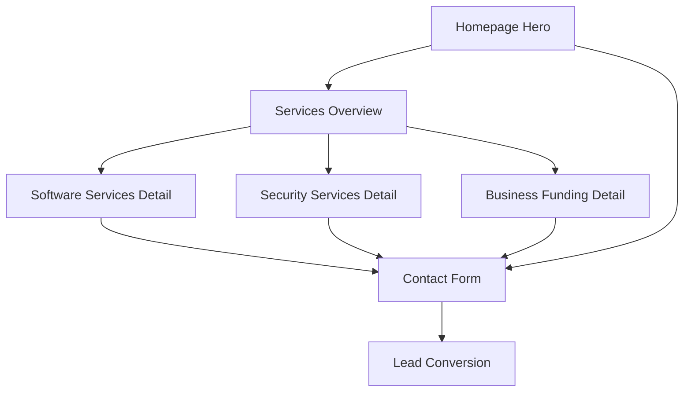

# DiveSeeks Ltd Homepage - Product Requirements Document

## 1. Product Overview
DiveSeeks Ltd is a multi-service company offering comprehensive business solutions through three distinct service branches: Software Services, Security Services, and Business Funding.
The homepage will serve as the primary digital gateway to showcase these services and convert visitors into leads through clear value propositions and strategic call-to-action placements.
Target market includes small to medium businesses seeking integrated technology, security, and funding solutions.

## 2. Core Features

### 2.1 User Roles
| Role | Registration Method | Core Permissions |
|------|---------------------|------------------|
| Visitor | No registration required | Can browse all content, contact forms, service inquiries |
| Lead | Contact form submission | Receives follow-up communications, access to detailed service information |

### 2.2 Feature Module
Our DiveSeeks Ltd homepage consists of the following main sections:
1. **Hero Section**: company introduction, primary value proposition, main call-to-action button
2. **Services Overview**: three service branch cards with descriptions and navigation links
3. **Service Details**: detailed breakdown of each service offering with sub-services
4. **About Section**: company credibility, experience, and trust indicators
5. **Contact Section**: contact form, business information, and secondary call-to-actions

### 2.3 Page Details
| Page Name | Module Name | Feature description |
|-----------|-------------|---------------------|
| Homepage | Hero Section | Display compelling headline, subheadline, and primary CTA button. Include company logo and navigation menu |
| Homepage | Services Overview | Present three main service cards (Software, Security, Funding) with icons, brief descriptions, and "Learn More" buttons |
| Homepage | Software Services Detail | Showcase POS system, online ordering website, and React Native app with feature highlights and benefits |
| Homepage | Security Services Detail | Highlight SIA-licensed staff, cybersecurity audits, and business protection with trust badges and certifications |
| Homepage | Business Funding Detail | Explain broker services, funding options, and application process with success metrics |
| Homepage | About Section | Display company experience, team credentials, client testimonials, and trust indicators |
| Homepage | Contact Section | Provide contact form, business address, phone, email, and social media links with clear CTAs |
| Homepage | Navigation | Sticky header with logo, menu items, and contact button for seamless user experience |
| Homepage | Footer | Company information, service links, legal pages, and additional contact methods |

## 3. Core Process
**Visitor Journey Flow:**
Visitors land on the homepage and are immediately presented with the hero section explaining DiveSeeks' value proposition. They can explore the three main service branches through dedicated cards, each leading to detailed service information. Interested visitors can contact the company through multiple touchpoints including the main CTA, service-specific inquiry buttons, and the contact form. The process is designed to guide visitors from awareness to inquiry through clear navigation and compelling content.

## 4. User Interface Design
### 4.1 Design Style
- **Primary Colors**: Professional blue (#1e40af) and clean white (#ffffff)
- **Secondary Colors**: Accent orange (#f97316) for CTAs and highlights
- **Button Style**: Rounded corners with subtle shadows and hover animations
- **Typography**: Modern sans-serif fonts (Inter or similar) with clear hierarchy
- **Layout Style**: Card-based design with generous white space and grid layouts
- **Icons**: Professional line icons and service-specific illustrations
- **Animations**: Smooth transitions, fade-ins, and hover effects using Framer Motion

### 4.2 Page Design Overview
| Page Name | Module Name | UI Elements |
|-----------|-------------|-------------|
| Homepage | Hero Section | Large headline text, gradient background, prominent CTA button with hover animation, navigation bar with logo |
| Homepage | Services Cards | Three equal-width cards with icons, titles, descriptions, and "Learn More" buttons in grid layout |
| Homepage | Service Details | Expandable sections with feature lists, benefit highlights, and service-specific CTAs |
| Homepage | About Section | Company stats, team photos, testimonial cards with client logos and quotes |
| Homepage | Contact Section | Two-column layout with contact form on left, business information on right |
| Homepage | Navigation | Sticky header with transparent background, logo left-aligned, menu center, contact button right |
| Homepage | Footer | Multi-column layout with service links, company info, social icons, and legal links |

### 4.3 Responsiveness
The design follows a mobile-first approach with responsive breakpoints at 768px (tablet) and 1024px (desktop). Touch interactions are optimized for mobile devices with appropriate button sizes and spacing. The layout adapts from single-column on mobile to multi-column grids on larger screens, ensuring optimal user experience across all devices.