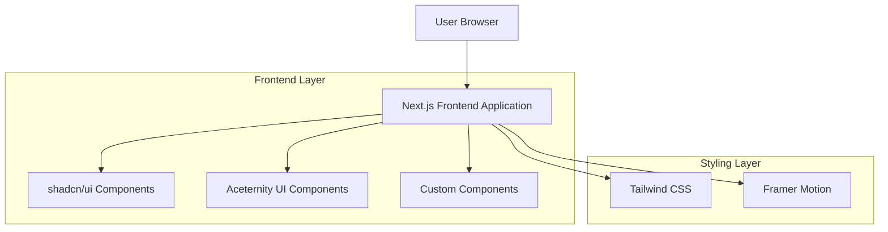

# DiveSeeks Ltd Homepage - Technical Architecture Document

## 1. Architecture Design



## 2. Technology Description

* Frontend: Next.js\@14 + React\@18 + TypeScript

* UI Library: shadcn/ui (primary) + Aceternity UI components

* Styling: Tailwind CSS\@3

* Animations: Framer Motion

* Build Tool: Next.js built-in bundler

* Deployment: Vercel (recommended)

## 3. Route Definitions

| Route              | Purpose                                                                       |
| ------------------ | ----------------------------------------------------------------------------- |
| /                  | Homepage with hero section, services overview, and contact information        |
| /software-services | Detailed page for Software Services (POS, ordering systems, React Native app) |
| /security-services | Detailed page for Security Services (SIA staff, cybersecurity, protection)    |
| /business-funding  | Detailed page for Business Funding services and broker information            |
| /about             | Company information, team, and credentials                                    |
| /contact           | Contact form and business information                                         |

## 4. Component Architecture

### 4.1 Core Components Structure

```
src/
├── components/
│   ├── ui/                    # shadcn/ui components
│   │   ├── button.tsx
│   │   ├── card.tsx
│   │   ├── input.tsx
│   │   └── form.tsx
│   ├── aceternity/            # Aceternity UI components
│   │   ├── hero-section.tsx
│   │   ├── service-cards.tsx
│   │   └── animated-elements.tsx
│   ├── layout/
│   │   ├── header.tsx
│   │   ├── footer.tsx
│   │   └── navigation.tsx
│   ├── sections/
│   │   ├── hero.tsx
│   │   ├── services-overview.tsx
│   │   ├── service-details.tsx
│   │   ├── about.tsx
│   │   └── contact.tsx
│   └── common/
│       ├── cta-button.tsx
│       ├── service-card.tsx
│       └── contact-form.tsx
├── app/
│   ├── page.tsx               # Homepage
│   ├── layout.tsx             # Root layout
│   ├── globals.css            # Global styles
│   └── (routes)/              # Additional pages
├── lib/
│   ├── utils.ts               # Utility functions
│   └── constants.ts           # App constants
└── types/
    └── index.ts               # TypeScript definitions
```

### 4.2 Component Specifications

**Reusable Components:**

* `ServiceCard`: Displays service information with icon, title, description, and CTA

* `CTAButton`: Consistent call-to-action button with hover animations

* `ContactForm`: Contact form with validation and submission handling

* `SectionContainer`: Wrapper component for consistent section spacing

* `AnimatedSection`: Wrapper for scroll-triggered animations

**Layout Components:**

* `Header`: Sticky navigation with logo, menu, and contact button

* `Footer`: Multi-column footer with links and company information

* `Navigation`: Mobile-responsive navigation menu

**Section Components:**

* `HeroSection`: Main hero with headline, subheadline, and primary CTA

* `ServicesOverview`: Grid of three main service cards

* `ServiceDetails`: Detailed breakdown of each service offering

* `AboutSection`: Company information and trust indicators

* `ContactSection`: Contact form and business information

## 5. Styling Guidelines

### 5.1 Tailwind Configuration

```javascript
// tailwind.config.js
module.exports = {
  content: [
    './src/pages/**/*.{js,ts,jsx,tsx,mdx}',
    './src/components/**/*.{js,ts,jsx,tsx,mdx}',
    './src/app/**/*.{js,ts,jsx,tsx,mdx}',
  ],
  theme: {
    extend: {
      colors: {
        primary: {
          50: '#eff6ff',
          500: '#3b82f6',
          600: '#2563eb',
          700: '#1d4ed8',
          900: '#1e3a8a',
        },
        accent: {
          500: '#f97316',
          600: '#ea580c',
        }
      },
      fontFamily: {
        sans: ['Inter', 'sans-serif'],
      },
      animation: {
        'fade-in': 'fadeIn 0.5s ease-in-out',
        'slide-up': 'slideUp 0.6s ease-out',
      }
    },
  },
  plugins: [],
}
```

### 5.2 Component Design Tokens

* **Spacing**: Consistent use of Tailwind spacing scale (4, 8, 12, 16, 24, 32px)

* **Typography**: Heading hierarchy using text-4xl, text-3xl, text-2xl, text-xl

* **Shadows**: Subtle shadows for cards and buttons (shadow-sm, shadow-md)

* **Borders**: Rounded corners using rounded-lg, rounded-xl

* **Transitions**: Smooth transitions with duration-300 and ease-in-out

## 6. Development Standards

### 6.1 Code Organization

* Use TypeScript for type safety

* Implement proper component props interfaces

* Follow Next.js App Router conventions

* Use shadcn/ui components as the primary UI library

* Integrate Aceternity UI components for enhanced animations

* Maintain consistent naming conventions (PascalCase for components)

### 6.2 Performance Optimization

* Implement Next.js Image optimization for all images

* Use dynamic imports for heavy components

* Optimize Framer Motion animations for performance

* Implement proper SEO meta tags

* Use Next.js built-in optimization features

### 6.3 Accessibility

* Ensure proper ARIA labels and roles

* Maintain keyboard navigation support

* Use semantic HTML elements

* Provide alt text for all images

* Ensure sufficient color contrast ratios

## 7. Deployment Configuration

### 7.1 Vercel Deployment

* Automatic deployments from Git repository

* Environment variables for configuration

* Custom domain setup for production

* Performance monitoring and analytics

### 7.2 Build Optimization

* Next.js automatic code splitting

* Static generation for optimal performance

* Image optimization and lazy loading

* CSS optimization and purging

